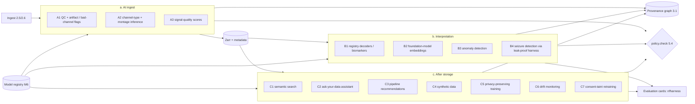

# NeuroForge Bio: AI layer

Status: **DESIGN, for owner review.** Written 2026-09-26 by the code architect. Nothing in this document is built.
Companion files:
- `docs/adr/0011-ai-layer-principles.md` (principles; Proposed);
- `architecture/BUILD-GUIDE.md` → "M8 / AI layer addendum" (build steps);
- `investor/AI-ADVANTAGES.md` (investor view).

> **Research use only. Not a medical device.** No AI output described here is a diagnosis, a treatment recommendation or a clinical decision aid. Nothing here sends a command, parameter or waveform to stimulation or acquisition hardware (SEC-090–094). Clinical use of any model needs its own regulatory route: MDR Rule 11 / FDA SaMD, IRB/REK, and a notified body where required.

**Evidence convention (as in BLUEPRINT).** Facts cite a file in this repo or `C:\Users\mariu\research-lab\…`, which carry the primary URLs/DOIs. Some sources were opened for this document: pgvector, autoreject, ICLabel, PREP (see §9). Numbers without a source are **ESTIMATE** with a method. Performance numbers are **targets or measurements to be made**, never claims.

---

## 0. The design in one paragraph

AI does not get a separate system. **Every AI capability is a model in the governed registry (M6), run as a step in the pipeline engine (M3).** Each run is written to the provenance graph (§3.6), gated by the single `policy.check` (5.4), and scored by an **evaluation card** produced by the leak-proof harness (`research/neurobiology/code/nfharness`, features 1–6 VERIFIED per `research/neurobiology/PLATFORM_FEATURES.md`).

The AI layer therefore inherits reproducibility, consent gating, deletion propagation and audit from what is already built (M2–M3 merged to main; `docs/hive/M2-REPORT.md`, `M3-REPORT.md`). It adds only four components:
1. a sandboxed **model runtime** step type (ONNX/safetensors only, SEC-061);
2. an **evaluation-card service** (a port of nfharness);
3. a **pgvector** index for metadata search;
4. an **LLM gateway** for the "ask your data" assistant (metadata and provenance only).

This is the verifiable part of the pitch. Any AI output can be traced to a model digest, training-data manifest, evaluation card, consent basis and a human approval.

## 1. Where AI plugs in

### 1.1 The AI component contract (applies to every feature below)

Every AI output records, as PROV entities and activities:
- `model_id@version` and its **weights SHA-256**;
- the **PipelineVersion digest** that ran it, and the input content hashes;
- the **training-data manifest** (hashed subject IDs, dataset IDs and licences, consent scopes used);
- the **evaluation card ID**;
- the decision threshold;
- `review_status` ∈ {`suggested`, `accepted`, `rejected`, `overridden`}, with the reviewer.

These rules apply to every component:
- **Output is a flag or annotation, never a mutation.** No AI component deletes, edits or silently excludes data. It writes a new derived artifact (flags, scores, labels) that a human or an explicit, versioned pipeline step may act on. Reason: Kessler 2025 found that artifact correction **reduced** decoding performance, and Huang 2025 found "no single best pipeline" (`market/landscape.md` §3). A silent "auto-clean" would contradict ADR 0001.
- **Human in the loop:**
  - Suggestions that change governance attributes (channel type, `nervous_system`) or exclude data need a `data-steward` accept.
  - Model deployment needs four-eyes (SEC-024).
  - Retraining promotion needs a human approve.
- **Tenant boundary.** A model trained or fine-tuned on tenant data is private to that tenant (SEC-143). NeuroForge's own shipped models are trained only on (i) permissively licensed public data, (ii) synthetic data, or (iii) research-pool data under `nf.model_training.internal` (`legal/data-agreements/CONSENT-SCOPES.en.md`). **Customer processor data is never used to train NeuroForge models** (DPA § 3.4; CONSENT-SCOPES rule 6; RISK-MEMO §0).
- **Inference outputs** are labels or coarse scores by default (SEC-144). Embeddings are personal data and never leave the tenant (§4.2).

### 1.2 Reading the feature cards

Each card below uses the same fields:
- Customer value.
- Investor value.
- Data needed.
- **Consent scope.** "Processor" means NeuroForge runs it on the customer's instruction under the DPA, using the customer's `study.*` scopes. `nf.*` scopes appear only when NeuroForge itself is controller.
- **AI Act.** Regulation (EU) 2024/1689, per `research-lab/ai/RAPPORT.md` §a.6 and `legal/data-agreements/RISK-MEMO.md` §6:
  - Art. 5 has applied since 2 Feb 2025.
  - The majority of rules, including Art. 50 transparency, apply from 2 Aug 2026.
  - High-risk rules for Annex I products, such as MDR devices, apply from 2 Aug 2028.
  - The Art. 2(6) research exemption and the wording of Art. 50 were **not opened**, so they are UNVERIFIED.
  - Norway has not yet implemented the Act. KI-loven is targeted for spring 2027 (same report).
  - Our default reading is **RUO, no medical purpose → not high-risk under Art. 6(1)**. This is an interpretation, not legal advice. It flips to high-risk if the customer or we give the output a medical purpose.
- **Re-identification risk.** EEG works as a biometric identifier (de Ataide et al., *Sensors* 2026, doi:10.3390/s26134045, cited in `security/THREAT-MODEL.md` P-03). All five EEG encoders in one negative-control study decoded **dataset identity at 1.000** (arXiv:2607.24519, preprint, via `research-lab/ai/RAPPORT.md` §a.1).
- Evaluation method.
- **Compute.** Owner hardware: an RTX 5060 Ti 16 GB. Campaign options: Sigma2 category C at 35 NOK/GPU-h, or Lambda H100 at 3.99 USD/h (`research-lab/ai/RAPPORT.md` §a.5). The local torch build is currently CPU-only (memory note). Production inference is on cloud CPU unless stated.
- Effort (person-months, **ESTIMATE**, same S/M/L sizing as BUILD-GUIDE).

---

## 2. (a) AI at ingest

### A1. Automated QC: artifact and bad-channel detection

| Field | Design |
|---|---|
| What | Runs automatically after conversion (2.5), as a pinned PipelineVersion `qc-ingest@x`. It flags bad channels, bad segments and artifact types, but **does not remove anything**. The first version packages established, published methods rather than new AI: PREP-style robust referencing and bad-channel detection (Bigdely-Shamlo et al., *Front Neuroinform* 2015, doi:10.3389/fninf.2015.00016, PMID 26150785); autoreject-style data-driven thresholds (Jas et al., *NeuroImage* 2017, doi:10.1016/j.neuroimage.2017.06.030, PMID 28645840); ICLabel-style IC classification (Pion-Tonachini et al., *NeuroImage* 2019, doi:10.1016/j.neuroimage.2019.05.026, PMID 31103785); and simple detectors for flatline, clipping and line noise. Titles, DOIs and PMIDs were opened via Europe PMC. The abstracts were not read, and nothing is claimed about their accuracy. Learned models are added later, only if they beat these on the evaluation card |
| Customer value | Every recording arrives with a QC report and quarantine-style warnings in minutes. It replaces manual scrolling, and every flag is reproducible and cited in provenance, so a reviewer can see *why* a channel was marked |
| Investor value | A visible "AI on every upload" feature with near-zero marginal cost (CPU). It feeds A3 scores, B3 anomaly detection and C6 drift monitoring, so the rest of the layer builds on it |
| Data needed | The recording (Zarr) plus channel metadata. For the learned variants: public, licence-checked labelled datasets and the synthetic generator (0.6, known injected artifacts) |
| Consent scope | Processor (`study.processing`); runs as a customer-instructed pipeline. Training NeuroForge's QC models: public or synthetic data only in v1; pool data only with `nf.model_training.internal` |
| AI Act | RUO tooling with no medical purpose → not high-risk (interpretation). If a customer embeds it in a clinical device, the QC becomes part of *their* device software; we supply it as SOUP (BLUEPRINT §8.6) |
| Re-id risk | Low. Outputs are flags and scores, not signal |
| Evaluation | Synthetic ground truth first: injected blinks, muscle bursts, flat and noisy channels (0.6 generator), with sensitivity and false-flag rate per artifact type. Then agreement with expert labels on public labelled data, with CIs from a cluster bootstrap over subjects (`research-lab/matematikk/RAPPORT.md` §a.1). Every version gets an evaluation card. A version ships only if it is **not worse** than the previous one on the locked card |
| Compute | CPU. MNE-based steps measured locally at about 35 MB import and about 110 MB ICA peak (M3-REPORT). No GPU |
| Effort | 1.5 PM |

### A2. Channel-type and montage inference

| Field | Design |
|---|---|
| What | Suggests each channel's modality (EEG/ECoG/SEEG/EMG/EOG/ECG/misc), 10-20/10-10 labels from names and positions, reference scheme and likely montage. It suggests the **governance attributes** `modality` and `nervous_system` (5.1), which the classification engine (5.2) needs: CO/CA cover central *or* peripheral, CT covers central only (`market/regulation.md` §1). The v1 method is rules plus signal features, such as ECG periodicity and EOG/EMG spectra. A small classifier is added if it beats the rules |
| Customer value | Messy vendor files (EMG channels named "EXG3", unlabeled references) stop blocking analysis and compliance. A mis-typed EMG channel can change which state law applies, so this has real compliance value |
| Investor value | Directly couples AI to the governance product. It is not a separate demo |
| Data needed | Channel names, units, sampling rates, sidecars, short signal windows |
| Consent scope | Processor |
| AI Act | Not high-risk (interpretation) |
| Re-id risk | Low |
| Evaluation | A held-out set of public files with known channel types, stratified by vendor, and a confusion matrix per class. **Hard gate:** a suggestion may never move a channel from `central` to `peripheral` or to `unknown` without steward acceptance. That direction could remove legal protection, so the policy test covers it |
| Human in the loop | Always `suggested` until a `data-steward` accepts (SEC-022). Bulk-accept is allowed, and the audit log records it |
| Compute | CPU |
| Effort | 1 PM |

### A3. Signal-quality scores

| Field | Design |
|---|---|
| What | A per-channel and per-recording quality score composed of A1 flags plus spectral health (line-noise ratio, aperiodic fit R² via fooof 1.1, per `research-lab/matematikk/RAPPORT.md` §a.2). The score is **transparent**: a documented formula, not an opaque number |
| Value | Customers can filter datasets by quality and see device-to-device comparison (`research-lab/neuroforge-kart/RAPPORT.md` G4 notes that consumer-EEG quality is device- and task-dependent). For investors, it feeds search facets, drift and anomaly detection |
| Data / scope / AI Act / re-id | As A1 |
| Evaluation | Monotonicity checks on synthetic degradation (more injected noise must give a lower score) and test-retest stability on repeated public recordings |
| Compute | CPU |
| Effort | 0.5 PM (on top of A1) |

**Model version in provenance (all of section a).** Each run records `qc-ingest@x` → `model_id@version` + weights hash + card ID (§1.1). When the QC model is upgraded, old flags stay attached to the old version. A "re-QC" is a new run, and the two can be diffed. M3 already has the machinery for this (3.1, 3.5).

---

## 3. (b) Interpretation

### B1. Decoder and biomarker models from the governed registry (M6)

| Field | Design |
|---|---|
| What | Customers register their own models, or pull reviewed third-party or open models (safetensors/ONNX only, SEC-061), and run them as pipeline steps. Examples: motor-intent decoders, spectral biomarkers, sleep staging. The registry enforces `intended_use` and `use_restrictions`, and it refuses AI Act Art. 5(1)(f) contexts and stimulation or actuator contexts (6.2; SEC-092) |
| Customer value | Every prediction is traceable to model, data, pipeline and consent. That is the FDA-evidence story (5.8) applied to models |
| Investor value | The workflow lock-in point. Model history, evaluation cards and deployments live in the customer's lineage graph |
| Data needed | Tenant data; the model's input spec |
| Consent scope | Inference: processor. Training on tenant data: the tenant's `model training` scope (SEC-146). Training on the pool: `nf.model_training.internal`. Licensing weights trained on the pool: `nf.model_training.licensed` plus commercial terms (CONSENT-SCOPES) |
| AI Act | Registry metadata records the customer's declared purpose. A medical purpose makes the model the customer's device software, and likely high-risk from 2 Aug 2028 under Art. 6(1) + MDR (`research-lab/ai/RAPPORT.md` §a.6). We are then a SOUP supplier, and the registry's SOUP export (6.5) and evaluation cards are the documentation. Emotion or cognitive-state models carry an Art. 5(1)(f) restriction flag |
| Re-id risk | Medium to high for models trained on few subjects. Membership inference (P-05) and inversion (P-06) apply. Mitigation: private by default; publication needs a privacy-risk section with a membership-inference test (SEC-143); coarse outputs (SEC-144) |
| Evaluation | **Only through the evaluation-card service (B4 harness).** That means patient-disjoint or causal splits locked before test labels are read, a leak meter, and CIs with a few-cluster rule. It also includes robustness under perturbation, which is recorded but never claimed as robustness (SEC-145) |
| Compute | CPU for classical and small models; GPU only for deep models (§8) |
| Effort | Included in M6 plus B4; 0.5 PM glue |

### B2. EEG/ECoG foundation-model embeddings

| Field | Design |
|---|---|
| What | Open-weight encoders (for example CBraMod, REVE and LaBraM, where their licences allow) are registered as **feature extractors**. Their embeddings feed downstream probes in the tenant. **We do not pre-train our own foundation model.** `research-lab/ai/RAPPORT.md` (b) rates that "holde seg unna (nå)" (stay away for now): the data and compute are far beyond budget, and no independent gain has been shown |
| Honest framing | Independent 2025–26 benchmarks find that EEG foundation models "do not consistently outperform time-series FMs", and that "simpler models often remain competitive" (NeuroAtlas arXiv:2605.14698; EEG-Bench arXiv:2512.08959; EEG-FM-Compass arXiv:2601.17883; all preprints via the ai report). In one study, a randomly initialised encoder beat pretrained REVE on CAUEEG (arXiv:2607.24519). The product therefore offers foundation models **as candidates that are always benchmarked next to classical baselines on the customer's own data**, never as "SOTA" |
| Customer value | A few clicks to test whether any foundation model helps *on their task*, with the same input pipeline for foundation model and baseline. arXiv:2609.23924 shows that differing pipelines alone move accuracy ±0.08 |
| Investor value | Positions NeuroForge as the **neutral referee** that gains from foundation-model commoditisation instead of losing to it |
| Data needed | Tenant recordings; each model's weights and licence |
| Consent scope | Processor for inference and tenant-private probing. A licensed third-party model's own training data is the vendor's responsibility, recorded in its model card |
| AI Act | Using or fine-tuning is probably not "provider of a general-purpose AI model" (UNVERIFIED interpretation, ai report §a.6). The downstream probe inherits the customer's purpose |
| Re-id risk | **High.** Embeddings are dense signal summaries that encode dataset identity (1.000 in arXiv:2607.24519), and EEG is biometric. Rules: embeddings are stored as tenant-private derived artifacts with the source's classification (SEC-142); they are never pooled cross-tenant; they are never returned by public inference APIs (SEC-144); and "similar-recording" search over embeddings is **off by default**, because it is a linkage engine (P-03/P-04) |
| Evaluation | The evaluation-card service, plus the **negative controls** the literature asks for: random-init encoder, label permutation, dataset-identity probe and montage matching (arXiv:2607.24519). These controls ship only after the nfharness negative-control suite passes its N1b redesign. It is PENDING today (PLATFORM_FEATURES.md #7), and until then foundation-model cards are marked **"controls not validated"** |
| Compute | Inference and fine-tuning of small encoders (CBraMod about 5M parameters, per arXiv:2604.23091 via the ai report) fits on the 16 GB card. A benchmark campaign of about 1,000–2,000 GPU-h costs roughly 35–70 kNOK on Sigma2 category C or 4–8 kUSD on Lambda H100 (ai report §a.5, ESTIMATE). Production: batch GPU jobs on demand, billed as compute pass-through (§7) |
| Effort | 1.5 PM, plus a GPU campaign |

### B3. Anomaly detection

| Field | Design |
|---|---|
| What | Flags recordings or segments that are unusual **relative to the tenant's own history**: unseen noise spectra, a sudden impedance-like drift, device firmware changes, timestamp irregularities (SEC-041 already marks `suspect` segments). v1 uses robust statistics on A1/A3 feature distributions. v2 adds density or isolation models on those features. Embedding-based anomaly detection is only used within a tenant and follows B2's rules |
| Customer value | Catches broken electrodes, a mis-configured site or a bad batch early. It is a data-integrity product, not a clinical one |
| Investor value | A recurring "the platform watches your data" reason to stay subscribed |
| Consent scope | Processor |
| AI Act | Not high-risk (interpretation). **Copy rule:** never "detects abnormal brain activity". Say "detects unusual recordings relative to your data" (copy-lint, no medical claims) |
| Re-id risk | Low for feature-based detection; high if embeddings are used (see B2) |
| Evaluation | Injected anomalies in synthetic and public data, with precision/recall at a fixed alert budget. The false-alarm rate is reported per 100 recordings |
| Compute | CPU |
| Effort | 1 PM |

### B4. Seizure-detection and other event models, **only** through the leak-proof harness

| Field | Design |
|---|---|
| What | The nfharness reference implementation becomes the platform's **evaluation-card service**. It provides patient-wise or causal splits locked by hash before labels are read, forbidden-operation guards (F1–F9, S1, S5, S7), a leak meter, a SzCORE event scorer equal to `timescoring` 0.0.7, Clopper-Pearson/Garwood CIs with a few-cluster rule, and a bit-identical card on rerun. These are features 1–6, **VERIFIED** (PLATFORM_FEATURES.md; `research/neurobiology/STATUS.md`). Any seizure or event model, whether the customer's, a third party's or our baseline, is scored only by this service |
| Status honesty | The negative-control suite is **PENDING**: the N1 cycle-1 controls were mis-specified and are being redesigned in N1b. The baseline detector is **EXPLORATORY**, with FA 0–33 per 24 h and "not verifiable" until N1b passes (`research/neurobiology/STATUS.md`). The product ships features 1–6 and labels cards "negative controls: pending" until N1b is verified |
| Customer value | A vendor or lab gets a standard, leak-proof, citable score. Scoring convention alone changes the false-alarm rate by about 100×, so the card states the convention (PLATFORM_FEATURES.md build notes) |
| Investor value | **The strongest verifiable asset in the AI layer.** It is already built and independently reviewed in research. It is the "honest evaluation" differentiator that `research-lab/ai/RAPPORT.md` rates "satse" (bet on it) |
| Data needed | Recordings, event annotations, and a patient-identity map. chb01 and chb21 are the same patient, so the map is a platform requirement (PLATFORM_FEATURES.md) |
| Consent scope | Processor for customer data. Our public benchmark tracks use public data (CHB-MIT, verified by SHA-256); owner-gated datasets are not used |
| AI Act / MDR | The harness is evaluation tooling. The **models it scores** are medical-purpose if used clinically: MDR Rule 11 class IIa+ and AI Act high-risk from 2 Aug 2028 (ai report §a.6). Every card carries "RESEARCH USE ONLY. NOT A MEDICAL DEVICE". We never publish a "seizure detector" as a product |
| Re-id risk | Low for the cards (aggregate metrics). Per-subject verdicts use pseudonyms only |
| Evaluation | It *is* the evaluation. It is self-tested through its 54 pytest tests, scorer equivalence on 1,000 random pairs, and a determinism rerun |
| Compute | CPU (numpy/scipy) |
| Effort | 1.5 PM (port into `services/workers` as a step family + card store + API) |

**Evaluation cards (all models).** A card is a PROV entity (JSON + Markdown + figure) that holds:
- input hashes;
- split hash;
- prereg hash, if any;
- package versions and seed;
- metric definitions (convention stated);
- CIs;
- leak-meter result;
- negative-control status;
- perturbation results;
- privacy-risk section, for published models.

It is required for registry promotion (6.1) and is exportable into the FDA Evidence Kit (5.8) and AI Act technical documentation. It follows the ai report's call for TRIPOD+AI-style reporting (§a.4; TRIPOD+AI itself UNVERIFIED there).

---

## 4. (c) After storage

### C1. Semantic search over datasets and runs

| Field | Design |
|---|---|
| What | Natural-language and faceted search over **metadata and provenance text only**. That covers dataset descriptions, task names, channel and modality summaries, pipeline names and parameters, run summaries, evaluation-card summaries and A3 quality facets. It uses a small self-hosted text-embedding model on CPU with pgvector in the existing Postgres. pgvector is "Open-source vector similarity search for Postgres", supports HNSW and IVFFlat, and uses the PostgreSQL License (github.com/pgvector/pgvector, opened 2026-09-26). No new database is needed |
| Customer value | Queries like "all 64-channel motor-imagery sessions with QC score > 0.8 processed with eeg-basic ≥ 1.2" or "runs where the high-pass changed decoding accuracy" |
| Investor value | A daily-use feature that makes the lineage graph the place people start. It is cheap (CPU) |
| Data needed | Metadata and provenance text. **Free-text annotations are excluded or scrubbed**, because they can carry identifiers (P-02, SEC-141). No signal embeddings |
| Consent scope | Processor |
| Tenant isolation | Vectors live in tenant-scoped tables under the same FORCE RLS as everything else (M2 isolation tests cover every table). The query runs with the user's database role, so search cannot return what the user cannot read. A cross-tenant test is required |
| AI Act | Not high-risk; no interaction with natural persons beyond a search box |
| Re-id risk | Low (metadata). P-09 (a dataset's *existence* reveals facts) is handled by tenant scoping |
| Evaluation | A labelled query set on synthetic tenants: recall@10 and nDCG, measured, not claimed. Leakage test: cross-tenant hits must be 0 |
| Compute | CPU. Indexing ESTIMATE: about 10–100 ms per text chunk for a small embedding model on CPU (unmeasured; measure in 8.2) |
| Effort | 0.75 PM |

### C2. "Ask your data": LLM assistant over metadata and provenance

| Field | Design |
|---|---|
| What | A chat panel in the console that answers questions such as "Which pipeline version produced the figure in report R, and how many withdrawals affect it?" or "Which QC version flagged the most channels in study S?" (study-level only; see C2a). It uses **retrieval over C1 plus read-only provenance and ledger tools**. It **never** receives raw signals, embeddings, subject pseudonym lists beyond what the question needs, or free-text notes |
| Hard rules | 1. **Retrieval runs as the user.** Every tool call goes through the API with the user's token, so RLS and `policy.check` apply and the model cannot see more than the user. 2. **Every factual sentence cites a run, node or ledger ID.** A post-processor checks that each cited ID exists and is readable by the user. Answers with uncited claims are replaced with "I can't answer that from your records". 3. **Read-only.** The assistant can *propose* an action, such as "re-run QC with v2" or "open a deletion job", but the user executes it through the normal UI and authz. It has no export, delete or deploy tools. 4. **Prompt-injection posture.** Metadata is untrusted text, since a dataset description could contain instructions. Tool outputs are passed as data, and the tool set is read-only, so injection cannot cause writes. 5. **AI disclosure** in the UI ("You are talking to an AI system; answers can be wrong; check the cited records") |
| LLM hosting | **DECIDED (owner, 2026-09-26): Anthropic API** through a NeuroForge Bio company account, with Haiku/Sonnet tiering. See **C2a** below for provider, models, secrets, data sent, audit, subprocessor terms and cost control. A self-hosted open-weights model stays a documented fallback only, for example for an EU-only tenant, and is not built |
| Customer value | Compliance leads and PIs get answers from the lineage graph without learning query syntax. It is especially useful for audits and deletion certificates |
| Investor value | The most demo-able feature, and it is **verifiable**: every answer links to records, which differentiates it from generic "chat with your data" |
| Consent scope | Processor. Metadata is personal data where it concerns subjects, so it is covered by the DPA, and Anthropic must be listed as a subprocessor (C2a) |
| AI Act | Art. 50 transparency for AI systems interacting with natural persons applies from 2 Aug 2026 (dates per the ai report; wording UNVERIFIED), hence the disclosure. Not high-risk. We are the provider of this AI *system*. The underlying general-purpose model's provider carries Art. 53 duties (RISK-MEMO §6 dates) |
| Re-id risk | Low to medium. The main risk is disclosure to the LLM provider (Anthropic). It is handled by the DPA, **study-level-only projection** (no subject-, session- or recording-level nodes, no clinical fields, no diagnosis-revealing titles, no derived signal features), a fail-closed redaction layer and the tenant opt-in with a transfer notice (C2a; legal memo) |
| Evaluation | A golden set of about 200 questions over synthetic tenants (ESTIMATE of size). Gates: **citation validity 100%** (automated); answer correctness scored by a second grader with human spot checks (measured, not claimed); a red-team suite for cross-tenant access and injection with 0 successes allowed; and a refusal rate on unanswerable questions |
| Compute | Anthropic API per-token cost (C2a cost section). No GPU on our side |
| Effort | 2 PM |

### C2a. Decision: Anthropic API as the assistant's LLM (owner, 2026-09-26)

**Provider and account**
- The Anthropic API (first-party Claude API), called through a **NeuroForge Bio company API account**.
- Creating that account, accepting the terms, adding billing and setting spend limits are **owner actions** 🔒. Agents never sign up or pay.
- The company is not yet incorporated (RISK-MEMO header), so whether the account can be held in the company's name before incorporation is a question for the owner and legal.
- The owner's Claude Code session credentials are **never** used by the product, in any environment.
- Use a separate API key per environment (dev, staging, prod), each in its own workspace, so spend limits and revocation are per environment.

**Model tiering (config flag, not code)**

| Config key | Default value | Use | Price per MTok (input / output) |
|---|---|---|---|
| `assistant.model.routine` | `claude-haiku-4-5-20251001` (Claude API ID; alias `claude-haiku-4-5`) | Routine lookups: one to three tool calls, a single entity or run | $1 / $5 |
| `assistant.model.complex` | `claude-sonnet-5` | Multi-hop lineage, audits, comparisons, and any retry after a routine answer fails the citation validator | $2 / $10 |
| `assistant.routing` | `rules-v1` | Rule-based router on question features (entity count, requested hops, "compare"/"why"/"audit" intents). Escalates once to `complex` on a citation-validation failure. It never escalates silently beyond `complex` | — |

- Model IDs and prices come from Anthropic's models overview and pricing pages (platform.claude.com/docs/en/about-claude/models/overview and /pricing, opened 2026-09-26). Sonnet 5's $2/$10 is stated there as the standard price.
- **Lifecycle risk.** The models page lists Haiku 4.5 retirement as "Not sooner than October 15, 2026", which is weeks away, and Sonnet 5 as "Not sooner than June 30, 2027".
  - A model swap is therefore a config change **gated by re-running the golden set** (the 8.7 evaluation). It is never a silent change.
  - The response's `model` field and `request-id` are recorded in provenance with every answer.
- **Data residency.** Per the data-residency page (opened 2026-09-26):
  - `inference_geo` supports only `"us"` and `"global"`;
  - it is rejected on Haiku 4.5;
  - workspace (storage) geo is currently `"us"` only.

  So **there is no EU-only option**, and every call is a transfer to the US (see the legal notes).

**Secrets and tests**
- The API key lives only in the secrets manager (ADR 0004 / D4: AWS). It is injected at runtime into the LLM-gateway service role only, never into workers, the console or the SDK.
- Secret scanning (SEC-086) covers the `sk-ant-` prefix. A key found in the repo is revoked, not just deleted.
- Rotation: yearly, and immediately on any suspicion.
- **CI uses a mock LLM client only.** The gateway depends on a small `LlmClient` interface with a recorded-fixture implementation. Tests run with network egress blocked, so a test that tries to reach `api.anthropic.com` fails.
- A live smoke test against the real API is a manual, owner-approved job that uses synthetic data only 🔒.

**What is sent: binding redaction rule** (`legal/data-agreements/ai-assistant-memo.md` §§ 1–5, nfb-legal-commercial, 2026-09-26, DRAFT pending advokat)

The memo's reasoning:
- Metadata tied to a subject pseudonym is personal data (Recital 26).
- A diagnosis-revealing study title (for example "ALS cohort") combined with subject-level provenance nodes, or with per-subject clinical fields, is "data concerning health" under Art. 9 (memo § 2).
- Derived signal features (band power, spike rates, decoder outputs) are **likely "neural data"** under CO/CA/CT, whereas plain metadata on a plain reading is not (memo § 3; Montana UNVERIFIED).

The design therefore sends **study-level metadata only**. It is enforced by a **redaction layer that runs before any request is built**, so the Anthropic client never receives an unredacted object.

1. **Retrieval** runs with the user's token (RLS + `policy.check`). Nothing the user cannot read is ever a candidate.
2. **Study-level projection.** Only these node types pass:
   - dataset/study, PipelineVersion, sweep, evaluation card, model version, jurisdiction RuleSet;
   - **aggregate** run, QC and consent statistics, for example "38 recordings, 2 flagged, 1 withdrawal affects report R".
   - **Subject-, session- and recording-level nodes are dropped**, together with any field keyed to a subject. The assistant cannot answer per-subject questions. It answers with study-level aggregates and a link to the relevant console view, which is rendered locally and never sent to the LLM.
3. **Field allow-list per node type.** The allowed fields are:
   - IDs of study-level nodes;
   - pipeline names, versions and parameters;
   - QC/card summary statistics;
   - modality and channel-count summaries;
   - consent-status **counts**;
   - RuleSet IDs.

   Everything else is dropped. That includes free text, file paths, clinical or phenotype fields (diagnosis, medication, scores such as UPDRS), participants tables, and consent documents.
4. **Title and description handling.** Study titles and descriptions are **dropped by default**. They are sent only if a tenant admin has marked that study "non-sensitive" (memo § 6.2). Even then they pass a **diagnosis-term detector** (a condition-term list plus ICD-10/SNOMED-style code patterns). A hit replaces the text with a generalised label such as "study (title withheld)" and audits the replacement.
5. **Never sent, in any mode:**
   - raw or processed signals, signal windows and embeddings;
   - **derived signal features**: numeric arrays, band-power or spike-rate values, decoder outputs and feature vectors. The detector blocks any numeric array longer than a small threshold, and any field whose schema type is a feature or artifact payload;
   - direct identifiers and subject pseudonyms;
   - credentials and tokens.
6. **Blocking, not best-effort.** If the redactor finds a disallowed item after projection, for example from a new field it doesn't know, it **fails closed**. No request is sent, the user gets "I can't answer that without sending restricted data", and `llm.request_blocked` is audited with the rule that fired.

**Transfer treatment**

Every call is a **transfer to the US**:
- EEA, UK and Swiss customers contract through **Anthropic Ireland, Limited** (Commercial Terms, per memo § 5).
- The transfer runs on **SCC 2021/914 Module Three** (processor → sub-processor) via Anthropic's DPA, **not the DPF** (memo § 5).
- Anthropic's DPA states no processing location, so the US is assumed. Workspace geo is US-only (data-residency page).

The consequences for the product:
- The **tenant opt-in screen** shows a transfer notice before a tenant admin can enable the assistant: Anthropic Ireland, Limited as sub-processor, data may be processed in the US under SCCs, only study-level metadata is sent, and retention is 30 days by default (ZDR if agreed). The notice text comes from legal.
- The admin's acceptance is recorded as a ledger-style event (tenant, admin, notice version and hash).
- A per-tenant **and** global kill switch exists (memo § 6.3).
- **Hard prerequisite before enabling for any customer 🔒:**
  - a completed **transfer impact assessment**;
  - Anthropic listed in DPA Annex III;
  - the § 6.2 advance notice (≥ [30] days) sent to customers whose DPA predates the listing;
  - a DPIA update (memo §§ 4, 6).

  The enable switch refuses unless a `tia_ref` and a `dpia_ref` are configured for the deployment.

**Audit, per request**
- The queryable audit log (2.8) gets an `llm.request` event with:
  - tenant, user, model requested and model returned, and the Anthropic `request-id`;
  - token counts, including cache reads and writes;
  - the **manifest of what was sent**: record IDs, field paths, serializer version and the SHA-256 of the exact payload;
  - the citation-validation result.
- The **exact payload and response** are stored encrypted under the tenant key in the audit object store. This lets an auditor reproduce precisely what left the platform, while application logs stay free of subject data (SEC-147).
- Retention follows `legal/data-agreements/RETENTION-POLICY.en.md`. Crypto-shredding a tenant makes the stored payloads unreadable.

**Subprocessor terms (checked on official pages, 2026-09-26; not legal advice)**

| Topic | What the official page says | Status |
|---|---|---|
| Training on our data | Commercial Terms of Service (effective June 17, 2025): "Anthropic may not train models on Customer Content from Services." | Opened (anthropic.com/legal/commercial-terms) |
| Output ownership | Same page: Customer "retains all rights to its Inputs, and … owns its Outputs." | Opened |
| DPA | Commercial Terms: data "will be processed in accordance with the Anthropic Data Processing Addendum ('DPA'), which is incorporated into these Terms by reference." The DPA (effective February 24, 2025) incorporates SCCs Module Two and/or Three, with UK and Swiss addenda, and grants general authorisation for the subprocessors in its Schedule 4 / the published list | Opened (anthropic.com/legal/data-processing-addendum). The exact DPA wording was read through a summarising fetch tool, so **the advokat must read the full text** |
| Anthropic's own subprocessors | Published at trust.anthropic.com/subprocessors | **UNVERIFIED**: the page is a JS app and did not render |
| Retention | Privacy Center (last updated July 1, 2026): "we automatically delete inputs and outputs on our backend within 30 days of receipt or generation", with exceptions. Zero data retention is available by separate agreement. Content flagged for Usage Policy violations: inputs/outputs "for up to 2 years", trust and safety classification scores "for up to 7 years" | Opened (privacy.claude.com article 7996866) |
| Data location | Workspace geo `us` only; inference `us`/`global` | Opened (docs data-residency page) |
| EU–US Data Privacy Framework certification of Anthropic | Not checked by us. Legal's memo § 5 says to rely on SCCs, not the DPF | **UNVERIFIED**; the design does not rely on it |
| Contracting entity for EEA customers | Anthropic Ireland, Limited (per legal memo § 5, citing the Commercial Terms) | Per legal memo |

**Legal notes (handed to nfb-legal-privacy via `legal/BOARD.md`)**
1. Add Anthropic to the **DPA subprocessor annex** before the assistant is enabled for any customer. The assistant is off by default, with a per-tenant opt-in.
2. Write a **transfer impact assessment** for EEA/Norway → US under the SCCs in Anthropic's DPA. There is no EU residency option.
3. Decide whether to request **zero data retention** from Anthropic (by agreement). If ZDR is not granted, disclose the 30-day default and the policy-violation retention exception (up to 2 years) in our DPA annex.
4. Confirm that disclosure to Anthropic as a **processor** is not a "sale" under CT PA 25-113 / CCPA. RISK-MEMO §5 notes that the CT exceptions include disclosure to a processor.
5. Record in the DPIA that only **study-level**, allow-listed, redacted metadata leaves (no subject-level nodes, no clinical fields, no derived features), and cite the audit trail. Legal's `ai-assistant-memo.md` covers notes 1–5 and is binding for the design.
6. Check whether the Commercial Terms account can be opened before NeuroForge Bio AS is incorporated.

**Cost control (ESTIMATE)**
- **Per-tenant quota.** Monthly caps on questions and tokens are enforced in the gateway (4.8 quota machinery). Over quota returns HTTP 429 with a clear message, never a silent downgrade.
- **Global spend cap.** Workspace spend limits are also set in the Anthropic Console (an owner action).
- **Prompt caching.** The frozen system prompt and the deterministic tool list are a cached prefix. Per the pricing page, a cache read costs 0.1× base input and a 5-minute cache write 1.25×. Nothing volatile (timestamps, user IDs) goes into the prefix.
- **Answer cache.** Exact-repeat questions are answered from a cache keyed by (tenant, **user permission-scope hash**, normalised question, **provenance head hash**). A cached answer is never shown to a user with a different scope, and it expires as soon as the underlying records change.
- **Unit cost (ESTIMATE; token counts unmeasured).** Assume about 8,000 input tokens (prefix plus retrieved metadata) and 800 output tokens per question:
  - Haiku 4.5: 8,000 × $1/M + 800 × $5/M ≈ **$0.012**.
  - Sonnet 5: 8,000 × $2/M + 800 × $10/M ≈ **$0.024**.
  - So 1,000 questions per tenant per month ≈ **$12–$24** before caching.
  - The tokenizer for newer models produces "approximately 30% more tokens for the same text" (pricing page), so measure it in 8.7 instead of trusting this.

### C3. Automated pipeline recommendations from multiverse results

| Field | Design |
|---|---|
| What | This is **not** an LLM. It is a statistical recommender over Sweep results (3.6). For a task and metric, it ranks pipeline variants by **robustness**: a specification curve, the share of variants with the same sign, and FDR/e-value combination (`research-lab/matematikk/RAPPORT.md` §a.1; Simonsohn et al., *Nat Hum Behav* 2020, via that report). It recommends a variant from the stable region, not the single best score, because picking the maximum of a multiverse is exactly the overfitting the multiverse exposes |
| Knowledge sources | (i) the tenant's own sweeps; (ii) NeuroForge's **public** multiverse library on open datasets (3.9 study; dataset still an owner decision, M3-REPORT open issue 4). **Other tenants' results are never used** (processor data) |
| Customer value | "Start from the pipeline that was robust on data like yours", with the evidence one click away |
| Investor value | Turns the reproducibility product into a guided workflow, and every recommendation is backed by runs |
| Consent scope | Processor (tenant sweeps); public-data licences (library) |
| AI Act | Not high-risk |
| Re-id risk | Low |
| Evaluation | Leave-one-dataset-out: does the recommendation from other datasets beat the fixed default on the held-out dataset? Measured with CIs, and published even if the answer is no |
| Compute | CPU (the sweeps themselves are the cost, already in M3) |
| Effort | 1 PM |

### C4. Synthetic-data generation

| Field | Design |
|---|---|
| What | Tier (i): the **simulator** (BUILD-GUIDE 0.6 generator: known ground truth, no personal data), productised for CI fixtures, QC evaluation and demos. Tier (ii): **generative models trained on pool data**, later and gated |
| Customer value | Tier (i): pipeline testing without touching real data; tier (ii): shareable data where real data is restricted |
| Investor value | Tier (i) is cheap and immediate. Tier (ii) is a possible data product (`investor/DATA-REVENUE-STRATEGY.md` A4), but only after the gates below |
| Consent scope | Tier (i): none. Tier (ii): `nf.model_training.internal` to train; `nf.model_training.licensed` / commercial terms if outputs are sold (CONSENT-SCOPES; DATA-REVENUE-STRATEGY A4) |
| AI Act | Not high-risk. Synthetic data offered to others should be labelled as AI-generated (Art. 50 transparency; wording UNVERIFIED) |
| Re-id risk | Tier (i): none. Tier (ii): **medium**. "A generator trained on Art 9 data is itself possibly personal data until tested" (DATA-REVENUE-STRATEGY A4), and generative models can memorise records (RISK-MEMO §3). **Gate: a membership-inference audit before any release**, with thresholds set with the advokat (matematikk report §a.4) |
| Evaluation | Tier (i): the generator's own tests (0.6). Tier (ii): fidelity (spectral and statistical distances), utility (train on synthetic, test on real), and privacy (membership inference, nearest-neighbour distance to training records) |
| Compute | Tier (i): CPU. Tier (ii): GPU campaign (ESTIMATE; same order as B2) |
| Effort | Tier (i) 0.5 PM; tier (ii) 1.5 PM (roadmap) |

### C5. Privacy-preserving training: compute-to-data, federated learning, DP accounting

| Field | Design |
|---|---|
| What | 1. **Compute-to-data** (first). A partner submits a versioned pipeline or training job. It runs inside the data owner's tenant, or the customer's VPC, on the existing pipeline engine. Only reviewed aggregate outputs or weights leave, with four-eyes and `policy.check` (DATA-REVENUE-STRATEGY A1). 2. **DP accounting.** An RDP-based ε/δ ledger per dataset and per researcher, with the **person** as the privacy unit, not the window. It is hash-chained like the consent ledger (matematikk report §a.4: Mironov 2017, Abadi 2016; Opacus is Apache-2.0). 3. **Federated learning** across tenants (Flower, Apache-2.0, same report), **roadmap, on customer pull** |
| Honest limits | Neural datasets are small, so DP-SGD utility cost is likely large (UNVERIFIED for EEG; matematikk §a.4). FL alone does not prevent gradient leakage (same report). Marketing never says "anonymous because DP" or "FL = private" |
| Customer value | Collaborations (sponsor + sites; vendor + hospital) without moving raw neural data |
| Investor value | Unlocks multi-party programmes (pharma, consortia) where the data cannot move. That is a higher-ACV segment (`market/sizing.md` S4) |
| Consent scope | Each data holder's subjects need the scope that matches the output: `model training` for weights, research scopes for aggregates. Cross-organisation projects need a controller arrangement (Art. 26 joint controllers or separate controllers) per RISK-MEMO §8. EHDS permits may become a basis type later (neuroforge-kart G2) |
| AI Act | Depends on the trained model's purpose (see B1) |
| Re-id risk | Medium. Outputs are aggregates or weights; the membership-inference gate applies to released weights (SEC-143) |
| Evaluation | DP: an accountant unit test against Opacus's accountant; a privacy-budget exhaustion test (queries refused). FL: convergence and utility measured against centralised training on synthetic splits |
| Compute | Compute-to-data: the customer's tenant compute. FL: per-site CPU/GPU |
| Effort | Compute-to-data + DP ledger 2 PM; FL 2 PM (roadmap) |

### C6. Drift monitoring for deployed models

| Field | Design |
|---|---|
| What | For every registry deployment, it monitors (i) **input drift**: distributions of A1/A3 features, channel sets, device and firmware IDs and sampling rates; and (ii) **performance drift** when labels arrive. It uses **anytime-valid sequential tests (e-processes)**, so continuous monitoring does not inflate false alarms (Ramdas et al., arXiv:2210.01948, via matematikk §a.1). Alerts are routed to model owners; nothing is auto-rolled back without a human |
| Customer value | "Your decoder's input changed after the headset firmware update" arrives before results degrade silently |
| Investor value | A recurring monitoring revenue line and a reason to keep models deployed on the platform |
| Consent scope | Processor |
| AI Act | For customers whose models become high-risk, post-market monitoring is a customer obligation that this helps with. The Omnibus removed the *prescribed harmonised* plan per the proposal (ai report §a.6, UNVERIFIED in final text) |
| Re-id risk | Low (feature statistics) |
| Evaluation | Planted shifts in synthetic streams, with detection delay and false-alarm rate per month measured under the null |
| Compute | CPU |
| Effort | 1 PM |

### C7. Consent-taint-aware retraining

| Field | Design |
|---|---|
| What | This builds on 5.5, 6.3 and 6.4. On a withdrawal, every affected model version, **including NeuroForge's own AI-layer models** such as QC classifiers trained on pool data, is flagged `retrain_required`. A retrain job re-runs the *same* PipelineVersion minus the subject, retraining only the affected SISA shard where enabled (Bourtoule et al., arXiv:1912.03817). It produces a **new evaluation card**, and a diff of the old and new cards goes to a human for promotion. The deletion certificate lists the new model hash. **No certified unlearning is claimed** (BLUEPRINT §8.4; matematikk §a.4) |
| Customer value | Withdrawal "reaches the model", which the market research ranks as the #1 idea (`market/new-ideas.md` #1) |
| Investor value | A concrete, testable answer to "what happens to the AI when someone withdraws?" Pure-model competitors cannot answer that without a lineage graph |
| Consent scope | Triggered by the withdrawal of `model training` or `nf.model_training.*` scopes (CONSENT-SCOPES rule 3) |
| AI Act | Supports data governance for high-risk customers (Art. 10; wording UNVERIFIED) |
| Re-id risk | Reduces it |
| Evaluation | The 5.5 end-to-end scenario extended with an AI-layer model: after withdrawal, the new model's training manifest excludes the subject; the old version is blocked; the card diff is stored; the certificate lists the shard and the new hash |
| Compute | One shard's retrain (CPU or GPU depending on the model) |
| Effort | 1 PM |

---

## 5. Cross-cutting safeguards

| Topic | Rule | Enforced by |
|---|---|---|
| No stimulation | No AI output type, API field or deployment context may control stimulation or actuators. The registry refuses `closed_loop_stimulation`, `neuromodulation_control` and `actuator_control` | SEC-090–094; 6.2 test; hw-guard |
| No medical claims | AI copy says "flags", "scores", "unusual relative to your data" and "research use only". Copy-lint gets new banned phrases: "diagnoses", "detects disease", "predicts seizures" (as a product claim), "clinically validated", "SOTA" | 0.4 copy-lint extension (8.0) |
| Tenant boundary | Tenant-trained models, embeddings and fine-tunes never leave the tenant without consent and four-eyes | SEC-143, SEC-024, policy tests |
| No training on processor data | `nf.*` training jobs cannot read `study.*`-only data | CONSENT-SCOPES rule 6 CI test |
| Safe model formats | safetensors/ONNX only; no pickle | SEC-061 |
| Model supply chain | Third-party weights are recorded with source URL, licence and SHA-256; the licence is checked (AGPL/GPL models are refused in SaaS unless the owner accepts them; matematikk §a.6 on AGPL) | 6.1 + licence-check |
| Adversarial transfer | Published open EEG encoders enable query-free attacks on private downstream models (arXiv:2608.16931 via the ai report §e), so which encoder a tenant uses is not exposed publicly | SEC-144, model-card privacy |
| AI literacy | Internal training record for staff (AI Act Art. 4 since 2 Feb 2025; ai report §a.6) | 5.7 policies |

## 6. What we deliberately do not do

- **Pre-train our own neural foundation model** (not now: cost, data, no demonstrated gain; ai report (b)#3). Reconsider only if a consented longitudinal pool exists.
- **Emotion or cognitive-state inference products** (Art. 5(1)(f) risk; PITCH rejected uses R1/R3).
- **Train on customer data** without an `nf.*` opt-in (DPA § 3.4).
- **Signal-similarity search across tenants** (a re-identification engine).
- **Market "SOTA EEG AI"** (independent benchmarks undercut it; ai report (f)).

## 7. Compute and cost (ESTIMATE)

**Method.** Unit prices come from `research-lab/ai/RAPPORT.md` §a.5 (Sigma2 category C 35 NOK/GPU-h; Lambda H100 3.99 USD/h, A6000 1.09 USD/h). CPU features run on the existing worker fleet (BLUEPRINT §12.1 bands). Volumes are assumptions.

| Item | Driver | ESTIMATE |
|---|---|---|
| A1–A3, B3, B4, C1, C3, C6 | CPU workers, already budgeted | Marginal: within the BLUEPRINT §12.1 compute band. QC is about 1 worker-minute per recording-hour (unmeasured assumption; measure in 8.1) |
| B2 benchmark campaign | 1,000–2,000 GPU-h once per quarter | 35–70 kNOK (Sigma2 C) or 4–8 kUSD (Lambda) per campaign (ai report) |
| B2 customer inference / fine-tune | Per job | Pass-through GPU billing + margin (pricing decision) |
| C2 assistant (Anthropic API, decided) | Tokens per question | ≈ $0.012 (Haiku 4.5) to $0.024 (Sonnet 5) per question, from assumed token counts and official prices; ≈ $12–$24 per 1,000 questions. Capped by per-tenant quota plus caching (C2a) |
| Local development | RTX 5060 Ti 16 GB | about 0 marginal. It needs a CUDA-enabled torch in a separate Python 3.12/3.13 environment (UNVERIFIED, ai report) |

**Effort total (ESTIMATE):** about **14.5 PM** for the core layer (8.0–8.10 in the BUILD-GUIDE addendum), plus about **5.5 PM** roadmap (synthetic tier ii, compute-to-data + DP ledger, federated learning).

## 8. Open questions for the owner

1. ~~LLM hosting for C2~~ **Decided 2026-09-26: Anthropic API** (C2a). Still open for the owner: creating the company account and billing 🔒, and whether to request zero data retention.
2. **Public multiverse dataset** for C3 and 3.9 (M3-REPORT open issue 4).
3. **Which open foundation-model weights** may be used, after a licence check per model (B2).
4. **Whether AI-layer models may ever train on pool data.** Default: public and synthetic only until the pool has a DPIA and REK approval (CONSENT-SCOPES status).
5. **AI Act research exemption (Art. 2(6)) and Art. 50 wording:** a legal read is needed before the EU pilot (both UNVERIFIED).

## 9. Sources opened for this document (2026-09-26)

- pgvector README and LICENSE: https://github.com/pgvector/pgvector (description, HNSW/IVFFlat), https://raw.githubusercontent.com/pgvector/pgvector/master/LICENSE (PostgreSQL License).
- Anthropic, used for C2a:
  - models overview: https://platform.claude.com/docs/en/about-claude/models/overview.md
  - pricing: https://platform.claude.com/docs/en/about-claude/pricing.md
  - data residency: https://platform.claude.com/docs/en/manage-claude/data-residency.md
  - Commercial Terms: https://www.anthropic.com/legal/commercial-terms
  - DPA: https://www.anthropic.com/legal/data-processing-addendum
  - retention article: https://privacy.claude.com/en/articles/7996866-how-long-do-you-store-my-organization-s-data
  - subprocessor list: https://trust.anthropic.com/subprocessors (did not render; UNVERIFIED)
- Europe PMC search results (title, DOI and PMID only; abstracts not read):
  - autoreject: doi:10.1016/j.neuroimage.2017.06.030, PMID 28645840;
  - ICLabel: doi:10.1016/j.neuroimage.2019.05.026, PMID 31103785;
  - PREP: doi:10.3389/fninf.2015.00016, PMID 26150785.
- Internal:
  - `research-lab/ai/RAPPORT.md` (foundation-model benchmarks, AI Act timeline, compute prices);
  - `research-lab/matematikk/RAPPORT.md` (statistics, DP, FL, SISA, e-values);
  - `research-lab/neuroforge-kart/RAPPORT.md` (shared harness first, G1/G2/G4);
  - `research/neurobiology/PLATFORM_FEATURES.md` and `STATUS.md`;
  - `legal/data-agreements/CONSENT-SCOPES.en.md` and `RISK-MEMO.md`;
  - `security/SECURITY-REQUIREMENTS.md` and `THREAT-MODEL.md`;
  - `docs/hive/M2-REPORT.md` and `M3-REPORT.md`;
  - `investor/DATA-REVENUE-STRATEGY.md` and `PITCH.md`;
  - `architecture/BLUEPRINT.md`.
