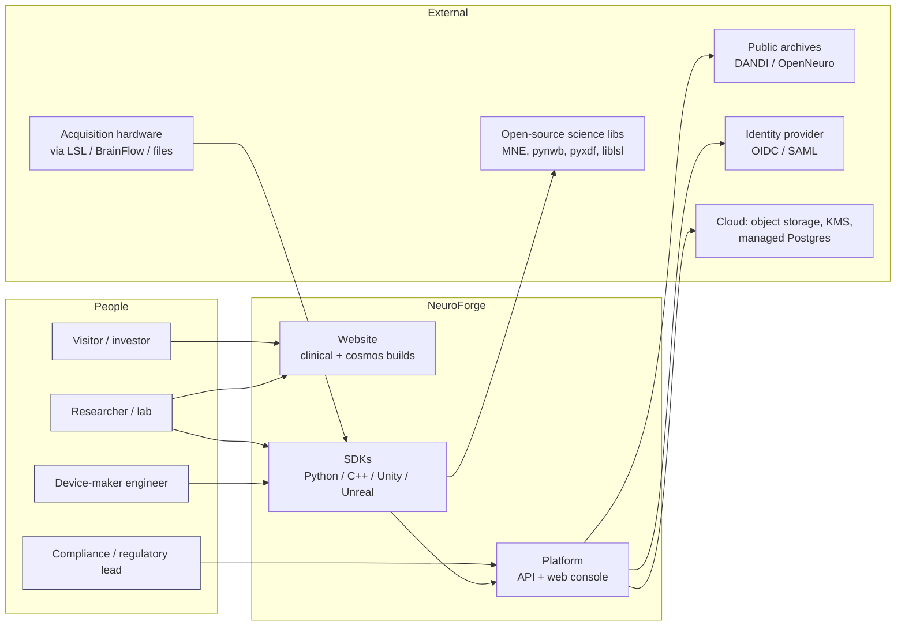

# NeuroForge: enterprise architecture blueprint

Status: **DRAFT for GATE B**. Written 2026-09-26 by the code architect (STEP 3 of `BRIEF.md`). Nothing described here is built. Every component is **designed**, **planned** or **roadmap**.

Companion documents: `BUILD-GUIDE.md` (numbered build steps) and `DECISIONS.md` (owner decisions for GATE B).

**Evidence convention.** Market and legal facts cite the files in `market\` (which carry their own primary sources and grades). Technology facts cite the documentation pages opened for this blueprint (listed in §14). Numbers that are not sourced are labelled **ESTIMATE** with the method. Design choices are opinions and are marked as recommendations. No benchmarks were run. Performance figures below are **targets**, not measurements.

---

## 0. Summary

- **One codebase, two themes.** A static-first website (Astro, TypeScript). Every component, all content, and all logic are shared. The `clinical` (option 1) and `cosmos` (option 3) themes differ only in design tokens and **four presentational slots**. The theme is chosen **at build time, per deployment**. This means the clinical build never contains three.js. §2.
- **Platform = a provenance graph with services around it.** The market research concludes that consent (new-ideas #1), FDA evidence (#2) and reproducibility (#4) "are views over" a single lineage graph over neural data, pipelines and models (`market\new-ideas.md`, closing paragraph). The architecture is built around that graph. §3.
- **Boring, portable storage.** PostgreSQL holds metadata, the provenance graph, and the consent ledger. Chunked Zarr v3 arrays on S3-compatible object storage hold signals. A dedicated time-series database is **not** in v1, because `market\validation.md` #7 found low-latency storage is a commodity and not a differentiator. §6.
- **One shared core for all SDKs.** A Rust crate (`nf-core`) is exposed to Python through PyO3/maturin and to C++, Unity and Unreal through a C ABI. File-format parsing stays in the existing open-source readers (MNE, pynwb, pyxdf, liblsl), which we integrate rather than rewrite. §5.
- **Compliance as data, not prose.** Per-channel jurisdiction classification, a hash-chained consent ledger, deletion propagation through the graph into trained models, per-subject crypto-shredding, and EU AI Act use restrictions on models. §8.
- **Positioning in the architecture follows the research.** The product is "reproducible, comparable pipelines + neural-data governance", not "automated cleaning" (`BRIEF.md` GATE A copy fix; `market\validation.md` #5). The final wording is in `DECISIONS.md` D1.

---

## 1. System context (C4 level 1)



**Actors and what they need**

| Actor | Primary need | Where it is served |
|---|---|---|
| Researcher / lab | Import BIDS/NWB/EDF/XDF, run versioned pipelines, cite exact provenance, publish to DANDI/OpenNeuro | Python SDK, console, API |
| Device-maker engineer | Stream from their hardware, pin pipeline versions, get timing and reproducibility evidence | C++/Python SDK, streaming API |
| Compliance / regulatory lead | Per-state classification, consent records, deletion certificates, FDA documentation exports | Console, ledger API, exports |
| Visitor / investor | Understand the product honestly; read the whitepaper | Website (either theme) |

**Out of scope (by design).** Diagnosis, treatment recommendation, and closed-loop control of stimulation. The platform is designed to stay a **non-device software function** (`market\regulation.md` §4, a planning assumption, not legal advice). Any model output used in a clinical or assistive BCI becomes the customer's device software. We then supply documented SOUP/OTS components (§8.6).

---

## 2. Website

### 2.1 Framework: Astro + TypeScript (recommended)

| Option | Fit | Verdict |
|---|---|---|
| **Astro** (static output, islands) | Pages are mostly static text. The interactive parts are small: EEG canvas, three.js hero, whitepaper figures, audience tabs. Astro renders "the majority of your page to fast, static HTML with smaller 'islands' of JavaScript added when interactivity is needed". Directives such as `client:visible` and `client:idle` control when each island's JS loads (docs.astro.build/en/concepts/islands, opened 2026-09-26). This matches the per-theme lazy-loading requirement exactly | **Recommended** |
| Next.js (React, SSR/SSG) | Capable, but ships a React runtime on every page and adds more machinery than a marketing site plus whitepaper needs | Not chosen for the site. The **console** (§3.8) can use React |
| Plain HTML (as the design options are) | No duplication control: two themes would mean two HTML files, which breaks "don't write software twice" | Rejected |

Islands are written in plain TypeScript (canvas and three.js need no UI framework). Content is MDX plus typed JSON (Astro content collections), so copy lives in one place.

### 2.2 Theming architecture: "one site, two skins"

**Rule:** a theme is *data plus a small number of presentational slot implementations*. A theme may not contain copy, routes, layout logic, data fetching, or analytics.

```
packages/
  content/            # ALL copy: MDX + JSON (hero, pipeline, audience, compliance, pricing, research, footer)
    brand.json        # SINGLE brand token: { "name": "NeuroForge", "legalName": "...", "domain": "..." }
  ui/                 # ALL components (Nav, Hero, PipelineSteps, AudienceTabs, ComplianceGrid,
                      #   PricingTeaser, ResearchCards, Figure, Footer), styled ONLY via semantic tokens
  themes/
    contract.ts       # the SlotContract type + the list of required semantic tokens
    clinical/
      tokens.css      # [data-theme="clinical"] { --color-bg: #F7F9FB; ... }
      slots/HeroVisual.ts          # canvas 10-20 EEG montage (from option-1 / assets/asset-1)
      slots/BrandMark.astro
      slots/SectionOrnament.astro  # hairline grid rules
      slots/SecurityVisual.astro   # spec-sheet table ornament
    cosmos/
      tokens.css      # [data-theme="cosmos"] { --color-bg: #05010F; ... }
      slots/HeroVisual.ts          # three.js point-cloud brain + SVG fallback (from option-3 / asset-3)
      slots/BrandMark.astro
      slots/SectionOrnament.astro  # glass + gradient glow
      slots/SecurityVisual.astro   # "vault" SVG
apps/web/             # routes + page composition; imports ui + content + ONE theme (resolved at build)
```

**Brand token (one-line rename).** The company name lives only in `packages/content/brand.json`. The site, console, docs, OpenAPI `info.title`, email templates and page `<title>`s all read it through `brand.name` (content uses a `{brand}` placeholder). A CI test fails if the literal name appears anywhere else in `apps/`, `packages/` or `openapi/`. Identifiers that cannot be read from a config file at runtime (the PyPI/import name `neuroforge`, the gRPC package `neuroforge.*`, repo names) are fixed only after the clash check in `market\names.md` is clean. They are listed in `brand.json` under `codeIdentifiers` so a rename has a checklist.

**Semantic tokens (the contract).** Components reference only these, never raw colours. Values are taken from the two design files: `design\option-1.html` `:root` and `design\option-3.html` `:root`.

| Token | clinical (option 1) | cosmos (option 3) |
|---|---|---|
| `--color-bg` | `#F7F9FB` | `#05010F` |
| `--color-surface` | `#FFFFFF` | `rgba(255,255,255,.04)` (glass) |
| `--color-ink` | `#0B2540` | `#EDE9FE` |
| `--color-muted` | `#4A5B6E` | `#A5A0C0` |
| `--color-accent` | `#0E7C86` | `#8B5CF6` |
| `--color-accent-ink` (text-safe accent) | `#0A5F67` | `#B79CFF` |
| `--color-secondary` | `#5B8DEF` | `#22D3EE` |
| `--color-line` | `#DDE4EC` | `rgba(255,255,255,.08)` |
| `--emphasis-paint` (how `<em>` in headings renders) | accent-coloured italic | `linear-gradient(100deg,#B79CFF,#22D3EE,#F472B6)` text fill |
| `--font-display` / `--font-body` | IBM Plex Sans / IBM Plex Sans | Space Grotesk / Inter |
| `--font-mono` | IBM Plex Mono | (Inter fallback; add a mono font; see D9) |
| `--radius-card` | `6px` | `20px` |
| `--motion-duration`, `--motion-ease` | short, linear (calm) | longer, eased (reveal animations) |
| `--elevation-card` | hairline border | glass blur + border |

The two themes reuse the same heading copy. A heading marks its emphasised part semantically (`The data layer for <em>brain-computer interfaces.</em>`), and each theme paints `<em>` through `--emphasis-paint`. That one device covers most of the visual difference between the two designs' headings without forking copy.

**Presentational slots (the only theme-specific code).** Four slots, all with the same TypeScript props (`SlotContract`), all receiving any text (aria-labels, captions) from `packages/content`:

| Slot | clinical | cosmos | Loading |
|---|---|---|---|
| `HeroVisual` | 2D canvas EEG montage with synthetic traces (~vanilla TS) | three.js point cloud. Static SVG fallback when WebGL is missing, `prefers-reduced-motion` is set, Save-Data is on, or the device is low-memory | clinical: `client:idle`; cosmos: `client:visible` + dynamic `import()` of three.js |
| `BrandMark` | monochrome mark | gradient mark | static |
| `SectionOrnament` | hairline rules / numbered 01–04 | glow backgrounds / orbit lines | static CSS/SVG |
| `SecurityVisual` | spec-table styling | vault SVG | static SVG |

**Adding a fifth slot needs architect sign-off.** Each slot is a place where the themes can drift apart, so the slot budget is enforced by a test that counts the files under `themes/*/slots/`.

**Content differences found in the two designs.** The designs used different section headings, for example "One pipeline, from electrode to model." (option 1) vs "From electrode to model, in one orbit." (option 3). The recommendation is a single heading set. An optional `voice.json` override of at most 10 strings per theme is allowed only if the owner wants it (`DECISIONS.md` D8), and it passes the same copy lint.

### 2.3 How the theme is chosen: recommendation = **per deployment, at build time**

| Approach | Pros | Cons |
|---|---|---|
| **A. Build-time, per deployment/domain** (`THEME=clinical pnpm build` → `dist/clinical`; `THEME=cosmos` → `dist/cosmos`) | The unused theme's slots are tree-shaken out, so **the clinical bundle contains no three.js at all**, and a CI check can prove it. Each build is static HTML that is fully crawlable. There is no flash of the wrong theme. The QA matrix is two fixed builds | Two deploy targets. Visitors cannot switch theme. SEO needs a canonical decision (below) |
| B. Runtime toggle (one build; `data-theme` attribute switched by the user and remembered) | One URL; visitors pick a theme | Both token sets ship (small), and three.js must still be dynamically imported on switch. It needs care to avoid a flash of the wrong theme before the attribute is set. QA must test both themes on every page in one deployment. It raises the question of which theme search engines see |
| C. Both | Maximum flexibility | Highest QA cost for little buyer value |

**Recommended: A.**
- Deploy **clinical as the canonical public site** on the primary domain. The paying buyers are regulated (clinical-stage device makers and CNS pharma make up about 70–80% of the SAM range, `market\sizing.md` §4), which suits the calm, auditable look.
- Deploy **cosmos** on a secondary host, for example a subdomain used for investor decks, conferences and campaigns. Its pages carry `<link rel="canonical">` pointing at the clinical URL of the same page, so search engines do not see duplicate content.
- Because tokens are scoped by `[data-theme]`, a runtime toggle (B) can be added later **without refactoring**. It stays out of v1.
- Which theme is primary is the owner's call: `DECISIONS.md` D3.

**Performance budgets (targets, to be enforced in CI; not measured).**
- Clinical: total JS on the home page ≤ 60 KB gzip (**ESTIMATE**: a canvas island plus the tab and nav scripts).
- Cosmos: initial JS before the hero enters view ≤ 60 KB gzip. three.js loads only after the hero is visible and WebGL is available. The design team estimated three.js at "~600 KB from CDN" (`design\options.md`, option 3 cons; not re-measured here).
- **Self-host three.js from the npm package at the pinned version** that option 3 uses (`three@0.160.0`, `design\option-3.html` line 673) rather than loading it from jsDelivr at runtime. This lets a strict Content-Security-Policy allow `script-src 'self'` and removes a third-party runtime dependency.

### 2.4 Pages and information architecture

`/` (home, same sections as the designs) · `/platform` · `/governance` (consent ledger, state-law map, with a not-legal-advice banner) · `/sdks` · `/research` (index) · `/research/[slug]` (whitepaper) · `/pricing` (teaser; no final prices until pricing is validated in discovery) · `/security` · `/law-tracker` (lead magnet, `market\pricing-and-gtm.md` §4) · `/docs` (redirects to docs site, M4) · `/legal/*`.

Early-access form: a static form posting to an API endpoint (`POST /v1/public/early-access`) that stores the email with double opt-in. The endpoint arrives in M4 (BUILD-GUIDE step 4.7). Until then, the form is shown disabled ("early-access list opens soon"), because collecting emails needs a privacy policy first. **No third-party form or analytics scripts in v1** (privacy posture; see D9).

### 2.5 Whitepaper page with interactive figures

- **Source of truth.** Each whitepaper is MDX under `packages/content/research/<slug>/`. Figures are **not** hand-drawn. They render from the result files produced by the research code, for example `research\somatosensory\code\results\p1_grip_latency.json` and `p4_pooling_capacity.json`, which already exist in the repo alongside SVG exports in `code\figures\`.
- **Figure manifest.** `figures.json` per paper lists each figure's result file, its SHA-256, the generating script and its commit, and the status (verified / preliminary). The build **fails** if a result file's hash does not match the manifest, so a published figure can always be traced to the exact code and data. This is the same provenance idea as the platform, applied to our own science: it doubles as a product demo.
- **Figure islands** (`packages/figures`): small TypeScript + SVG components (line/heatmap/scatter with hover readouts and keyboard access). They are theme-aware only through tokens. Each has a static SVG fallback (the existing `figures\*.svg`) rendered server-side for no-JS readers, print and crawlers.
- **Required on every whitepaper page:** status label ("In preparation" / "Preprint" / "Planned"), evidence grades per claim, the banner "Computational/theoretical work; any clinical application requires IRB/FDA oversight" (`design\CONTENT-SPEC.md`), and a citation block (BibTeX + DOI once one exists).
- **Downloads:** PDF generated from the same MDX (print stylesheet), plus a "reproduce this figure" link to the script and result file.

### 2.6 Copy fixes the website build must apply (binding)

From `BRIEF.md` (GATE A) and `market\validation.md`:

1. Status labels use **designed / planned / roadmap / in preparation**. Never "built-in", "live", "available now", or "certified". A copy-lint test enforces this (§10). Negations such as "not a live product" are allowlisted.
2. Replace "automated neuro-cleaning" in the hero sub-line and pipeline step 2 with reproducible, comparable pipelines. Proposed step-2 text: "Versioned preprocessing pipelines with full provenance. Run one, or run a grid of them and see how your results move." (grounded in Kessler 2025 and Huang 2025, `market\landscape.md` §3).
3. Research card "Benchmarking automated artifact rejection on public EEG datasets" → "How preprocessing choices change decoding results: a multiverse analysis on public EEG" (status: Planned).
4. Neuro-AI step: "Model marketplace" → "Governed model registry (roadmap): versioned models with provenance, documented intended use and use restrictions". Remove "Benchmarked on public datasets" unless a benchmark exists; use "benchmarks will be published with methods".
5. Illustrative code snippet: show the pinned pipeline version and the provenance handle, not an "ica-default" auto-clean:
   ```python
   import neuroforge as nf            # Illustrative API, subject to change
   rec = nf.open("sub-01_task-motor_eeg.edf")
   run = nf.pipelines.get("eeg-basic@1.2.0").run(rec)
   print(run.provenance.id)          # every parameter, version and input hash
   ```
6. Compliance wording exactly as `design\CONTENT-SPEC.md` (for example, "BAA available for enterprise (planned)", "SOC 2 Type II: on roadmap"). No certification claims.
7. No medical claims (treat/diagnose/restore/cure), no invented customers or numbers. Demo data is labelled "demo data".
8. The company name "NeuroForge" (owner decision, 2026-09-26; trademark/domain clash check pending in `market\names.md`) is read from the brand token (§2.2). It is never typed into copy or components.

### 2.7 Accessibility and quality bar (carried over from `design\CONTENT-SPEC.md`)

Supports widths from 360 px to 1440 px or more, with no horizontal scroll. Semantic landmarks, a skip link, visible focus and WCAG AA contrast in **both** themes. The cosmos theme's glass-on-dark cards must be re-checked for contrast. Every canvas or WebGL visual has `role="img"` and a content-supplied `aria-label`. `prefers-reduced-motion` stops the animations.

---

## 3. Platform

### 3.1 Container view (C4 level 2)

```mermaid
flowchart TB
  subgraph Edge[Customer edge / lab PC]
    SDKp[Python SDK\n(nf-core via PyO3)]
    SDKc[C++ / Unity / Unreal SDK\n(nf-core via C ABI)]
    LSL[LSL / BrainFlow sources]
    LSL --> SDKp
    LSL --> SDKc
  end
  subgraph Cloud[NeuroForge platform]
    GW[API gateway\nREST + gRPC, authN, rate limits]
    API[Control-plane API\nPython / FastAPI]
    ING[Ingest service\nfile + stream]
    PIPE[Pipeline workers\ncontainerised steps]
    LEDGER[Governance service\nclassification, consent, deletion]
    REG[Model registry]
    PG[(PostgreSQL\nmetadata, provenance graph,\nconsent ledger, job queue)]
    OBJ[(Object storage\nZarr v3 chunks, raw uploads,\nartifacts, model weights)]
    KMS[(KMS\ntenant + subject keys)]
    AUD[(Audit log\nappend-only, WORM bucket)]
    CON[Web console\nReact]
  end
  SDKp -->|HTTPS / gRPC| GW
  SDKc -->|gRPC| GW
  CON --> GW
  GW --> API
  GW --> ING
  API --> PG
  ING --> OBJ
  ING --> PG
  API --> PIPE
  PIPE --> OBJ
  PIPE --> PG
  API --> LEDGER
  LEDGER --> PG
  LEDGER --> KMS
  API --> REG
  REG --> OBJ
  API --> AUD
  LEDGER --> AUD
```

**Service count is deliberately small.** v1 runs the API, ingest, governance and registry as **modules in one Python deployable** (a modular monolith), plus a separate **worker** deployable for pipelines. Module boundaries are enforced in code (import-linter), so any module can be split out later if load requires it. This is a cost and complexity choice for a small team.

### 3.2 Canonical data model (shared by server and SDKs)

```
Tenant ─< Project ─< Dataset ─< Subject ─< Session ─< Recording ─< Channel
                                         Recording ─< Segment (time range) ─> ZarrArray (chunks in object storage)
Artifact (any derived file / feature set)   Model (registry entry)
Run (one execution of a PipelineVersion)    PipelineVersion (content-addressed spec)
ConsentRecord (versioned, per Subject)      Classification (per Channel and per Artifact, per jurisdiction)
```

Channel carries the governance attributes that classification needs: `modality` (EEG/ECoG/LFP/spikes/EMG/…), `nervous_system` (`central` | `peripheral` | `unknown`), `derived_from_non_neural` (bool), `sampling_rate`, `units`, and `device_ref`. These three fields exist because the state definitions differ on exactly these points: CO and CA cover central **or peripheral**; CT covers the **central** nervous system only; CA excludes data "inferred from non-neural information" (`market\regulation.md` §1).

### 3.3 Ingest (BIDS, LSL, EDF/BDF, NWB, XDF)

**Principle: wrap the maintained open-source readers; do not write new parsers.** `market\landscape.md` §4 recommends integrating with MNE, BIDS and NWB rather than competing with them.

| Format | Reader (integrated, not rewritten) | Notes |
|---|---|---|
| BIDS (EEG/iEEG/MEG) | `mne-bids` + `bids-validator` | BIDS EEG allows EDF, BrainVision, EEGLAB `.set` and BDF; the spec recommends EDF or BrainVision (bids-specification, EEG page, opened 2026-09-26). The BIDS sidecars supply subject/session/task metadata |
| EDF/EDF+, BDF/BDF+ | MNE readers | |
| NWB (HDF5 or Zarr) | `pynwb`; `hdmf-zarr` for Zarr-backed NWB. hdmf-zarr "implements a Zarr backend for HDMF as well as convenience classes for integration of Zarr with PyNWB" (github.com/hdmf-dev/hdmf-zarr, opened) | Zarr-backed NWB lines up with our storage layout |
| XDF | `pyxdf`: "a Python importer for XDF files", BSD-2-Clause (github.com/xdf-modules/pyxdf, opened) | Multi-stream, clock offsets kept |
| LSL (live) | `liblsl` via the SDK | LSL is LAN-scoped with no persistence (`market\landscape.md` §2). The SDK is the bridge that persists and uploads |

**File ingest flow**
1. The SDK or console requests an upload session: `POST /v1/datasets/{id}/uploads` returns pre-signed multipart URLs.
2. The raw file goes to `raw/` in object storage, encrypted with the tenant key. Its SHA-256 is computed client-side (nf-core) **and** server-side, and they must match.
3. An ingest worker validates it (BIDS validator, NWB inspector where applicable) and extracts metadata into Postgres. It converts signals to the canonical **Zarr v3** layout (chunked by time × channel) and writes the provenance record: `raw file --(activity: convert@version)--> recording`.
4. The classification engine (§8.2) labels every channel. If consent is missing and the tenant policy requires it, the recording is **quarantined** and cannot be processed or exported.

**Stream ingest flow (LSL/BrainFlow → cloud)**
- The SDK reads LSL locally, timestamps with LSL clock-offset data, buffers to a local write-ahead file (so a network drop does not lose data), and sends chunks over a **gRPC client-stream** (`IngestService.StreamChunks`) with sequence numbers and per-chunk hashes.
- The server appends chunks to the Zarr array and acknowledges them. It is idempotent on `(stream_id, seq)`.
- **Real-time decoding does not round-trip through the cloud.** Closed-loop latency belongs at the edge (the SDK runs pinned pipeline steps locally through nf-core/Python). Cloud streaming is for persistence, monitoring and later analysis. This is the honest design, given that LSL already handles LAN real-time for free (`market\validation.md` #7).

**Data volume (ESTIMATE, arithmetic).**
- 64-channel EEG at 1 kHz, float32: 64 × 1,000 × 4 B = 256 KB/s ≈ **0.92 GB per recording hour**.
- 1,024-channel array at 30 kHz, int16: 1,024 × 30,000 × 2 B ≈ 61 MB/s ≈ **221 GB per hour**.

Both are uncompressed. The second shows why raw signals go to object storage and not to a relational or time-series database.

### 3.4 Time-series storage

- **Analysis store:** Zarr v3 arrays in object storage, one array per recording (plus multiscale downsampled pyramids for fast viewing). Chunk size **ESTIMATE**: 1–10 s × 64 channels. It is tuned in M2 against real access patterns.
- **Why not a TSDB for raw signals.** Neural recordings are dense, regularly sampled arrays with thousands of samples per second per channel. They are read as windows for analysis, not queried as sparse labelled points. Chunked arrays fit that access pattern, work with the Python science stack (xarray, dask, NWB-Zarr), and cost object-storage prices: S3 Standard is $0.023/GB-month for the first 50 TB in us-east-1 (aws.amazon.com/s3/pricing, opened), and Cloudflare R2 Standard is $0.015/GB-month with free egress (developers.cloudflare.com/r2/pricing, opened).
- **Hot buffer for live views:** the last N minutes of each live stream are held in worker memory and served over a server-streaming gRPC/WebSocket endpoint. No separate database.
- **Low-rate derived metrics** (band power per minute, device telemetry, QC scores) go in a partitioned Postgres table. If volume later needs it, TimescaleDB is the upgrade path. Licensing caveat: code in its `tsl` directory is under the Timescale License, not Apache-2.0 (github.com/timescale/timescaledb LICENSE, opened), which matters if we ever offer it as a service. That upgrade is **roadmap**, not v1.

### 3.5 Pipeline engine: versioned, reproducible runs with provenance

**What "reproducible" means here (testable definition).** Given the same `PipelineVersion` digest, the same input content hashes, the same container image digest, and the same seed, a run produces **byte-identical outputs** on the same platform class. It produces numerically equivalent outputs within a declared tolerance across CPU architectures. Each step declares which of these two guarantees it offers.

- **PipelineVersion** is a YAML/JSON spec: ordered steps, each with `image@sha256:…`, entrypoint, parameters and declared tolerance. It is canonicalised and hashed (nf-core), and its hash is its ID (`eeg-basic@1.2.0` resolves to a digest). Published versions are immutable.
- **Steps** are thin, tested wrappers around MNE and friends (filter, re-reference, resample, ICA, epoching, bad-channel detection, feature extraction). Every parameter is explicit, and defaults are written into the run record rather than left implicit. This responds to the finding that preprocessing choices change results (Kessler 2025; Huang 2025 "no single best pipeline", `market\landscape.md` §3).
- **Multiverse runs** (new-ideas #4): a `Sweep` expands a parameter grid into N runs. A report compares downstream metrics across runs, showing, for example, how decoding accuracy shifts with high-pass cutoff. This is the reproducibility product, and it runs on the same engine.
- **Orchestration (v1):** a Postgres-backed job queue (`SELECT … FOR UPDATE SKIP LOCKED`) feeding container workers. It has fewer moving parts than adopting a workflow platform on day one. Upgrade path: Argo Workflows or Temporal when multi-day DAGs or cross-region workers arrive (roadmap; not evaluated in depth here).
- **Determinism controls:** pinned image digests; BLAS thread count pinned; seeds recorded; floating-point tolerance tests in CI (§10).
- **Every run writes provenance** (§3.6) before its outputs become visible. That makes provenance a precondition, not a best-effort log.

### 3.6 Provenance graph

- **Model:** W3C PROV. "Provenance is information about entities, activities, and people involved in producing a piece of data or thing"; PROV became a W3C Recommendation on 30 Apr 2013 (w3.org/TR/prov-overview, opened). Entities are files, recordings, artifacts and models. Activities are ingest, runs and training. Agents are users, service accounts and pipeline versions.
- **Interop:** emit **OpenLineage** events, "an open framework for data lineage collection and analysis" built around datasets, jobs and runs (openlineage.io/docs, opened), so customers' existing lineage tools can consume ours. Export PROV-JSON for regulators and papers.
- **Storage:** two Postgres tables (`prov_node`, `prov_edge`) with typed edges (`wasGeneratedBy`, `used`, `wasDerivedFrom`, `wasAttributedTo`), queried with recursive CTEs. **No graph database in v1.** The queries we need (all descendants of a subject's raw data; the full ancestry of a model) are bounded traversals that Postgres handles. Revisit this only if a measured traversal exceeds its latency target.
- **Integrity:** every node carries a content hash. Every provenance batch is appended to a hash chain (each batch hash includes the previous one) and periodically signed, so tampering is detectable. The same mechanism backs the audit log and the consent ledger.

### 3.7 Model registry (the market's "marketplace", reframed)

`market\validation.md` #6 rates a paid marketplace **WEAK** and advises deferring it. If built, it should be a **governed registry**. Design:

- `Model` = weights artifact + model card + training provenance (training-set manifest of hashed subject IDs, pipeline versions, code commit) + `intended_use` + `use_restrictions`.
- **Use restrictions** are machine-checkable. For example, `eu_ai_act_5_1_f` blocks deployment tokens for workplace/education contexts, because Art. 5(1)(f) bans emotion inference there except for medical or safety reasons (`market\regulation.md` §5). Deployment requests must declare a context, and the registry refuses combinations that are prohibited.
- **Consent taint:** if any training subject withdraws consent, the model is flagged `retrain_required` (§8.4).
- **SOUP pack:** the registry exports a SOUP/OTS disclosure (versions, known anomalies, test evidence) for customers whose product is a device (§8.6).
- **Third-party models** (a real marketplace) are roadmap and gated on customer pull (M6 in the build guide).

### 3.8 Web console

A React + TypeScript single-page app (a separate app from the marketing site) for datasets, runs, provenance explorer, consent ledger and exports. It **reuses the website's semantic tokens** (the clinical theme by default), so the product and the site feel related without sharing marketing components.

---

## 4. Public API

### 4.1 Styles

| Surface | Use | Why |
|---|---|---|
| **REST/JSON (OpenAPI 3.1)** | All control-plane resources | Universal; generates docs and the TS client |
| **gRPC** | Streaming ingest, bulk chunk reads, SDK-to-server hot paths | Binary, streaming, the same `.proto` for Python/C++/Unity/Unreal |
| **Server-sent events** | Run status and ledger events for the console | Simple, one-way, works through proxies |
| **Webhooks** (signed) | Consent withdrawn, run finished, model tainted | Customer integrations |

### 4.2 Auth

- **Humans:** OIDC/SAML SSO through an identity provider (managed IdP or self-hosted Keycloak; decided in D4). MFA is required for admin roles.
- **Machines:** OAuth2 client-credentials for services. Scoped, expiring **API keys** for SDK users, stored hashed. **Device tokens** bound to a device ID for edge SDKs, with optional mTLS for enterprise.
- **Authorization:** RBAC roles (`owner`, `admin`, `data-steward`, `scientist`, `viewer`, `auditor`, `device`) plus attribute checks on classification (for example, `scientist` cannot export raw data classified `sensitive:CO` without a consent-scope match). Postgres **row-level security** enforces tenant isolation at the database layer. RLS lets tables "restrict, on a per-user basis, which rows can be returned by normal queries or inserted, updated, or deleted" (postgresql.org/docs/current/ddl-rowsecurity, opened). App-level checks remain the first line of defence.

### 4.3 Versioning and deprecation

- URI major version (`/v1`). Only additive changes within a major version. Deprecations are announced with `Deprecation` and `Sunset` response headers and a changelog. The minimum support window after deprecation is 12 months (**recommendation**).
- gRPC packages are versioned (`neuroforge.ingest.v1`). Breaking changes create `v2` alongside `v1`.
- API and SDK versions are decoupled. SDKs declare the API range they support.

### 4.4 OpenAPI outline (abridged)

```yaml
openapi: 3.1.0
info: { title: NeuroForge API, version: 1.0.0-draft }
servers: [{ url: https://api.example.invalid/v1 }]
security: [{ oidc: [] }, { apiKey: [] }]
paths:
  /projects:                         { get: listProjects, post: createProject }
  /projects/{projectId}/datasets:    { get: listDatasets, post: createDataset }
  /datasets/{datasetId}:             { get: getDataset, patch: updateDataset, delete: deleteDataset }
  /datasets/{datasetId}/uploads:     { post: createUploadSession }         # pre-signed multipart
  /uploads/{uploadId}/complete:      { post: completeUpload }              # triggers ingest
  /datasets/{datasetId}/validate:    { post: validateDataset }             # BIDS / NWB checks
  /recordings/{recordingId}:         { get: getRecording }
  /recordings/{recordingId}/channels:{ get: listChannels }
  /recordings/{recordingId}/data:    { get: readWindow }                   # ?start&end&channels&level
  /streams:                          { post: openStream }                  # returns gRPC endpoint + token
  /pipelines:                        { get: listPipelines, post: publishPipelineVersion }
  /pipelines/{name}/versions/{ver}:  { get: getPipelineVersion }           # immutable, digest-addressed
  /runs:                             { post: startRun, get: listRuns }
  /runs/{runId}:                     { get: getRun, delete: cancelRun }
  /sweeps:                           { post: startSweep }                  # multiverse grid
  /sweeps/{sweepId}/report:          { get: getSweepReport }
  /provenance/{nodeId}:              { get: getNode }
  /provenance/{nodeId}/lineage:      { get: getLineage }                   # ?direction=up|down&depth
  /provenance/{nodeId}/export:       { get: exportProv }                   # ?format=prov-json|openlineage
  /subjects/{subjectId}/consents:    { get: listConsents, post: recordConsent }
  /subjects/{subjectId}/withdrawals: { post: withdrawConsent }             # starts deletion propagation
  /deletion-jobs/{jobId}:            { get: getDeletionJob }               # status + certificate link
  /classifications:                  { get: queryClassifications }         # ?jurisdiction=CO|CA|CT|MT|EU
  /jurisdiction-rules:               { get: listRuleSets }                 # versioned, with review status
  /models:                           { get: listModels, post: registerModel }
  /models/{modelId}/versions/{ver}:  { get: getModelVersion }
  /models/{modelId}/deployments:     { post: requestDeployment }           # checked vs use_restrictions
  /audit-events:                     { get: listAuditEvents }              # auditor role only
  /exports/fda-evidence:             { post: buildEvidencePackage }        # roadmap (M5+)
  /webhooks:                         { get: listWebhooks, post: createWebhook }
  /public/early-access:              { post: joinEarlyAccess }             # website form, no auth, rate-limited
components:
  securitySchemes:
    oidc:   { type: openIdConnect, openIdConnectUrl: https://id.example.invalid/.well-known/openid-configuration }
    apiKey: { type: apiKey, in: header, name: Authorization }
  schemas: [Project, Dataset, Subject, Session, Recording, Channel, PipelineVersion, Run, Sweep,
            ProvNode, ProvEdge, ConsentRecord, Withdrawal, DeletionJob, Classification, RuleSet,
            Model, ModelVersion, UseRestriction, AuditEvent, Problem]   # errors: RFC 9457 problem+json
```

gRPC services (`.proto`, abridged): `IngestService.StreamChunks(stream Chunk) returns (Ack)`, `DataService.ReadWindow(WindowRequest) returns (stream Chunk)`, `RunService.WatchRun(RunId) returns (stream RunEvent)`.

---

## 5. SDKs: one shared core

```
core/nf-core (Rust crate)  — the ONLY place shared SDK logic lives
  ├─ data model types (Recording, Channel, Segment, ProvRecord) + serde
  ├─ canonical JSON + hashing (content IDs for pipelines, chunks, provenance)
  ├─ Zarr chunk read/write + local cache
  ├─ gRPC/HTTP client, auth token handling, retry + write-ahead buffer for streams
  ├─ LSL bridge (links liblsl C library)
  └─ local provenance recorder (works offline, syncs later)
bindings/
  python  — PyO3 + maturin wheel  → `neuroforge` on PyPI (Python-facing API is idiomatic, thin)
  c       — `extern "C"` ABI + generated header (cbindgen)  → stable C ABI
sdk/
  cpp     — header-only C++17 RAII wrapper over the C ABI
  unity   — C# package calling the C ABI via P/Invoke (Unity native plug-ins)
  unreal  — UE plugin module linking the C ABI
```

**Why Rust for the core.**
- One implementation of the hashing, protocol, buffering and provenance rules. If those drift between languages, reproducibility breaks.
- Memory safety for code that parses network input on customer machines.
- First-class Python packaging: PyO3 provides "Rust bindings for Python, including tools for creating native Python extension modules", and maturin builds and publishes such packages (pyo3.rs, opened).
- A C ABI reaches C++, Unity and Unreal. Unity native plug-ins are "libraries of unmanaged code written in languages such as C, C++" that C# calls (docs.unity3d.com/Manual/plug-ins-native.html, opened).
- **Alternative: C++ core with pybind11.** Viable, and it matches liblsl and BrainFlow. It was not chosen because of the safety argument and simpler cross-compiling with cargo. Owner decision D7 if the team's C++ depth is much greater than its Rust depth.

**What the core does *not* do:** signal-processing algorithms. Those stay in the Python/MNE step library (server and Python SDK). Rewriting MNE in Rust would contradict "integrate, don't compete" (`market\landscape.md` §4). C++/Unity users run pipelines server-side or through a pinned local Python runtime (roadmap).

**Order.** Python first; C++ next. Unity/Unreal only on customer pull, because `market\validation.md` #10 found no evidence of Unity/Unreal demand.

**Build note for this machine.** Rust builds need `CARGO_BUILD_JOBS=1` here (`BRIEF.md`). CI builds wheels on hosted runners, not on the owner's PC.

---

## 6. Databases and storage: products and reasons

| Store | Product (recommended) | Holds | Why this, not something else |
|---|---|---|---|
| Relational metadata | **PostgreSQL 16+** (managed: AWS RDS/Aurora or equivalent; self-host for on-prem) | Tenants, projects, datasets, channels, runs, registry, job queue | Mature, portable, RLS for tenancy, JSONB for heterogeneous metadata. One engine to operate |
| Provenance graph | **Same PostgreSQL** (`prov_node`/`prov_edge` + recursive CTE) | Lineage | Queries are bounded traversals. No second database to secure and back up. Graph DB only if measured need (§3.6) |
| Consent ledger | **Same PostgreSQL**, append-only table + hash chain; periodic anchor of the chain head into the WORM audit bucket | Consent versions, withdrawals, deletion jobs | Ledger integrity comes from the hash chain, not from a blockchain. No blockchain: nothing in the requirements needs decentralised trust |
| Signals (time-series) | **Zarr v3 on S3-compatible object storage** | Raw-converted and processed arrays, pyramids | Array-shaped data, science-stack native, NWB-Zarr compatible, object-storage prices (§3.4) |
| Raw uploads, artifacts, model weights | **S3-compatible object storage** (S3 / R2 / MinIO on-prem) | Original files, outputs, weights, exports | The S3 API is the portability layer |
| Audit log | **Object storage with object lock (WORM)** + a queryable copy in Postgres | Security and data-access events | Tamper-evident retention separate from the app database |
| Low-rate metrics | Postgres partitioned table (TimescaleDB later, license caveat §3.4) | QC scores, telemetry | Avoid a TSDB until needed |
| Cache / rate-limit | None in v1 (Postgres + in-process). Redis/Valkey when measured load needs it | — | Fewer moving parts |

---

## 7. Infrastructure and deployment

**Cloud-agnostic where it is cheap; cloud-specific where it saves real work.**

| Layer | Portable choice | Cloud-specific (accepted) |
|---|---|---|
| Compute | OCI containers | Managed container service (e.g. AWS ECS Fargate); Kubernetes only when the team or customers need it (on-prem enterprise) |
| Database | PostgreSQL wire protocol | Managed Postgres (backups, PITR) |
| Objects | S3 API | Provider's KMS integration, object lock |
| Keys | Envelope encryption interface in code | Cloud KMS (AWS KMS or equivalent) |
| IaC | **OpenTofu/Terraform** modules | Provider modules |
| Identity | OIDC/SAML | Managed IdP |
| Telemetry | OpenTelemetry | Any backend |

- **Website:** static files on a CDN (Cloudflare Pages, Netlify or S3+CloudFront, all equivalent for static output). Two projects: `clinical` and `cosmos`. There are no servers to patch.
- **Platform environments:** `dev` (synthetic data only), `staging` (synthetic + public datasets), `prod`. **No real human neural data in dev or staging**, ever.
- **Regions:** one US region at launch. EU region planned (GDPR, `market\regulation.md` §5). Data residency is enforced per tenant at the storage-bucket level.
- **BAA path:** host PHI-bearing tenants only on services covered by the provider's BAA. AWS lists "175+" HIPAA-eligible services, including S3 (`market\regulation.md` §3). Whether other object stores (for example R2) offer a BAA was **not verified**, so PHI stays on BAA-covered services only. See D4.
- **CI/CD:** GitHub Actions (or equivalent). Stages: signed commits, lint/test, SBOM generation, container build with digest pinning, image signing, deploy to staging, smoke tests, manual promotion to prod.
- **Backups:** managed Postgres PITR; object versioning; quarterly restore drills. Deletion in backups is handled by crypto-shredding (§8.3).

---

## 8. Security and compliance

> Not legal advice. `market\regulation.md` is a research summary. Counsel must review the jurisdiction rules before any customer relies on them (the rules engine shows each rule's review status).

### 8.1 Baseline controls

- **Encryption:** TLS 1.3 in transit; AES-256 at rest through cloud KMS (envelope encryption). Key hierarchy: KMS root → tenant key → **per-subject data keys** for signal chunks and raw files.
- **Access:** RBAC + attribute checks (§4.2); least-privilege service roles; break-glass access is logged and alerts.
- **Audit:** every read or export of classified data, every consent change, every admin action and every deletion is written to the append-only audit log (§6). Auditors get a read-only role and an export.
- **Secure SDLC:** dependency scanning, SBOM (CycloneDX) per release, signed images, secrets in a manager (never in the repo), yearly external penetration test (roadmap, budget item).
- **Tenant isolation:** RLS plus per-tenant keys; single-tenant/VPC deployment for enterprise (roadmap).
- **Logging hygiene:** no signal data, subject identifiers or free-text notes in application logs. Log fields are allow-listed.

### 8.2 Jurisdiction classification engine (new-ideas #1; regulation.md §6 items 1, 3)

- A **RuleSet** is versioned data (YAML in the repo, loaded into Postgres) with, per jurisdiction: citation, effective date, definition predicate, obligations, and `review_status` (`draft` → `counsel-reviewed`).
- Initial predicates (from `market\regulation.md` §1; **draft, pending counsel review**):
  - **CO** (HB24-1058, effective 7 Aug 2024): `nervous_system in {central, peripheral}` and processable by a device → *sensitive data; opt-in consent*.
  - **CA** (SB 1223, Ch. 887): `nervous_system in {central, peripheral}` and `not derived_from_non_neural` → *sensitive personal information; right to limit use* (produces a `limit_use` flag).
  - **CT** (PA 25-113; CTDPA sections effective 1 Jul 2026): `nervous_system == central` → *sensitive data*.
  - **MT** (SB 163, 2025): **statute text not opened** (`market\regulation.md` open items) → the rule ships as `review_status: unverified`, and the console shows that it is unverified.
  - **EU** GDPR Art. 9 flag when health-revealing or used for unique identification; AI Act 5(1)(f) handled in the model registry (§3.7).
- Output: a `Classification` per channel **and per derived artifact**. Derived artifacts inherit the strictest label of their inputs unless a documented rule says otherwise. The engine never claims a channel is *not* regulated. It reports "not matched by rule set vN", which is weaker.
- The same engine powers the public `/law-tracker` page, from the same data.

### 8.3 Consent ledger

- `ConsentRecord` (append-only): subject pseudonym, consent document version + hash, scopes (collection, processing, sharing, model training, commercial use), jurisdiction basis, timestamp, collector identity, and evidence reference (for example, the signed-form object key).
- Each entry is hash-chained to the previous entry for that tenant. The chain head is anchored in the WORM audit bucket daily. Any edit is a new entry; nothing is updated in place.
- **Enforcement point:** every data read, pipeline run and training job checks consent scope through one policy function (a single code path, tested exhaustively). No scope means the job is denied, with a clear error.

### 8.4 Deletion propagation into derivatives and trained models (the lineage problem)

On `POST /subjects/{id}/withdrawals` a **DeletionJob** runs:

1. **Traverse** the provenance graph downward from every entity attributed to the subject: raw files → recordings → artifacts → aggregated datasets → models.
2. **Act per node type:**
   - Raw files, recordings and subject-only artifacts: delete the objects, then **destroy the subject's data key**. Crypto-shredding makes copies in backups unreadable without rewriting backups.
   - Aggregated artifacts mixing several subjects (for example, group averages): mark them `stale` and re-run the producing pipeline without the subject, or tombstone them, according to tenant policy.
   - **Trained models:** mark `retrain_required`, block new deployments (configurable), notify model owners by webhook, and record which versions contained the subject. The registry supports **sharded training (SISA)** as an opt-in training mode, so retraining after a withdrawal touches only the affected shard. SISA "strategically limits the influence of a data point in the training procedure" to speed up unlearning (Bourtoule et al., "Machine Unlearning", arXiv:1912.03817, opened; grade B/C, a method paper). **We do not claim certified unlearning.** The honest guarantee is "retrained without the subject; here is the provenance proof".
   - Exports already shared outside the platform: they cannot be recalled. The job lists them for the customer's follow-up.
3. **Certificate:** a signed deletion certificate (PDF + JSON) listing each affected node, the action taken, and the timestamps. This is the audit export promised in `market\new-ideas.md` #1.
4. **Target** (not measured): a deletion job completes within 24 h for a subject with ≤10k descendant nodes. This is an ESTIMATE of an acceptable SLA, to be validated with design partners.

### 8.5 HIPAA / BAA path

HIPAA binds covered entities and their business associates only. Many consumer or research neurotech customers are neither, which makes state privacy law their binding constraint (`market\regulation.md` §3). The plan:

1. v1 architecture already implements the Security Rule-style technical safeguards (access control, audit, integrity, transmission security) because they are good practice.
2. Before the first clinical customer: sign the cloud provider's BAA, restrict PHI tenants to BAA-covered services, write policies (risk analysis, incident response, workforce training), and offer our own BAA to customers. Counsel reviews all of it.
3. **SOC 2 Type II** is roadmap (budget item; D10). Website copy must keep saying "on roadmap" until a report exists.
4. HIPAA infrastructure is a commodity (`market\validation.md` #2). It is **table stakes, not the moat**.

### 8.6 FDA software documentation path

- **Product posture:** the platform is designed as a **non-device** data function: storage, conversion, audit, pipelines, with no diagnosis or treatment suggestion (`market\regulation.md` §4). Marketing copy must not undercut this (no medical claims).
- **Customer device path:** customers building implanted BCIs "should generally address the recommendations for an Enhanced Documentation Level" under the Jun 2023 premarket software guidance (`market\regulation.md` §4, FDA BCI guidance). We support them as a **supplier of documented OTS/SOUP components**:
  - versioned requirements and architecture docs per component;
  - a traceability matrix (requirement → test → result), generated from the test suite;
  - release notes with known anomalies;
  - an SBOM per release;
  - cybersecurity documentation. FDA's "Cybersecurity in Medical Devices: Quality Management System Considerations and Content of Premarket Submissions" was finalised Feb 2026 (fda.gov guidance page, opened). Its full text, including any SBOM expectations, was **not read** in this pass, so verify before building the export.
- **Development lifecycle:** for components we ever market as SOUP for devices (nf-core, the pipeline step library, the model registry export), follow an IEC 62304-style lifecycle (planning, requirements, architecture, verification, configuration management, problem resolution). *IEC 62304 was not opened in this pass. Treat this as a plan to verify with a regulatory consultant.* This is the **FDA Evidence Kit** product (new-ideas #2), and it is built from the same provenance graph.
- **Science safety:** the somatosensory research is computational only. Clinical work requires IRB and, where applicable, an FDA IDE (`BRIEF.md`; `market\regulation.md` §4).

### 8.7 Threat model highlights (STRIDE, abridged)

| Threat | Example | Control |
|---|---|---|
| Spoofing | Stolen API key streams fake data | Scoped expiring keys, device binding, mTLS option, anomaly alerts |
| Tampering | Edited provenance to hide a pipeline change | Hash chains, signed batches, immutable versions |
| Repudiation | "We never exported that" | WORM audit log |
| Information disclosure | Cross-tenant read via API bug | RLS + per-tenant keys + authz tests in CI |
| DoS | Upload flood | Rate limits, quotas, pre-signed uploads bypass the API |
| Elevation | Scientist exports raw sensitive data | Classification-aware policy function; exports need `data-steward` approval (configurable) |
| Supply chain | Compromised npm/PyPI dependency | Lockfiles, SBOM, pinned digests, self-hosted three.js, minimal dependencies |

---

## 9. Observability

- **OpenTelemetry** traces, metrics and logs from every service and worker, with trace IDs propagated from SDK calls. Backend: a managed service or self-hosted Grafana stack (D4).
- **SLOs (targets, not measured).**
  - API availability 99.5% at launch.
  - p95 control-plane latency < 300 ms.
  - Ingest time to "queryable" < 10 min for a 1 GB file.
  - Deletion jobs < 24 h.
- **Domain dashboards:** runs by status, reproducibility-check failures, quarantined recordings (missing consent), open deletion jobs, and tainted models awaiting retrain.
- **Website:** Core Web Vitals from the CDN's privacy-preserving analytics or none (D9). No third-party trackers on pages about neural data.

---

## 10. Testing strategy

| Layer | Tests |
|---|---|
| Website | Unit tests (content schema); **copy lint** (banned terms: built-in, live*, certified, HIPAA-compliant, treat, cure, diagnose, restore, "automated neuro-cleaning"; negation allowlist); **theme contract test** (every semantic token defined in both themes; slot count ≤ 4); **bundle test** (clinical `dist` contains no `three` module; cosmos loads three only after the hero is visible); Playwright visual snapshots per theme at 360/768/1440 px; axe accessibility with zero serious violations in both themes; Lighthouse budget |
| Whitepaper | Figure manifest hash check; every figure has SVG fallback + aria-label |
| Converters | Round-trip property tests (read → Zarr → export → read, compare within tolerance); golden files from public datasets (license-checked); BIDS validator passes on exports |
| Pipelines | **Reproducibility test:** run twice, compare output hashes; cross-architecture tolerance tests; per-step numerical tests against MNE reference outputs; synthetic signals with known ground truth (injected artifacts, known spectra) |
| Provenance / ledger | Hash-chain verification; fuzzed graph traversal; **deletion end-to-end:** create subject → derive artifacts → train toy model → withdraw → assert objects gone, key destroyed, model flagged, certificate lists everything |
| Classification | Table-driven tests per jurisdiction predicate with the statutory text snippet in the test name; counsel-review status required before a rule leaves draft |
| API | Contract tests generated from OpenAPI; authz matrix tests (every role × every endpoint); tenant-isolation tests with two tenants |
| SDKs | nf-core unit + property tests; the same conformance suite run through Python, C and C++ bindings; wheels built for Windows/macOS/Linux in CI |
| Security | SAST, dependency audit, container scan, secret scan; yearly external pentest (roadmap) |

---

## 11. Repository layout (monorepo)

```
neuroforge/
  apps/web/            Astro site (both themes via THEME env)
  apps/console/        React console
  packages/content/    all copy + whitepapers (MDX/JSON)
  packages/ui/         shared components (token-styled)
  packages/themes/     clinical/, cosmos/, contract.ts
  packages/figures/    interactive figure islands
  services/platform/   Python modular monolith (api, ingest, governance, registry modules)
  services/workers/    pipeline workers + step library
  core/nf-core/        Rust crate
  bindings/{python,c}/ PyO3 + C ABI
  sdk/{cpp,unity,unreal}/
  proto/               gRPC definitions
  openapi/             OpenAPI 3.1 source of truth
  rules/               jurisdiction RuleSets (YAML)
  infra/               OpenTofu modules + environments
  docs/                ADRs, runbooks, FDA-facing docs
```

Toolchains: pnpm (JS), uv (Python), cargo (Rust). ADRs live in `docs/adr/`. The first ADRs are the decisions in this blueprint once they are approved at GATE B.

---

## 12. Cost estimate: **ESTIMATE**

**Method.**
1. Infrastructure is built bottom-up from unit prices opened today where available (S3 $0.023/GB-month; R2 $0.015/GB-month and free egress; Aptible $499/mo as a HIPAA-platform comparable from `market\regulation.md` §3). Where no price was opened (managed Postgres, container compute, IdP, observability), the figure is a **band ESTIMATE** from typical small-instance pricing and must be re-quoted from the chosen provider's pricing page before any commitment.
2. People costs are expressed in **person-months**, because no salary data was sourced. The owner applies their own rates.
3. No purchase is made or implied.

### 12.1 Infrastructure (monthly)

| Phase | Items | ESTIMATE / month |
|---|---|---|
| M1 website only | Static hosting for two sites on a CDN free/low tier; domain | **$0–$50** |
| M2–M4 pilot (≤5 design partners, ≤5 TB) | Managed Postgres small HA (band $150–$400); container compute for API + 2 workers (band $150–$500); object storage 5 TB × $0.023 = **$115** (S3) or 5 TB × $0.015 = **$75** (R2); KMS + secrets ($20–$50 band); observability ($0–$200 band); IdP ($0–$300 band) | **~$500–$1,600** |
| M5+ with BAA tenants, 50 TB | Postgres larger HA ($600–$1,500); compute incl. batch sweeps ($800–$3,000); storage 50 TB × $0.023 = **$1,150**; backups/WORM audit (+20–40% of storage); security tooling ($200–$1,000) | **~$3,000–$7,500** |

Storage examples tie back to §3.3 volumes. One 1,024-channel, 30 kHz recording-hour (~221 GB uncompressed) costs about $5/month on S3 Standard (221 × $0.023). Compression, which is not yet measured, would lower that.

### 12.2 One-off / annual (ESTIMATE, re-quote before committing)

SOC 2 Type II audit + readiness tooling; external penetration test; privacy/regulatory counsel review of the RuleSets and BAA; FDA regulatory consultant for the Evidence Kit. **No prices were opened for these in this pass.** They are the largest non-people cost items and must be quoted before GATE C / budget approval.

### 12.3 Effort by milestone (person-months, ESTIMATE; method: sum of step sizes in BUILD-GUIDE.md, S=0.25, M=0.5, L=1, XL=2)

| Milestone | Person-months |
|---|---|
| M0 foundations | ~2.5 |
| M1 website, both themes, whitepaper page | ~5.25 |
| M2 ingest + storage | ~5.75 |
| M3 pipelines + provenance | ~6.75 |
| M4 API + Python SDK (incl. nf-core) | ~5.25 |
| M5 compliance ledger + evidence kit v0 | ~6.75 |
| M6 model registry | ~4 |
| M7 C++ / Unity / Unreal SDKs | ~4 |
| **Total** | **~40 person-months** (±50%, not validated) |

Reading: M0 + M1 (the website in both themes) is ~7.75 person-months. That is roughly 2 months for a team of 4. M0–M5, the governance product that `market\pricing-and-gtm.md` §5 wants in months 3–9, is ~32 person-months. That is about 8 months for 4 people, or about 5 months for 6. ESTIMATE.

---

## 13. Risks and mitigations

| Risk | Mitigation |
|---|---|
| The two themes drift into two codebases | Slot budget test, token contract test, content-in-one-place rule, both builds in every PR |
| The provenance graph grows beyond Postgres traversal speed | Traversal latency SLO with an alert; graph DB is a planned swap behind a repository interface |
| Legal rules encoded wrongly | `review_status` on every rule; counsel review before GA; "not matched" never shown as "not regulated" |
| Over-building before demand | Build order follows `market\pricing-and-gtm.md` §5; marketplace and Unity/Unreal gated on customer pull |
| Reproducibility claims fail across hardware | Declared per-step guarantees (byte-identical vs tolerance); CI on two architectures |
| Website overclaims | Copy lint in CI; owner review at each milestone |
| Owner's PC limits (~3 GB free RAM) | All heavy builds in CI; local work limited to the site dev server and unit tests |

---

## 14. Sources opened for this blueprint (2026-09-26)

- Astro islands: https://docs.astro.build/en/concepts/islands/
- TimescaleDB license: https://github.com/timescale/timescaledb/blob/main/LICENSE
- PyO3: https://pyo3.rs/
- OpenLineage: https://openlineage.io/docs/
- W3C PROV overview: https://www.w3.org/TR/prov-overview/
- Unity native plug-ins: https://docs.unity3d.com/Manual/plug-ins-native.html
- PostgreSQL row security: https://www.postgresql.org/docs/current/ddl-rowsecurity.html
- hdmf-zarr: https://github.com/hdmf-dev/hdmf-zarr
- pyxdf: https://github.com/xdf-modules/pyxdf
- BIDS EEG formats: https://bids-specification.readthedocs.io/en/stable/modality-specific-files/electroencephalography.html
- Cloudflare R2 pricing: https://developers.cloudflare.com/r2/pricing/
- AWS S3 pricing: https://aws.amazon.com/s3/pricing/
- Machine Unlearning (SISA): http://export.arxiv.org/api/query?id_list=1912.03817 (arXiv:1912.03817)
- FDA cybersecurity guidance page: https://www.fda.gov/regulatory-information/search-fda-guidance-documents/cybersecurity-medical-devices-quality-management-system-considerations-and-content-premarket
- Internal: `BRIEF.md`; `market\landscape.md`, `regulation.md`, `sizing.md`, `validation.md`, `new-ideas.md`, `pricing-and-gtm.md`; `design\options.md`, `CONTENT-SPEC.md`, `option-1.html`, `option-3.html`

**Not opened (flagged in the text):** IEC 62304; the full text of the FDA cybersecurity guidance; Montana SB 163 statute; BAA availability for non-AWS object stores; managed Postgres/compute/IdP pricing.
