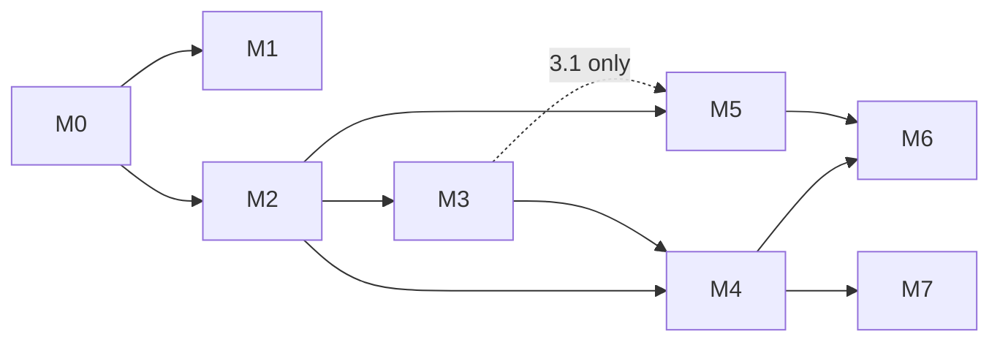

# NeuroForge: step-by-step build guide

Status: **DRAFT for GATE B**. Nothing here starts until the owner approves at GATE B. Architecture reference: `BLUEPRINT.md` (section numbers §x below). Owner decisions that change steps: `DECISIONS.md` (D1–D10).

## How to read this guide

- Each step is written as **Inputs → Outputs**, followed by **Owner role**, **Acceptance tests**, **Depends on**, and **Size**.
- **Size** is an ESTIMATE of effort: S = 0.25, M = 0.5, L = 1, XL = 2 person-months. The totals feed `BLUEPRINT.md` §12.3.
- Owner roles are frontend, backend, SDK, data, security, designer and scientist. "External" means counsel or a consultant, which needs owner approval and budget.
- A **step is done only when all its acceptance tests pass in CI** (or, for review items, when the named reviewer has signed off in the PR).
- **Owner gates (🔒)** mark anything outward-facing: publishing a site, registering a domain, signing up for a cloud account, contacting anyone, or spending money. Agents never do these on their own.
- **Machine limits:** the owner's PC has about 3 GB of free RAM. Heavy builds (Rust release builds, wheels, container images, Playwright suites) run in CI, not locally. Locally, run only the site dev server, unit tests and `CARGO_BUILD_JOBS=1` debug builds.
- **Global rules for every step:** no real human neural data outside prod; every factual claim in copy cites a source; status labels say designed/planned/roadmap; no medical claims.

## Milestone overview

| Milestone | Goal | Size (person-months, ESTIMATE) | Exit criterion |
|---|---|---|---|
| M0 Foundations | Repo, CI, security baseline, shared specs, synthetic data | 2.5 | CI green on an empty skeleton; hashing spec + test vectors frozen |
| M1 Website (both themes) | One codebase, `clinical` and `cosmos` builds, whitepaper page | 5.25 | Both builds pass every M1 test; owner approves before any publish 🔒 |
| M2 Ingest + storage | Files and streams in; Zarr storage; auth; encryption | 5.75 | Public EDF/BIDS/NWB/XDF samples round-trip; tenant isolation proven |
| M3 Pipelines + provenance | Versioned runs, lineage graph, multiverse sweeps, console v1 | 6.75 | Reproducibility test passes; lineage explorer works end to end |
| M4 API + Python SDK | OpenAPI v1, nf-core, Python wheel, docs | 5.25 | `pip install` of a CI-built wheel runs the quickstart against staging |
| M5 Compliance ledger | Classification, consent, deletion propagation, evidence kit v0 | 6.75 | Withdrawal end-to-end test passes; counsel review of RuleSets started 🔒 |
| M6 Model registry | Governed registry, use restrictions, consent taint, SOUP export | 4 | A tainted model is blocked and its retrain is traced |
| M7 C++ / Unity / Unreal SDKs | C ABI, C++ wrapper; engines only on customer pull | 4 | Same conformance suite passes through C, C++ and Python |
| **Total** | | **~40** | |
| M8 AI layer (addendum at the end of this file; design in `AI-LAYER.md`) | QC, search, montage inference, evaluation cards, assistant, then the rest; woven into M3–M6 | 14.5 core + 5.5 roadmap | See the M8 exit criterion in the addendum |

**Sequencing note.** The milestone order is the one the owner asked for. `market\pricing-and-gtm.md` §5 argues that the consent ledger should ship earlier, in months 3–9. The dependency graph lets M5 start right after M2 plus step 3.1 (the provenance tables), in parallel with the rest of M3/M4. See `DECISIONS.md` D5.

---

## M0: Foundations

### 0.1 Monorepo and toolchains (size M)
- **Inputs:** `BLUEPRINT.md` §11 layout; GATE B decisions.
- **Outputs:** the `neuroforge/` monorepo with the folders from §11:
  - pnpm workspace (JS), uv project (Python), cargo workspace (Rust);
  - a root `Makefile`/`justfile` with `lint`, `test`, `build-web THEME=…`;
  - EditorConfig and formatters: Prettier, Ruff, rustfmt.
- **Owner role:** backend (repo lead).
- **Acceptance tests:**
  - `just lint test` passes on a clean clone on Windows and Linux CI runners.
  - Each toolchain version is pinned (`.nvmrc`/`package.json#engines` with Node 22, `pyproject` requires-python, `rust-toolchain.toml`).
- **Depends on:** GATE B approval.

### 0.2 CI pipeline skeleton (size S)
- **Inputs:** 0.1.
- **Outputs:** CI workflows for lint, test and build per package; path filters, so that web-only changes skip the Rust builds; cached dependencies; and a required-checks list on the main branch.
- **Owner role:** backend.
- **Acceptance tests:** a PR that breaks a unit test in any package is blocked; a docs-only PR finishes in under 5 min (target).
- **Depends on:** 0.1. 🔒 A hosted git/CI account is owner-created.

### 0.3 Security baseline (size S)
- **Inputs:** `BLUEPRINT.md` §8.1, §8.7.
- **Outputs:** secret scanning, dependency audit (npm/pip/cargo), CycloneDX SBOM per build, branch protection with signed commits, `SECURITY.md`, and a `.gitignore` covering data files (`*.edf`, `*.bdf`, `*.nwb`, `*.xdf`, `*.set`, `*.fif`, `data/`).
- **Owner role:** security.
- **Acceptance tests:**
  - A committed fake AWS key fails CI.
  - A committed `.edf` file fails CI.
  - An SBOM artifact is attached to every CI build.
- **Depends on:** 0.2.

### 0.4 Copy-lint tool (size S)
- **Inputs:** `BRIEF.md` copy fixes; `design\CONTENT-SPEC.md` honesty rules; `BLUEPRINT.md` §2.6.
- **Outputs:** `tools/copy-lint`, which scans content (MDX/JSON) and built HTML:
  - Banned terms: `built-in`, `live` (as a status), `available now`, `certified`, `HIPAA-compliant`, `SOC 2 compliant`, `treat`, `diagnose`, `cure`, `restore`, `automated neuro-cleaning`.
  - Negation allowlist, for example "not a live product".
  - Numbers in mock UI must sit next to "demo data"/"target"/"ESTIMATE".
- **Owner role:** frontend.
- **Acceptance tests:** a fixture page containing each banned phrase fails with the file and line; the allowlisted footer sentence passes.
- **Depends on:** 0.1.

### 0.5 Canonical hashing and ID spec, with test vectors (size S)
- **Inputs:** `BLUEPRINT.md` §3.5, §3.6, §5.
- **Outputs:** `docs/spec/hashing.md`, covering:
  - canonical JSON rules (key order, number formatting, Unicode normalisation);
  - hash algorithm (SHA-256);
  - ID formats for PipelineVersion, chunk and provenance batch.

  Also `spec/test-vectors/*.json`, which the Python server code (M2/M3) and nf-core (M4) must both reproduce.
- **Owner role:** SDK (with backend review).
- **Acceptance tests:** a reference Python implementation reproduces every vector; the spec is reviewed by one backend and one SDK engineer.
- **Depends on:** 0.1.
- **Why in M0:** the server writes hashes in M2/M3 before nf-core exists in M4. Without a frozen spec the two would diverge and break reproducibility.

### 0.6 Synthetic neural-data generator for fixtures (size M)
- **Inputs:** `market\new-ideas.md` #7 (synthetic data for CI; privacy value is a hypothesis, not claimed); the BIDS EEG format list.
- **Outputs:** `tools/synth`, which generates multichannel EEG/ECoG/spike-like signals with **known ground truth**: spectra, injected line noise, blink and muscle artifacts, bad channels, event markers. It writes EDF, BDF, BrainVision, NWB and XDF, and emits a truth JSON.
- **Owner role:** scientist + data.
- **Acceptance tests:**
  - Generated files open in MNE, pynwb and pyxdf.
  - The measured PSD peak frequency matches the injected frequency within one frequency bin.
  - Generation is deterministic for a fixed seed.
- **Depends on:** 0.1.

### 0.7 Dev environment IaC skeleton (size M)
- **Inputs:** `BLUEPRINT.md` §7; `DECISIONS.md` D4 (cloud).
- **Outputs:** OpenTofu modules (network, Postgres, bucket, KMS key, container service) and a `dev` environment definition. This step writes the code only: it is **not applied**.
- **Owner role:** backend.
- **Acceptance tests:** `tofu validate` and `tofu plan` against a mock or local provider pass in CI; no secrets appear in state files.
- **Depends on:** 0.2, D4.
- 🔒 Applying it to a real cloud account needs the owner to create the account and approve spend.

---

## M1: Website, both themes, one codebase

### 1.1 Semantic token contract and the two token files (size M)
- **Inputs:** `design\option-1.html` `:root` and `design\option-3.html` `:root`; `BLUEPRINT.md` §2.2 token table.
- **Outputs:**
  - `packages/themes/contract.ts`, the required token list;
  - `clinical/tokens.css` and `cosmos/tokens.css`, each scoped to `[data-theme=…]`;
  - font loading per theme: self-hosted font files, or Google Fonts per `CONTENT-SPEC.md` (see D9).
- **Owner role:** designer + frontend.
- **Acceptance tests:**
  - Contract test: every token in `contract.ts` is defined in both files, and neither file defines tokens outside the contract.
  - Contrast test: text/background token pairs meet WCAG AA in both themes. This includes cosmos glass cards, measured against `--color-bg`.
- **Depends on:** 0.1.

### 1.2 Content package with the copy fixes applied (size M)
- **Inputs:** `design\CONTENT-SPEC.md`; `BRIEF.md` GATE A copy fixes; `BLUEPRINT.md` §2.6; `DECISIONS.md` D1 (positioning); company name NeuroForge (owner, 2026-09-26).
- **Outputs:** `packages/content`: typed JSON/MDX for nav, hero, pipeline steps, audience, compliance, pricing teaser, research cards, footer and aria-labels. It has one heading set, with `<em>` marking emphasis. Optionally it adds `voice.json` overrides (≤ 10 strings per theme) if D8 allows them.
- **Owner role:** designer (copy) + scientist (research copy and citations).
- **Acceptance tests:**
  - Copy-lint (0.4) passes.
  - A schema validation test passes.
  - Every factual claim has a `source` field.
  - **Brand-token test:** the literal company name appears only in `packages/content/brand.json`. Changing `brand.name` there changes every page, `<title>`, the footer and the OpenAPI title at the next build.
  - Owner copy review is recorded in the PR.
- **Depends on:** 0.4, D1.

### 1.3 Shared components (size L)
- **Inputs:** 1.1, 1.2; section structure of both designs.
- **Outputs:** `packages/ui`: Nav (with mobile menu), Hero shell (text + slot), PipelineSteps, AudienceTabs (ARIA tabs), ComplianceGrid, PricingTeaser, ResearchCards, CTA and Footer. They are styled **only** through semantic tokens.
- **Owner role:** frontend.
- **Acceptance tests:**
  - A lint rule fails on raw hex colours or font names inside `packages/ui`.
  - Keyboard tests for tabs and the menu pass.
  - Every component renders in both themes in a Storybook-style gallery or Astro test page.
- **Depends on:** 1.1, 1.2.

### 1.4 Clinical slots (size S)
- **Inputs:** option-1 hero canvas code and `design\assets\asset-1-clinical.html`.
- **Outputs:** `themes/clinical/slots/*`, containing HeroVisual (canvas EEG montage, `client:idle`), BrandMark, SectionOrnament and SecurityVisual.
- **Owner role:** frontend.
- **Acceptance tests:**
  - Reduced-motion shows a static frame.
  - The canvas has `aria-hidden` inside a `role="img"` wrapper with the content-supplied label.
  - No `three` import anywhere under `clinical/`.
- **Depends on:** 1.3.

### 1.5 Cosmos slots with lazy three.js and fallback (size M)
- **Inputs:** option-3 module script (three@0.160.0) and `assets\asset-3-cosmos.html`; `BLUEPRINT.md` §2.2–2.3.
- **Outputs:** `themes/cosmos/slots/*`. HeroVisual works as follows:
  - It renders the SVG fallback first.
  - It dynamically imports three.js from the **self-hosted npm package** only when **all** of these hold: the hero is visible; WebGL is available; reduced motion is off; Save-Data is off.
  - It pauses when off-screen.
- **Owner role:** frontend.
- **Acceptance tests:**
  - Playwright with WebGL disabled: the fallback is visible and there are no console errors.
  - With reduced motion: no animation frames after load.
  - The network log shows the three chunk requested only after scrolling or visibility.
  - No request goes to jsdelivr.
- **Depends on:** 1.3.

### 1.6 Build-time theme resolution, two build targets, canonical tags (size S)
- **Inputs:** 1.4, 1.5; `DECISIONS.md` D3 (which theme is canonical).
- **Outputs:**
  - `THEME` env resolved at build time to one slot module (the unused theme is tree-shaken);
  - `dist/clinical` and `dist/cosmos`;
  - `<html data-theme>` set statically;
  - `rel=canonical` on the non-canonical build pointing to the canonical host;
  - a `robots.txt` per build.
- **Owner role:** frontend.
- **Acceptance tests:**
  - **Bundle test:** a grep of `dist/clinical/**/*.js` for three.js signatures finds nothing.
  - Both builds have identical text content: the extracted text diff is empty, except for the D8 voice strings if they are enabled.
  - The canonical tag is present and correct on every cosmos page.
  - Slot-count test: at most 4 slot files per theme.
- **Depends on:** 1.4, 1.5, D3.

### 1.7 Whitepaper page and interactive figures (size L)
- **Inputs:**
  - `research\somatosensory\whitepaper\` (the draft, when the research hive delivers it);
  - `research\somatosensory\code\results\*.json` and `code\figures\*.svg`;
  - `BLUEPRINT.md` §2.5.
- **Outputs:**
  - `/research` index and `/research/[slug]` MDX layout;
  - `packages/figures`: line, heatmap and scatter islands with hover and keyboard readouts;
  - a `figures.json` manifest (result file SHA-256, script, commit, status);
  - status label, evidence grades, and the IRB/FDA banner;
  - print/PDF stylesheet and a citation block.
- **Owner role:** frontend + scientist.
- **Acceptance tests:**
  - Changing one byte of a result file fails the build.
  - Every figure has an SVG fallback and an aria-label.
  - With JS off, figures still render as SVG.
  - The scientist signs off that each figure matches the verified result, and only verified results are labelled "verified" (the whitepaper verification gate).
- **Depends on:** 1.3; research deliverable (the page ships with "In preparation" status if the paper is not ready).

### 1.8 Secondary pages (size M)
- **Inputs:** 1.2, 1.3; `BLUEPRINT.md` §2.4.
- **Outputs:**
  - Pages: `/platform`, `/governance`, `/sdks`, `/security`, `/pricing` (teaser), `/law-tracker` (static draft from `market\regulation.md`, not-legal-advice banner), `/legal/*` placeholders, and a 404.
  - The early-access form is shown **disabled** until step 4.7.
- **Owner role:** frontend + designer.
- **Acceptance tests:**
  - Copy-lint passes.
  - Every law-tracker row cites its source.
  - Law-tracker entries that `regulation.md` marks unverified (for example, the MT statute text and MIND Act status) are displayed as unverified.
- **Depends on:** 1.3.

### 1.9 Quality gate: accessibility, visual, performance, responsive (size M)
- **Inputs:** both builds.
- **Outputs:** Playwright visual snapshots (360/768/1440 px × 2 themes), axe runs, Lighthouse CI budgets (`BLUEPRINT.md` §2.3), and a link checker.
- **Owner role:** frontend.
- **Acceptance tests:**
  - Zero serious or critical axe violations in either theme.
  - No horizontal scroll at 360 px.
  - JS budgets met (clinical ≤ 60 KB gzip initial; cosmos ≤ 60 KB before the hero is visible). These are targets; if one is missed, the PR must record the measured number and a decision.
  - Zero broken internal links.
- **Depends on:** 1.6, 1.7, 1.8.

### 1.10 Preview deploys, then owner-approved publish (size S) 🔒
- **Inputs:** 1.9 green; D3; the name clash check in `market\names.md` is clean (required before public release, not before previews).
- **Outputs:** static hosting projects for `clinical` and `cosmos`. Password-protected or unlisted **preview** URLs come first; public release follows only after owner approval.
- **Owner role:** frontend.
- **Acceptance tests:**
  - The preview smoke test passes on both hosts.
  - Security headers are present: CSP `script-src 'self'`, HSTS, `Referrer-Policy`.
  - The owner's written go/no-go is recorded.
- **Depends on:** 1.9. 🔒 Domain registration, hosting sign-up and going public are owner actions.

---

## M2: Ingest and storage

### 2.1 Platform service skeleton and metadata schema v1 (size L)
- **Inputs:** `BLUEPRINT.md` §3.1, §3.2, §6.
- **Outputs:**
  - `services/platform`: a FastAPI modular monolith with modules `api`, `ingest`, `governance`, `registry`, and import-linter boundaries.
  - Postgres schema v1 (tenant → … → channel, including governance attributes `modality`, `nervous_system`, `derived_from_non_neural`) with migrations and RLS policies.
  - A local docker-compose dev stack (Postgres + MinIO), which runs in CI. On the owner's PC it is optional, given the RAM limit.
- **Owner role:** backend.
- **Acceptance tests:**
  - Migrations run up and down cleanly.
  - **Tenant-isolation test:** with two tenants, every table's queries under tenant A's DB role return zero rows of tenant B.
  - Import-linter passes.
- **Depends on:** 0.1, 0.2, 0.7.

### 2.2 Authentication and authorization v1 (size M)
- **Inputs:** `BLUEPRINT.md` §4.2; D4 (IdP choice).
- **Outputs:** OIDC login, hashed API keys with scopes and expiry, role model (`owner … device`), and one central `authorize(principal, action, resource)` function.
- **Owner role:** security + backend.
- **Acceptance tests:**
  - An authz matrix test covers every role × every endpoint implemented so far and matches the expected table.
  - An expired key gives 401; a wrong scope gives 403.
  - Admin roles require MFA (checked through an IdP claim).
- **Depends on:** 2.1, D4.

### 2.3 Object storage with envelope encryption and per-subject keys (size M)
- **Inputs:** `BLUEPRINT.md` §8.1, §8.4.
- **Outputs:** a storage module with these properties:
  - Tenant key and per-subject data keys (wrapped by KMS; local dev uses a mock KMS).
  - Every object is encrypted client-side with the subject's data key.
  - Buckets are `raw/`, `zarr/`, `artifacts/`, `models/` and `audit/` (object lock).
- **Owner role:** security.
- **Acceptance tests:**
  - Objects read without the key are ciphertext.
  - **Crypto-shred test:** after a subject's key is destroyed, reading their objects (including a backup copy) fails, and other subjects are unaffected.
  - Keys never appear in logs (log-scan test).
- **Depends on:** 2.1.

### 2.4 Zarr v3 canonical signal layout and window reads (size L)
- **Inputs:** `BLUEPRINT.md` §3.3–3.4; 0.6 synthetic data.
- **Outputs:**
  - The layout spec: chunking by time × channel, dtype policy, and units/scale in attributes.
  - A writer and reader.
  - Multiscale pyramids for viewing.
  - `GET /recordings/{id}/data?start&end&channels&level`.
- **Owner role:** data.
- **Acceptance tests:**
  - A written-then-read window equals the source exactly (integer dtypes) or within float tolerance.
  - Pyramid level k equals a decimated reference.
  - A chunk-size benchmark on synthetic 64-ch/1 kHz and 1,024-ch/30 kHz data is recorded in the PR as a **measurement** (no target claimed beforehand).
- **Depends on:** 2.1, 2.3, 0.6.

### 2.5 File converters: EDF/BDF, BIDS, NWB, XDF (size L)
- **Inputs:** readers MNE, mne-bids, bids-validator, pynwb, hdmf-zarr, pyxdf (`BLUEPRINT.md` §3.3); 0.6 fixtures; small public datasets from OpenNeuro/DANDI (license checked and recorded per file).
- **Outputs:** an `ingest` worker job for each format that extracts metadata, converts to Zarr (2.4), writes provenance (`raw --convert@v--> recording`), and sets the default channel governance attributes by modality (editable later).
- **Owner role:** data + scientist.
- **Acceptance tests:**
  - **Round-trip:** source → Zarr → export to the same format → re-read matches within tolerance, for every fixture.
  - A BIDS export passes `bids-validator`.
  - XDF multi-stream clock offsets are preserved (test against a synthetic XDF with known offsets).
  - Corrupt-file fuzz inputs produce clean errors, never crashes.
- **Depends on:** 2.4.

### 2.6 Upload sessions, hash verification, quarantine (size M)
- **Inputs:** `BLUEPRINT.md` §3.3 file flow.
- **Outputs:**
  - `POST /datasets/{id}/uploads` (pre-signed multipart) and `POST /uploads/{id}/complete`.
  - A server-side SHA-256 check against the client value.
  - A `quarantined` state that blocks processing and export until consent policy is satisfied (the policy hook is a stub until M5).
- **Owner role:** backend.
- **Acceptance tests:**
  - A hash mismatch rejects the upload.
  - A resumed multipart upload works.
  - A quarantined recording cannot be read by `scientist` (403) and is visible to `data-steward`.
- **Depends on:** 2.2, 2.3, 2.5.

### 2.7 Stream ingest over gRPC, with the edge buffer (Python prototype) (size L)
- **Inputs:** `BLUEPRINT.md` §3.3 stream flow; liblsl/pylsl.
- **Outputs:**
  - A `proto/ingest/v1` definition.
  - `IngestService.StreamChunks`: idempotent on `(stream_id, seq)`, with per-chunk hashes per the 0.5 spec.
  - A Python prototype client that reads LSL, keeps a local write-ahead file, and resumes after disconnect. nf-core replaces this prototype in step 4.2.
- **Owner role:** SDK.
- **Acceptance tests:**
  - A synthetic LSL outlet streams for 10 min while the network is cut twice. The server-side array equals the sent samples, with no gaps and no duplicates.
  - Throughput for 64 ch × 1 kHz is sustained on a CI runner, and the measured headroom is recorded.
- **Depends on:** 2.4, 0.5.

### 2.8 Audit log v1 (size S)
- **Inputs:** `BLUEPRINT.md` §6, §8.1.
- **Outputs:** audit events for authentication, data reads/exports and admin actions. Events are written to Postgres and batched hourly to a WORM bucket, with a hash chain.
- **Owner role:** security.
- **Acceptance tests:**
  - Every data-read endpoint emits an event (the test enumerates the routes).
  - A modified audit batch fails chain verification.
- **Depends on:** 2.1, 2.3.

---

## M3: Pipelines and provenance

### 3.1 Provenance graph and lineage API (size L)
- **Inputs:** `BLUEPRINT.md` §3.6; 0.5.
- **Outputs:** `prov_node`/`prov_edge` tables (PROV types); hash-chained, signed provenance batches; `GET /provenance/{id}`; `GET /provenance/{id}/lineage?direction&depth`.
- **Owner role:** backend.
- **Acceptance tests:**
  - Graph fuzz test: random DAGs of up to 10k nodes; up/down traversal equals a reference in-memory traversal.
  - Tampering with one node fails verification.
  - Traversal p95 latency on a 100k-node synthetic graph is **measured** and recorded; a target is set from that measurement.
- **Depends on:** 2.1.

### 3.2 PipelineVersion spec and content addressing (size M)
- **Inputs:** `BLUEPRINT.md` §3.5; 0.5.
- **Outputs:** a JSON Schema for pipeline specs (steps with `image@sha256`, params, declared tolerance class) and a publish endpoint (immutable). Name@semver resolves to a digest.
- **Owner role:** backend (SDK review).
- **Acceptance tests:**
  - Two semantically identical specs with different key order get the same ID.
  - Re-publishing an existing version with changes is rejected.
  - The 0.5 test vectors pass.
- **Depends on:** 0.5, 2.1.

### 3.3 Job queue and container workers (size M)
- **Inputs:** `BLUEPRINT.md` §3.5 orchestration.
- **Outputs:** a Postgres `SKIP LOCKED` queue with retries, timeouts, cancellation and heartbeats, plus a worker image that runs steps in pinned containers. Provenance is written **before** outputs become visible.
- **Owner role:** backend.
- **Acceptance tests:**
  - Killing a worker mid-run leads to a retry by another worker, with no duplicate outputs.
  - A run's outputs are invisible until its provenance commit succeeds (fault-injection test).
- **Depends on:** 3.1, 3.2.

### 3.4 Step library v1, wrapping MNE (size L)
- **Inputs:** MNE-Python; 0.6 synthetic ground truth.
- **Outputs:** steps for filter (FIR/IIR), notch, re-reference, resample, bad-channel detection, ICA (with fixed seed), epoching, band-power features. Every parameter is explicit and every default is written to the run record.
- **Owner role:** scientist + data.
- **Acceptance tests:**
  - Each step's output equals direct MNE calls with the same parameters (reference test).
  - On synthetic data, notch removes the injected line-noise peak by a stated dB amount (the threshold is set in the test from the filter design, not claimed as a benchmark).
  - Seeded ICA is stable across two runs.
- **Depends on:** 3.3.

### 3.5 Reproducibility harness (size M)
- **Inputs:** 3.3, 3.4.
- **Outputs:** CI job `repro-check` that runs every published pipeline twice on fixtures and on two CPU architectures (x86-64 and arm64 runners). It asserts byte-identical outputs for `exact` steps and tolerance for `tolerance` steps, and writes a report.
- **Owner role:** data.
- **Acceptance tests:** the harness fails on a deliberately non-deterministic step (an unseeded random call) and passes on the v1 library.
- **Depends on:** 3.4.

### 3.6 Sweeps (multiverse) and comparison report (size L)
- **Inputs:** `market\new-ideas.md` #4; Kessler 2025 and Huang 2025 (`market\landscape.md` §3).
- **Outputs:** `POST /sweeps` (parameter grid → N runs) and a sweep report showing how a chosen downstream metric (for example, decoding accuracy via a simple pyRiemann/sklearn classifier) varies across pipelines. Every cell links to its run provenance.
- **Owner role:** scientist + data.
- **Acceptance tests:**
  - On synthetic data with a known effect size, the report recovers the planted parameter sensitivity.
  - Every report number links to a run ID.
- **Depends on:** 3.5.

### 3.7 OpenLineage and PROV-JSON export (size S)
- **Inputs:** OpenLineage spec, W3C PROV (`BLUEPRINT.md` §3.6).
- **Outputs:** `GET /provenance/{id}/export?format=prov-json|openlineage`.
- **Owner role:** backend.
- **Acceptance tests:** exported OpenLineage events validate against the published JSON schema; PROV-JSON validates with a PROV library (prov Python package) in CI.
- **Depends on:** 3.1.

### 3.8 Console v1 (size L)
- **Inputs:** `BLUEPRINT.md` §3.8; tokens from 1.1 (clinical default).
- **Outputs:** a React console with login, projects/datasets, recording viewer (pyramids), runs, sweep report and lineage explorer.
- **Owner role:** frontend.
- **Acceptance tests:**
  - Playwright end-to-end: upload a fixture, run a pipeline, open the lineage, and see raw → recording → run → artifact.
  - axe passes.
  - Role-based UI hiding matches the authz matrix (UI checks are never the only enforcement).
- **Depends on:** 2.6, 3.3, 3.1.

### 3.9 Public multiverse study on open datasets (size L)
- **Inputs:** 3.6; public OpenNeuro/DANDI datasets (licenses recorded).
- **Outputs:** a whitepaper draft, "How preprocessing choices change decoding results", with interactive figures through 1.7 and all runs reproducible from provenance IDs.
- **Owner role:** scientist.
- **Acceptance tests:**
  - An independent re-run by a second agent or engineer from the provenance IDs reproduces every figure.
  - Claims are graded; nothing is published without the owner 🔒.
- **Depends on:** 3.6, 1.7.

---

## M4: Public API and Python SDK

### 4.1 OpenAPI 3.1 as the source of truth (size M)
- **Inputs:** `BLUEPRINT.md` §4; the endpoints built so far.
- **Outputs:** `openapi/v1.yaml`; server routes checked against it; RFC 9457 problem+json errors; `Deprecation`/`Sunset` header support; a generated TS client for the console.
- **Owner role:** backend.
- **Acceptance tests:**
  - Contract tests (schemathesis or equivalent) pass on every endpoint.
  - A breaking change to the spec without a major version bump fails a CI diff check.
- **Depends on:** M2, M3 endpoints.

### 4.2 nf-core Rust crate (size XL)
- **Inputs:** `BLUEPRINT.md` §5; 0.5 spec; the 2.7 prototype.
- **Outputs:** the crate, containing:
  - model types and canonical JSON + hashing;
  - Zarr chunk IO + local cache;
  - HTTP/gRPC client with auth and retries;
  - the stream write-ahead buffer;
  - the offline provenance recorder.
- **Owner role:** SDK.
- **Acceptance tests:**
  - All 0.5 vectors pass.
  - Property tests for canonicalisation and buffering pass.
  - The 2.7 network-cut test passes with nf-core in place of the prototype.
  - `cargo deny`/audit are clean.
  - Builds with `CARGO_BUILD_JOBS=1` locally (debug), release in CI.
- **Depends on:** 0.5, 2.7, 4.1.

### 4.3 Python bindings and the `neuroforge` package (size L)
- **Inputs:** 4.2; PyO3 + maturin.
- **Outputs:** an idiomatic Python API (`nf.open`, `nf.pipelines.get(...).run`, `run.provenance`, streaming helpers, MNE `Raw` interop) and abi3 wheels for Windows, macOS and Linux built in CI. PyPI publishing is 🔒 owner-approved.
- **Owner role:** SDK.
- **Acceptance tests:**
  - A CI-built wheel installs on a clean runner of each OS.
  - The quickstart runs against staging.
  - The snippet in `BLUEPRINT.md` §2.6 runs as written, or the website snippet is updated to match.
- **Depends on:** 4.2.

### 4.4 LSL bridge in nf-core (size M)
- **Inputs:** liblsl; 4.2.
- **Outputs:** LSL inlet → nf-core stream with clock-offset capture, exposed in Python.
- **Owner role:** SDK.
- **Acceptance tests:** a synthetic outlet with an injected clock offset is recovered within LSL's reported uncertainty; the 10-minute stream test passes.
- **Depends on:** 4.2.

### 4.5 Documentation site (size M)
- **Inputs:** 4.1 spec; 4.3 docstrings.
- **Outputs:** docs (can live in the Astro app under `/docs`, using the canonical theme) with quickstarts (file ingest, pipeline run, streaming, lineage export), API reference generated from OpenAPI, and a changelog.
- **Owner role:** frontend + scientist.
- **Acceptance tests:** every code block in the quickstarts is executed in CI against staging (doctest-style); copy-lint passes.
- **Depends on:** 4.1, 4.3.

### 4.6 Webhooks and server-sent events (size S)
- **Inputs:** `BLUEPRINT.md` §4.1.
- **Outputs:** signed webhooks (HMAC, timestamp, retries), SSE for run events.
- **Owner role:** backend.
- **Acceptance tests:** signature verification sample code passes; a replayed webhook older than 5 min is rejected by the sample verifier.
- **Depends on:** 4.1.

### 4.7 Early-access endpoint and privacy policy; enable the website form (size S) 🔒
- **Inputs:** `BLUEPRINT.md` §2.4; a privacy policy text (the owner or counsel provides or approves it).
- **Outputs:** `POST /v1/public/early-access` with double opt-in, rate limits and minimal fields (email, role, optional organisation). The website form is enabled in both builds.
- **Owner role:** backend + security.
- **Acceptance tests:**
  - An unconfirmed email is purged after 30 days.
  - A rate-limit test passes.
  - The privacy policy is linked from the form.
  - The owner approves go-live 🔒.
- **Depends on:** 4.1, 1.10.

### 4.8 Quotas, rate limits and API-key UI (size S)
- **Inputs:** 2.2.
- **Outputs:** per-tenant quotas (storage, runs), gateway rate limits, and key management in the console.
- **Owner role:** backend.
- **Acceptance tests:** exceeding a quota returns 429/403 with problem+json; a revoked key stops working within 60 s.
- **Depends on:** 2.2, 3.8.

---

## M5: Compliance ledger

### 5.1 Channel governance attributes in the product (size M)
- **Inputs:** `BLUEPRINT.md` §3.2; `market\regulation.md` §1 (definitions differ on central/peripheral/inferred).
- **Outputs:** UI and API to review and set `nervous_system`, `modality` and `derived_from_non_neural` per channel and per derived artifact, with modality defaults and a bulk editor. Changes are audited.
- **Owner role:** data + backend.
- **Acceptance tests:** every change emits an audit event; artifacts inherit the strictest attribute from their inputs (lineage test).
- **Depends on:** 2.5, 3.1.

### 5.2 RuleSet format and classification engine (size L) 🔒 (counsel)
- **Inputs:** `market\regulation.md` §1, §5, §6; `BLUEPRINT.md` §8.2.
- **Outputs:**
  - `rules/*.yaml` for CO, CA, CT, MT (marked `unverified`) and EU (GDPR Art. 9 flag). Each rule has a citation, effective date, predicate, obligations and `review_status`.
  - An engine producing `Classification` per channel and artifact.
  - `GET /classifications`, `GET /jurisdiction-rules`.
  - A counsel-review workflow: rules move from draft to counsel-reviewed only with a reviewer record.
- **Owner role:** security, with external counsel review (owner engages counsel 🔒).
- **Acceptance tests:**
  - Table-driven tests: an EMG channel (peripheral) is matched by the CO and CA rules and **not** by CT. A CA channel with `derived_from_non_neural=true` is not matched by CA.
  - The UI and API never output "not regulated", only "not matched by RuleSet vN".
  - A rule without `counsel-reviewed` status shows a draft badge.
- **Depends on:** 5.1.

### 5.3 Consent ledger (size L)
- **Inputs:** `BLUEPRINT.md` §8.3; `market\new-ideas.md` #1.
- **Outputs:** an append-only `consent_record` table with a per-tenant hash chain, daily anchoring into the WORM bucket, `POST/GET /subjects/{id}/consents`, consent-document versioning with hashes, and a scope model (collection, processing, sharing, model training, commercial use).
- **Owner role:** backend + security.
- **Acceptance tests:**
  - UPDATE/DELETE on the table is rejected at the DB level (trigger/permissions test).
  - Chain verification detects a modified row.
  - An anchor mismatch alerts.
- **Depends on:** 2.1, 2.8.

### 5.4 Single policy-enforcement function (size M)
- **Inputs:** 5.2, 5.3; `BLUEPRINT.md` §8.3 enforcement point.
- **Outputs:** `policy.check(principal, action, resource)`, combining RBAC, classification and consent scope. It is called by every data read, run start, export and training job. The quarantine stub from 2.6 is replaced.
- **Owner role:** security.
- **Acceptance tests:**
  - Route-enumeration test: every data-touching endpoint calls the policy function.
  - Matrix test over roles × classifications × consent scopes.
  - A training job on a subject without the `model training` scope is denied.
- **Depends on:** 5.2, 5.3.

### 5.5 Deletion propagation, crypto-shredding and certificate (size XL)
- **Inputs:** `BLUEPRINT.md` §8.4; 3.1 lineage; 2.3 keys.
- **Outputs:** a `POST /subjects/{id}/withdrawals` DeletionJob that:
  - traverses the graph;
  - deletes the subject's objects;
  - marks aggregated artifacts stale and re-runs them without the subject, or tombstones them, according to tenant policy;
  - flags models `retrain_required` (the hook is used by M6);
  - lists external exports;
  - destroys the subject's key;
  - issues a signed certificate (JSON + PDF).
- **Owner role:** backend + security.
- **Acceptance tests (the key M5 test):** subject → 3 recordings → 2 pipeline runs → 1 group average → 1 toy model; then withdraw. Assert all of the following:
  - the subject's objects are gone and unreadable in the backup copy (crypto-shred);
  - the group average is re-run without the subject, or tombstoned;
  - the model is flagged;
  - the certificate lists every affected node;
  - audit events exist;
  - an unrelated subject's data is untouched.

  The job duration is measured and recorded against the 24 h target.
- **Depends on:** 5.4, 3.1, 2.3.

### 5.6 Law-tracker page driven by the RuleSets (size S)
- **Inputs:** 5.2; the page from 1.8.
- **Outputs:** the website `/law-tracker` generated from `rules/*.yaml` at build time, with the not-legal-advice banner and review-status badges.
- **Owner role:** frontend.
- **Acceptance tests:** a changed rule file changes the page at the next build; unverified rules show as unverified.
- **Depends on:** 5.2, 1.8.

### 5.7 BAA-readiness pack (size M) 🔒
- **Inputs:** `market\regulation.md` §3; `BLUEPRINT.md` §8.5; D4.
- **Outputs:** a list of BAA-covered services used for PHI tenants; tenant flag `phi=true`, which restricts storage/compute to those services; draft policies (risk analysis, incident response, access review, workforce training) for counsel review.
- **Owner role:** security.
- **Acceptance tests:** an IaC test proves that `phi=true` tenants cannot be placed on non-listed services, and the draft policies are recorded as delivered to counsel. The website keeps "BAA (planned)" until the owner signs a provider BAA 🔒.
- **Depends on:** 0.7, 2.3.

### 5.8 FDA Evidence Kit v0 (size L)
- **Inputs:** `market\new-ideas.md` #2; `market\regulation.md` §4; `BLUEPRINT.md` §8.6 (IEC 62304 and the full FDA cybersecurity guidance text are **to be verified** before this step).
- **Outputs:** `POST /exports/fda-evidence`, which generates a zip containing:
  - a requirement → test → result traceability matrix from CI metadata;
  - the SBOM;
  - release notes with known anomalies;
  - the provenance export for a chosen dataset/model;
  - SOUP entries for our components.

  It is labelled as a scaffold, not a submission.
- **Owner role:** security + backend, with an external regulatory consultant review 🔒.
- **Acceptance tests:**
  - Every requirement ID in `docs/requirements` has at least one linked test, or is flagged.
  - The package regenerates byte-identically from the same inputs.
- **Depends on:** 3.1, 0.3, 4.1.

---

## M6: Governed model registry

### 6.1 Model registry core (size L)
- **Inputs:** `BLUEPRINT.md` §3.7.
- **Outputs:** `Model`/`ModelVersion` with weights artifact, model card schema, `intended_use`, and training provenance (training-set manifest of hashed subject IDs, pipeline versions, code commit). Endpoints come from the §4.4 outline.
- **Owner role:** backend + data.
- **Acceptance tests:**
  - Registering a model without a training-set manifest fails.
  - The lineage query from a model returns every training subject's raw node.
- **Depends on:** 3.1, 4.1.

### 6.2 Use restrictions and deployment checks (size M)
- **Inputs:** `market\regulation.md` §5 (EU AI Act Art. 5(1)(f), (a), (g)).
- **Outputs:** a `use_restrictions` vocabulary (for example, `eu_ai_act_5_1_f`) and `POST /models/{id}/deployments` requiring a declared context. Prohibited combinations are refused and audited.
- **Owner role:** security.
- **Acceptance tests:** an emotion/cognitive-state model with context `workplace` in the EU is refused unless a documented medical or safety exception record exists; the refusal is audited.
- **Depends on:** 6.1.

### 6.3 Consent taint and retrain flow (size M)
- **Inputs:** 5.5 hook.
- **Outputs:** on withdrawal, affected model versions become `retrain_required` and deployments are blocked (configurable). A retrain job template excludes the subject, and the new version's provenance proves the exclusion.
- **Owner role:** backend.
- **Acceptance tests:** in the 5.5 end-to-end scenario, the retrained model's training manifest excludes the subject, and the old version stays blocked.
- **Depends on:** 6.1, 5.5.

### 6.4 SISA sharded-training option (size L)
- **Inputs:** Bourtoule et al., arXiv:1912.03817.
- **Outputs:** an optional training mode with shard/slice checkpoints, so a withdrawal retrains only the affected shard. Documentation must state plainly that this is **not certified unlearning**.
- **Owner role:** scientist + data.
- **Acceptance tests:**
  - On a toy decoder, retraining after withdrawal touches only one shard (a checkpoint audit).
  - Accuracy relative to full retraining is **measured and reported**, not claimed in advance.
- **Depends on:** 6.3.

### 6.5 SOUP export for model components (size M)
- **Inputs:** 5.8; 6.1.
- **Outputs:** a per-model-version SOUP/OTS document (versions, dependencies, known anomalies, test evidence, intended use, restrictions).
- **Owner role:** security.
- **Acceptance tests:** the export includes every dependency in the model's container SBOM.
- **Depends on:** 5.8, 6.1.

### 6.6 Registry views in the console (size M)
- **Inputs:** 6.1–6.3.
- **Outputs:** model list and detail pages, with model card, lineage, restrictions, taint status and deployment requests.
- **Owner role:** frontend.
- **Acceptance tests:** Playwright end-to-end covers the taint scenario (the flagged model is shown with the reason); axe passes.
- **Depends on:** 6.1–6.3, 3.8.

**Third-party marketplace (listing others' models, billing):** not in this guide. It is gated on customer pull (`market\validation.md` #6).

---

## M7: C++, Unity and Unreal SDKs

### 7.1 Stable C ABI (size M)
- **Inputs:** 4.2.
- **Outputs:** an `extern "C"` API over nf-core with a header generated by cbindgen, an error-code convention, and an ownership/free rule for every returned pointer. An ABI stability policy is in `docs/`.
- **Owner role:** SDK.
- **Acceptance tests:** the ABI checker in CI fails on a breaking change; valgrind/ASan runs of the C conformance tests are clean.
- **Depends on:** 4.2.

### 7.2 C++17 wrapper (size L)
- **Inputs:** 7.1.
- **Outputs:** a header-only RAII wrapper, a CMake package config, and examples: file ingest, LSL stream upload, window read.
- **Owner role:** SDK.
- **Acceptance tests:** examples build on MSVC, GCC and Clang in CI; no leaks under ASan.
- **Depends on:** 7.1.

### 7.3 Cross-binding conformance suite (size M)
- **Inputs:** 0.5 vectors; 4.3; 7.2.
- **Outputs:** one language-neutral test manifest executed through Python, C and C++.
- **Owner role:** SDK.
- **Acceptance tests:** identical results across all three bindings for every case.
- **Depends on:** 7.2, 4.3.

### 7.4 Unity package (size L), only on customer pull
- **Inputs:** 7.1; Unity native plug-in model (C ABI via P/Invoke).
- **Outputs:** a UPM package with C# wrappers, native libraries per platform, and a sample scene that streams a synthetic LSL source and plots it.
- **Owner role:** SDK.
- **Acceptance tests:** the sample runs in Unity on Windows and macOS CI (or a manual checklist if CI licensing is not available); the conformance subset passes.
- **Depends on:** 7.3; a customer request recorded by the owner.

### 7.5 Unreal plugin (size L), only on customer pull
- **Inputs:** 7.1.
- **Outputs:** a UE plugin module linking the C ABI, with a Blueprint-exposed stream component and a sample.
- **Owner role:** SDK.
- **Acceptance tests:** the plugin compiles for Win64; the sample streams synthetic data; the conformance subset passes.
- **Depends on:** 7.3; a customer request recorded by the owner.

---

## Role summary (who is needed when)

| Role | Heaviest milestones |
|---|---|
| frontend | M1, M3 (console), M4 (docs), M6 (views) |
| designer | M1 (tokens, copy), M1.8 pages |
| backend | M0, M2, M3, M4, M5 |
| data | M2 (Zarr, converters), M3 (steps, reproducibility), M6 |
| SDK | M0.5, M2.7, M4, M7 |
| security | M0.3, M2 (auth, keys, audit), M5, M6 |
| scientist | M0.6, M1.7, M3.4–3.9, M6.4 |

---

## Addendum: M8, the AI layer (design: `architecture/AI-LAYER.md`; principles: ADR 0011)

**Rule for every M8 step.** An AI capability is a registry model run as a pipeline step. The step is **done** only when all of these hold:
- its output is written to provenance with the model digest, the training-data manifest and an evaluation-card ID (AI-LAYER §1.1);
- `policy.check` gates it;
- it only writes flags, scores or annotations, never mutating or deleting data;
- no-stimulation, no-medical-claim and tenant-boundary tests pass.

Sizes use the same S/M/L/XL scale as above.

**Order.** M2 and M3 are merged to main, and M4 and M5 are in progress (`docs/hive/M3-REPORT.md`). Steps 8.0–8.2 can start now, so QC and search ship first. The remaining steps follow the milestones they depend on.

| Ship order | Step | Rides with | Size (PM) |
|---|---|---|---|
| 1 | 8.0 AI component contract | M3/M4 now | 0.75 |
| 2 | 8.1 Automated QC + quality scores | M3 (after 3.4) | 2 |
| 3 | 8.2 Semantic search | M4 (4.1) | 0.75 |
| 4 | 8.3 Channel-type/montage inference | M5 (5.1) | 1 |
| 5 | 8.4 Evaluation-card service (nfharness port) | M5/M6 | 1.5 |
| 6 | 8.5 Registry AI glue | M6 (6.1–6.2) | 0.5 |
| 7 | 8.6 Pipeline recommendations | after the 3.9 dataset | 1 |
| 8 | 8.7 Ask-your-data assistant (Anthropic API, decided 2026-09-26) | after 8.2 + 4.8 + 5.4 + owner account setup | 2 |
| 9 | 8.8 Foundation-model embeddings | after 8.4 + 6.1 + N1b verified | 1.5 |
| 10 | 8.9 Anomaly detection + drift monitoring | after 8.1 + 6.2 | 2 |
| 11 | 8.10 Consent-taint retraining + synthetic tier (i) | after 6.3/6.4 + 5.5 | 1.5 |
| roadmap | 8.11 Synthetic tier (ii) · 8.12 Compute-to-data + DP ledger · 8.13 Federated learning | legal gates / customer pull | 1.5 · 2 · 2 |

Core total: **14.5 PM** (ESTIMATE); roadmap: **5.5 PM**.

**M8 exit criterion (core):**
1. A synthetic upload gets QC flags, a quality score and suggested channel types, each traced to a model digest and card.
2. Search finds the upload, and a cross-tenant search returns nothing.
3. The assistant answers a provenance question with 100% valid citations.
4. A withdrawal flags an AI-layer model and produces a new card.

### 8.0 AI component contract (0.75)
- **Inputs:** AI-LAYER §1.1; 3.1 provenance; 3.2 PipelineVersion schema; SEC-061; nfharness `card.py`.
- **Outputs:**
  - A `model` step type in the worker: an ONNX Runtime (CPU) / safetensors loader inside the existing sandbox (network blocked, read-only).
  - A PROV extension (`nf:model`, `nf:evalCard`, `nf:reviewStatus`).
  - An evaluation-card JSON schema.
  - The `review_status` workflow (suggested → accepted/rejected/overridden).
  - Copy-lint additions: "diagnoses", "detects disease", "predicts seizures", "clinically validated", "SOTA".
- **Owner role:** backend + security.
- **Acceptance tests:**
  - A model step without a weights hash, a card ID or a training manifest is refused at publish.
  - A pickle or `.pt` weight file is refused (SEC-061).
  - A model step cannot open the network.
  - A model output that tries to overwrite an input artifact fails.
  - Copy-lint fails on each new banned phrase.
- **Depends on:** 3.1, 3.2, 3.3.

### 8.1 Automated QC, artifact/bad-channel flags and signal-quality scores (2)
- **Inputs:** AI-LAYER A1 and A3; step library 3.4; 0.6 synthetic generator; published methods (PREP, autoreject-style thresholds, ICLabel-style IC classes; citations in AI-LAYER §9).
- **Outputs:**
  - PipelineVersion `qc-ingest@1.0.0`, triggered after conversion (2.5), which writes a `qc_report` artifact (per-channel and per-segment flags, artifact types, and a quality score with its formula).
  - Console QC panel.
  - `GET /recordings/{id}/qc`.
  - A first evaluation card.
- **Owner role:** scientist + data.
- **Acceptance tests:**
  - On synthetic data with injected blinks, muscle bursts, flat channels and line noise, the per-type sensitivity and false-flag rate are **measured** and stored in the card.
  - The release gate is "not worse than the previous version" on the locked card.
  - The recording's samples are byte-identical before and after QC (no mutation).
  - The quality score falls monotonically with injected noise.
  - Re-running QC reproduces the same flags (3.5 repro-check).
  - QC on a quarantined recording runs only for `data-steward`.
- **Depends on:** 8.0, 2.5, 3.4, 3.5.

### 8.2 Semantic search over metadata and provenance (0.75)
- **Inputs:** AI-LAYER C1; pgvector (PostgreSQL License); 2.1 RLS; 3.1 provenance.
- **Outputs:**
  - A pgvector extension migration.
  - Tenant-scoped `search_doc` and vector tables under FORCE RLS.
  - An indexer over dataset, recording, run, sweep and card metadata (free-text annotations excluded or scrubbed).
  - A self-hosted small text-embedding model (CPU; weights licence recorded).
  - `GET /search?q=&facets=`.
  - A console search bar with QC facets.
- **Owner role:** backend.
- **Acceptance tests:**
  - A two-tenant test returns zero cross-tenant hits for every query in the labelled set.
  - A query run as a `viewer` returns nothing the viewer cannot `GET`.
  - Recall@10 and nDCG on the synthetic labelled query set are **measured** and recorded.
  - Indexing latency per document is measured on CPU.
  - Fixtures with identifier strings in free-text notes are not indexed.
- **Depends on:** 8.0, 2.1, 3.1, 4.1 (the route in OpenAPI).

### 8.3 Channel-type and montage inference (1)
- **Inputs:** AI-LAYER A2; 5.1 governance attributes; 5.2 classification predicates.
- **Outputs:**
  - A step `channel-infer@1` that writes suggested `modality`, `nervous_system`, 10-20 label and reference scheme, with confidence.
  - A steward review UI (bulk accept).
  - Accepted suggestions become 5.1 attribute changes, which are audited.
- **Owner role:** data + frontend.
- **Acceptance tests:**
  - A confusion matrix on held-out public files is measured, stratified by vendor.
  - **Policy test:** no suggestion changes `central` → `peripheral`/`unknown` without steward acceptance.
  - An accepted change re-runs classification (5.2) and is audited (SEC-022).
  - Suggestions never auto-apply.
- **Depends on:** 8.0, 5.1, 5.2.

### 8.4 Evaluation-card service, a port of nfharness (1.5)
- **Inputs:** `research/neurobiology/code/nfharness` (features 1–6 VERIFIED; 54 pytest tests); PLATFORM_FEATURES.md build notes; `research/neurobiology/code/REVIEW_N1_N2.md`.
- **Outputs:**
  - Worker step family `eval.split`, `eval.score_events`, `eval.card`.
  - A patient-identity map table (tenant-scoped).
  - A card store as PROV entities.
  - `POST /evaluations` and `GET /evaluations/{id}/card`.
  - Negative-control status as a card field, `pending` until N1b is verified.
- **Owner role:** scientist + backend.
- **Acceptance tests:**
  - The research test suite passes unchanged inside the platform.
  - Scorer equivalence with `timescoring` 0.0.7 holds on the fixture plus 1,000 random pairs.
  - The card is bit-identical on rerun.
  - The forbidden-operation guards fire on the 12 violation fixtures.
  - A split that puts chb01 and chb21 on different sides is refused through the identity map.
  - Every card states its scoring convention.
- **Depends on:** 8.0, 3.3, 3.1. Promotion gating also needs 6.1 (8.5).

### 8.5 Registry AI glue (0.5)
- **Inputs:** 6.1, 6.2, 8.4; SEC-092, SEC-143–146.
- **Outputs:**
  - Registry promotion requires an evaluation card.
  - AI-layer deployment contexts are checked: stimulation and actuator contexts are refused, and the Art. 5(1)(f) flag applies.
  - Publication requires the privacy-risk section.
  - Every NeuroForge AI-layer model (for example `qc-ingest`) gets a registry entry whose training manifest lists only public and synthetic sources.
- **Owner role:** backend + security.
- **Acceptance tests:**
  - Promotion without a card → 409.
  - A `closed_loop_stimulation` context is refused and audited.
  - Publish without a membership-inference section → refused.
  - An AI-layer model whose manifest lists a `study.*`-only dataset is refused (CONSENT-SCOPES rule 6).
- **Depends on:** 6.1, 6.2, 8.4.

### 8.6 Pipeline recommendations from multiverse results (1)
- **Inputs:** AI-LAYER C3; 3.6 sweeps; the 3.9 public library (dataset = owner decision); matematikk report §a.1 (specification curve, FDR/e-values).
- **Outputs:** `GET /recommendations?task=&metric=`, which returns ranked robust pipeline variants, each with evidence links (run IDs, specification curve). The only knowledge sources are the tenant's own sweeps and the public library.
- **Owner role:** scientist.
- **Acceptance tests:**
  - On synthetic data with a planted robust region, the recommendation falls inside that region rather than at an isolated maximum.
  - Leave-one-dataset-out results against the fixed default are **measured** and published in the card, even if negative.
  - One tenant's sweeps never influence another tenant's recommendations.
- **Depends on:** 3.6, 3.9 (dataset chosen 🔒), 8.4.

### 8.7 "Ask your data" assistant (2): LLM = Anthropic API (owner decision 2026-09-26; ADR 0011 decision note) 🔒
- **Inputs:** AI-LAYER C2 and C2a; 8.2 search; 4.1 API; 5.4 policy; 4.8 quota machinery; the NeuroForge Bio **company** Anthropic API account and per-environment keys in the secrets manager (owner creates them 🔒; the owner's Claude Code credentials are never used).
- **Outputs:**
  - An LLM gateway service with an `LlmClient` interface. It has two implementations: the Anthropic SDK client and a recorded-fixture mock.
  - Read-only tools that call the public API **with the user's token**: search, get node, lineage, ledger status, card.
  - The model router: `assistant.model.routine` = `claude-haiku-4-5-20251001`, `assistant.model.complex` = `claude-sonnet-5`, and `assistant.routing` = `rules-v1`, which escalates once to `complex` on a complex question or a citation failure.
  - A **redaction layer** that runs before any request is built (AI-LAYER C2a; binding per `legal/data-agreements/ai-assistant-memo.md`). It projects to study-level nodes only; applies the field allow-list per node type; drops titles by default (sends them only if marked non-sensitive, after the diagnosis-term detector); blocks derived signal features and numeric arrays; and fails closed with `llm.request_blocked`.
  - A tenant opt-in screen with the legal transfer notice (Anthropic Ireland, Limited; US processing under SCC Module Three; study-level metadata only; retention terms). Acceptance is recorded with the notice version and hash. Per-tenant and global kill switches.
  - A citation validator and a refusal path.
  - AI disclosure in the UI.
  - A per-tenant opt-in switch (default off).
  - Per-tenant question and token quotas.
  - Prompt caching of the frozen system prompt and tool list.
  - A scope-keyed answer cache, invalidated when the provenance head changes.
  - `llm.request` audit events with the model requested and returned, the Anthropic request-id, token counts (including cache), and the manifest of what was sent (record IDs, field paths, payload SHA-256). The encrypted payload and response go to the audit store under the tenant key.
- **Owner role:** backend + frontend + security.
- **Acceptance tests:**
  - **No network in CI.** The whole suite runs on the mock client with egress blocked. Any attempt to reach `api.anthropic.com` fails the test run.
  - **No secret in the repo.** Secret scanning flags an `sk-ant-` fixture, and the gateway refuses to start if the key is not injected from the secrets manager (no env-file fallback in prod builds).
  - Golden set (about 200 synthetic questions, run on the mock with recorded fixtures in CI, and live only in an owner-approved manual job 🔒):
    - **100% citation validity**, checked automatically;
    - correctness measured per model tier and recorded, with no target claimed in advance;
    - the escalation rate (routine → complex) measured.
  - The red-team suite (cross-tenant access, prompt injection through dataset descriptions, export or delete attempts) has **0 successes**.
  - A static test of the tool registry confirms the gateway has no write tools.
  - **Data-sent tests:**
    - a fixture with a signal window, an embedding, a free-text note or a direct identifier in a retrievable record never appears in the outbound payload;
    - identifier-pattern fixtures are blocked and audited as `llm.request_blocked`;
    - subject pseudonyms never appear in the payload.
  - **Redaction-layer test suite** (runs against the redactor directly; the fixtures must be blocked **before any request object is built**, so the mock client records **zero** calls for them):
    - **planted subject IDs:** BIDS `sub-XXX` labels, tenant pseudonyms, session and recording IDs, and subject-keyed fields planted in study-level nodes, in nested structures and in retrieved tool outputs. All are removed or blocked;
    - **subject-level nodes:** a lineage query that would return `sub-017 → recording → run` returns only study-level aggregates;
    - **diagnoses in titles:** study titles and descriptions containing condition terms (for example "ALS cohort", "epilepsy patients", "Parkinson's") and ICD-10-style codes are dropped by default. When marked non-sensitive, they are generalised by the detector, and each replacement is audited;
    - **per-subject clinical fields:** diagnosis, medication, UPDRS-style scores and participants-table columns are never serialised;
    - **feature arrays:** band-power vectors, spike-rate arrays, decoder outputs, embeddings and any numeric array above the threshold, including arrays hidden inside JSON strings, are blocked;
    - **unknown fields fail closed:** adding a new field to a node schema without allow-listing it causes a block, not a pass-through;
    - **property test:** randomly generated metadata graphs with planted items never produce a payload that contains a planted item (seeded).
  - **Transfer gating:** the enable switch refuses without a configured `tia_ref` and `dpia_ref`, and without a recorded opt-in acceptance of the current notice version. When the notice version changes, re-acceptance is required.
  - **Audit test:** every call produces exactly one `llm.request` event, whose payload hash matches the stored encrypted payload.
  - When the tenant switch is off, no request leaves for the LLM (network test).
  - Over quota returns 429 with problem+json. The answer cache never serves an answer to a user with a different permission-scope hash (two-user test).
  - Changing `assistant.model.*` without a fresh golden-set report fails the release checklist. The Haiku 4.5 retirement date is "not sooner than October 15, 2026".
  - **Before any customer enablement 🔒:**
    - Anthropic is listed in the DPA subprocessor annex;
    - a transfer impact assessment (EEA/Norway → US via Anthropic Ireland, Limited, SCC Module Three; US-only workspace geo) is done and referenced as `tia_ref`, and the DPIA update is referenced as `dpia_ref`;
    - the DPA § 6.2 advance notice (≥ [30] days) has been sent to customers whose DPA predates the Annex III listing;
    - the zero-data-retention question is decided (AI-LAYER C2a legal notes 1–6; handed to nfb-legal-privacy).
- **Depends on:** 8.2, 4.1, 4.8, 5.4; the owner's account setup 🔒; legal notes 1–3 for customer enablement (internal and synthetic use can proceed before them).

### 8.8 Foundation-model embeddings as registry feature extractors (1.5)
- **Inputs:** AI-LAYER B2; licence-checked open weights (owner-approved list); 8.4 cards; the N1b negative-control verdict.
- **Outputs:**
  - Registered encoder models (ONNX/safetensors).
  - An `embed@model` step.
  - A tenant-private embedding artifact type, classified like its source.
  - A "foundation model vs baseline" template: the same input pipeline for the foundation model and the classical/Riemannian baselines, plus negative controls (random-init encoder, label permutation, dataset-identity probe).
- **Owner role:** scientist + data.
- **Acceptance tests:**
  - Embeddings are unreadable cross-tenant and are not returned by inference APIs (SEC-144 test).
  - The template refuses to run if the foundation-model and baseline pipelines differ.
  - The card shows "controls not validated" until N1b is VERIFIED.
  - A GPU benchmark campaign runs only after owner spend approval 🔒.
- **Depends on:** 8.4, 6.1, and the research N1b verdict.

### 8.9 Anomaly detection and drift monitoring (2)
- **Inputs:** AI-LAYER B3 and C6; 8.1 features; 6.2 deployments; matematikk §a.1 (e-processes).
- **Outputs:**
  - Anomaly flags on recordings and segments, relative to the tenant's own data.
  - A drift monitor per deployment, covering input features and, when labels arrive, performance, using anytime-valid sequential tests.
  - Alerts through webhooks (4.6). There is no automatic rollback.
- **Owner role:** data + scientist.
- **Acceptance tests:**
  - For planted anomalies and shifts in synthetic streams, detection delay and false alarms per month under the null are **measured**.
  - Under the null, the false-alarm rate stays within the test's nominal level across continuous monitoring (simulation).
  - No alert text contains medical language (copy-lint on alert templates).
- **Depends on:** 8.1, 6.2, 4.6.

### 8.10 Consent-taint-aware retraining and synthetic tier (i) (1.5)
- **Inputs:** 5.5 DeletionJob; 6.3 taint flow; 6.4 SISA; 0.6 generator.
- **Outputs:**
  - A withdrawal flags **AI-layer models** as well as customer models.
  - An automatic retrain job: the same PipelineVersion minus the subject, retraining only the affected shard.
  - A new evaluation card, plus a card diff for human promotion.
  - The certificate lists the new model hash.
  - Synthetic tier (i) is exposed as a documented dataset generator in the SDK and console.
- **Owner role:** backend + scientist.
- **Acceptance tests:**
  - The extended 5.5 end-to-end test: after withdrawal, the retrained AI-layer model's manifest excludes the subject, the old version is blocked, the card diff is stored, and promotion needs human approval.
  - The synthetic generator is deterministic per seed and carries a "synthetic" label in its metadata.
- **Depends on:** 5.5, 6.3, 6.4, 8.5.

### Roadmap steps (outside the core total; gated)
- **8.11 Synthetic tier (ii): generative models trained on pool data (1.5).**
  - Gates: pool DPIA, REK where required, `nf.model_training.*` scopes live, and a membership-inference audit with thresholds set with the advokat 🔒.
  - Acceptance: a release is blocked if the membership-inference test fails.
- **8.12 Compute-to-data + DP ledger (2).**
  - Partner jobs run inside the data owner's tenant. Only aggregates or weights approved by four-eyes leave.
  - An RDP ε/δ ledger with the **person** as the unit, hash-chained.
  - Acceptance: an exhausted budget refuses further queries, and the accountant matches the Opacus reference on test cases.
- **8.13 Federated learning with Flower (2).** Only on customer pull. Acceptance: utility against centralised training is measured on synthetic splits, and nothing is called "private" without DP.
