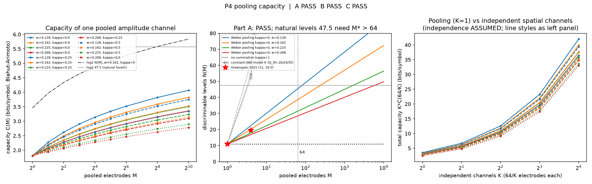
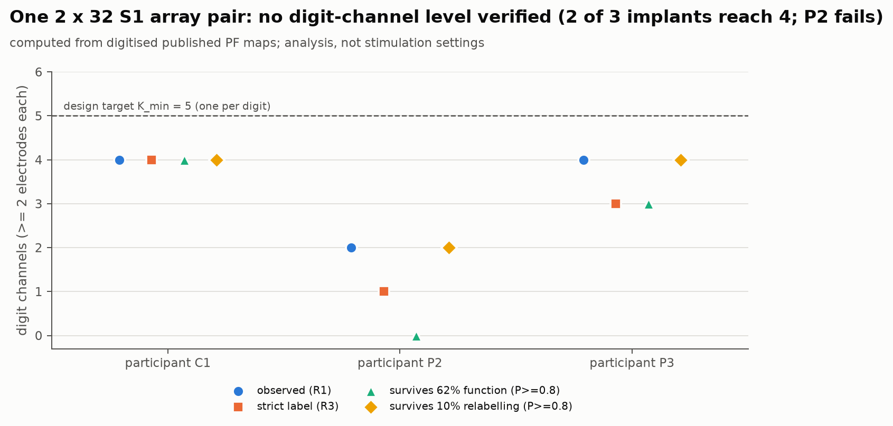
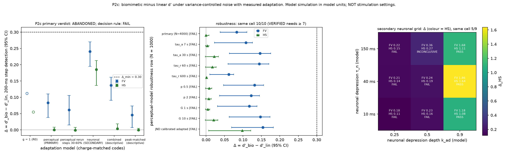

# Restoring touch through the brain: what the evidence supports, what our models show, and what remains open
DRAFT v0.2 (cycles 1-4), 2026-09-26. Author: Marius Carlsson, with a computational research team.
Status: internal draft. Not peer reviewed. No medical claims. All human data are cited from published studies. Our own work is
computational only. Any clinical application would require IRB/FDA-approved clinical studies.

---

## 1. Summary
- **Established science.** Intracortical microstimulation (ICMS) of the human hand area of primary somatosensory cortex (S1)
  evokes touch percepts on specific fingers and palm locations. Their intensity grows with current, and their locations have stayed stable for years.
  In one participant, adding ICMS contact feedback to a robotic-arm brain-computer interface (BCI) halved object-transfer trial time
  (median 20.9 s -> 10.2 s; Flesher et al. 2021, Science, PMID 34016775) [grade B, n=1].
- **Our computational results (4 cycles, 10 pre-registered tests, every one independently code-reviewed).**
  - Rich feedback must come from spatially distinct channels. Pooling current across electrodes adds information only logarithmically.
  - But the number of distinct channels an implant provides is limited by where it lands in the brain's hand map. In published
    implants, a 2 x 32-electrode array pair gave 2-4 digit-level channels, never 5.
  - Several attractive ideas failed their tests, and we report those failures (Section 4).
- **Design recommendation.** Treat a channel as a measured skin territory, not an electrode. Plan for 2-4 digit channels plus palm per
  array pair, with redundant electrodes per channel, and measure the count per person (Section 5).
- **Speculation (clearly marked).** Natural texture feel and controllable warmth are probably not reachable through S1 ICMS alone.

## 2. Established science (graded; every source opened and independently audited)
Grades: A = replicated across groups; B = single study or single consortium; C = preprint or theory.

| Finding | Numbers as reported | Grade | Source |
|---|---|---|---|
| S1 ICMS evokes somatotopic hand percepts | fingertips and palm; >= 4 digits covered in 5/5 participants | A | Flesher 2016; Fifer 2022; Armenta Salas 2018 |
| Detection thresholds are in the tens of microamps | initial medians 14.5-22.5 uA (4 of 5 people) | A | Greenspon preprint PMID 40832410; Hughes 2021 PMID 34320481 |
| Amplitude discrimination | median JND 13.5 uA (IQR 8.5-22.9) at a 60 uA standard | B | Greenspon 2025, PMID 39643730 |
| Biomimetic, multi-electrode trains widen the usable range | discriminable levels 8 (linear, single) -> 11 (biomimetic, single) -> 19.5 (biomimetic, 4 electrodes) | B | Greenspon 2025 |
| Biomimetic trains feel more like real indentation | on 32% of single electrodes and 75% of 4-electrode groups | B | Hobbs 2025, PMID 40106898 |
| Long-term safety within published caps | 5 people, up to 10 years, no serious adverse events; all 53 AEs were persistent sensations | B | Greenspon 2026, PMID 42455900 / preprint 40832410 |
| Electrode longevity | ~62-64% of electrodes functional at end of follow-up; thresholds drift +3.5 +/- 11.5 uA/year | B | Greenspon 2026 |
| Closed-loop benefit | ARAT trial time -51%; grasp phase 13.3 -> 4.6 s | B (n=1) | Flesher 2021 |
| Spatial patterns convey edges and motion | edge orientation 61-89%; motion direction 76-78% | B | Valle 2025, PMID 39818881 |
| Nearby electrodes evoke nearby percepts | 2 mm of cortex ~ 10 mm of skin, r = 0.69 | B | Greenspon 2025 |
| Percepts fade under sustained stimulation | 60-s burst trains extinguished the percept in 26/30 cases; intermittent trains (1 s on / 5 s off) persisted > 3 min | B | Hughes 2022, PMID 35671947 |
| Natural S1 touch responses are dominated by contact transients | onset response >15x sustained, offset >8x | B (monkey) | Callier 2019, PMID 30668644 |
| Fine texture relies on millisecond-precise timing of skin vibrations at 50-800 Hz | 7 PC fibres classify 55 textures at 83% | B | Weber 2013, PMID 24082087 |
| Warmth is represented in posterior insula, not S1 | S1 responds to cooling but barely to warming (mouse) | B | Vestergaard 2023, PMID 36755097 |

**Unknowns in the literature we opened:** no end-to-end loop latency (sensor -> stimulation -> percept) has been reported. No human texture
discrimination via ICMS has been reported, and no controllable thermal percepts. Continuous proprioceptive feedback has not been shown in humans.
The evidence base is about 12 implanted people, all male.

## 3. Method
- Each hypothesis was written as a pre-registration before any code ran: model, parameters (cited or labelled assumptions),
  PASS/FAIL threshold, null controls and an abandonment rule.
- A separate agent implemented it and logged every deviation, and an independent reviewer re-derived the key numbers (code\REVIEW_cycle1-4.md).
- Redesigns after a failure are labelled post hoc. Cycle 3-4 tests were written blind to earlier outcomes.
- Seed 20260926; each test runs in under 10 minutes on a laptop CPU.

## 4. Our computational results

### 4.1 Supported findings
**Pooling electrodes buys information only logarithmically (P4: PASS).**
- If perceived intensity tracks total injected charge with Weber-law noise, pooling M electrodes adds about ln M / ln(1+w) discriminable levels.
- Reaching the ~45-50 levels of natural touch by pooling alone would take **81 to ~5,800 electrodes**. The fit to the observed 19.5 levels
  for 4-electrode groups is a non-blind consistency check only.

**Distinct channels per implant: 2-4 digit channels, never 5 (P6: no level verified).**
- Data: open, per-electrode maps of where each electrode's percept falls on the hand, digitised from Greenspon 2025
  (3 participants, 186 electrodes, 2 x 32 electrodes each).
- For each digit we counted whether at least 2 electrodes land there (redundancy). Observed digit channels: **4, 2 and 4**.
- **No participant reached 5 under any labelling rule.**
- Electrodes cluster in the hand map far more than chance allows: effective territory count is 0.43-0.65 of a spatially random
  null, p <= 0.007 in 3/3.
- After the published long-term electrode survival (62%), 4 channels remain with probability 0.98 and 0.78 in two participants. In the
  third, whose arrays map mostly to the palm, 2 channels remain with probability 0.38.
- By our pre-registered rule, no guaranteed channel count is verified. The consistent message is that placement, not electrode count,
  decides the channel budget.

### 4.2 Negative results (reported deliberately)
| Test | Idea | Outcome |
|---|---|---|
| P2, P2b, P2c | Biomimetic (onset/offset) encoding carries more force-change information per unit charge | **FAIL.** The early apparent advantage was ~80-90% a noise-model artifact. Under measured human adaptation (tau ~13 s) and variance-controlled noise the advantage is 0.00-0.08 d' (threshold 0.30). The human perceptual evidence for biomimetic trains (Section 2) is unaffected. Our models simply do not explain it by detectability |
| P3, P3b | Bayesian adaptive (psi) calibration saves >= 30% of trials | **FAIL** (2/48 and 5/48 cells). Calibrating a 64-electrode array takes ~5 h at 4 s/trial either way (simulation ESTIMATE) |
| P5, P5b | Model-based channel counts from current spread and somatotopy | **ABANDONED.** Both models failed their own validation gates against published maps, so their numbers (~8-14 channels) are not design values |
| P1, P1b | A latency budget for slip feedback | **RETIRED.** Two grip models failed for modelling reasons, and no published end-to-end latency exists to validate against |

## 5. Design recommendation
> Build feedback as an **independent-channel architecture** in which a channel is a distinct, measured skin territory. Allocate
> >= 2 electrodes per channel, and plan for **2-4 digit channels plus palm** per 2 x 32-electrode S1 array pair, not one per digit.
> Measure the channel count per person from their percept map, and re-estimate it as electrodes fail.

- **Verified:** pooling cannot substitute for spatial channels; 5 digit channels are not supported by any open-data implant; channel count
  is placement-limited.
- **Not verified:** a guaranteed minimum for every implant, and whether two channels are perceptually distinguishable. That needs
  per-electrode percept areas, which exist only in access-restricted data.
- Details: research\somatosensory\DESIGN_RECOMMENDATION.md.

## 6. Speculation and roadmap (not established; for discussion)
- **Texture as a learned code.** About 4 bits of texture identity per exploration is within the capacity of a few channels, but only as
  an arbitrary, learned mapping. Natural texture feel would need timing precision ICMS likely cannot deliver [theory, grade C].
- **Temperature needs another route.** Biology places warmth outside S1 [theory based on grade-B biology].
- **Platform problems we can own:** per-implant channel mapping and attrition forecasting (our P6 analysis is a reviewed prototype),
  calibration time, and end-to-end loop-latency measurement.

## 7. Reproducibility
- Pre-registrations: research\somatosensory\prereg\ (P1-P6).
- Code: research\somatosensory\code\ (numpy/scipy only). Deviations: code\DEVIATIONS.md. Reviews: code\REVIEW_cycle1-4.md.
- Digitised data and extraction scripts: notes\published-derived\ and notes\data_cycle3b.md.
- Citation audit: lit\AUDIT.md (96 PMIDs resolved; 74/81 claims verified exactly, 5 minor corrections applied, 0 wrong).
