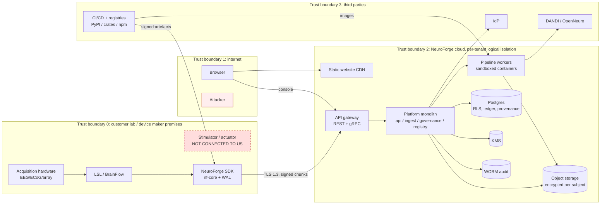

# NeuroForge Bio: threat model (STRIDE + LINDDUN)

Status: **DRAFT v0.1**, 2026-09-26, security expert. It covers the design in `architecture\BLUEPRINT.md`, none of which is built yet. It supersedes the abridged table in BLUEPRINT §8.7, and is reviewed at every milestone exit (SEC-113).

**Method.** We use a data-flow diagram with trust boundaries, then run **STRIDE** per component for security and **LINDDUN** (Linking, Identifying, Non-repudiation, Detecting, Data disclosure, Unawareness, Non-compliance) for privacy. FDA's Feb 2026 cybersecurity guidance asks for threat modelling "throughout the design process" with a stated rationale for the method, and cites the MDIC/MITRE Playbook (`STANDARDS-MAP.md` §4.3). Our rationale: STRIDE gives complete coverage of security properties per element. LINDDUN is the privacy counterpart, needed because the main harm of a neural-data breach is to the **data subject**, not to us.

**Rating.** Likelihood (L) 1–5 × Impact (I) 1–5 = score. **Critical ≥ 16, High 10–15, Medium 5–9, Low ≤ 4.** "Inherent" means without the controls. "Residual" means with the listed controls built and tested, which is a design **target**, not a measurement. Impact is scored on the worst credible harm to data subjects, customers' devices or research integrity.

**Evidence for BCI-specific claims:**
- **EEG as an identifier:** "Electroencephalography (EEG) has emerged as a promising modality for biometric user authentication due to its inherent uniqueness" (de Ataide et al., *Sensors* 2026, doi:10.3390/s26134045, PMID 42451287; review; grade A/B).
- **Inference beyond the stated purpose:** "EEG data is so rich with information that application developers can easily gain knowledge beyond the professed scope from unprotected EEG signals, including passwords, ATM PINs…" (Agarwal et al., *IEEE TNSRE* 2019, doi:10.1109/tnsre.2019.2926965, PMID 31283483; grade B).
- **Adversarial attacks on EEG decoders:** universal adversarial perturbations "are easy to construct, and can attack BCIs in real-time, exposing a potentially critical security concern" (Liu et al., arXiv:1912.01171; grade C, preprint).
- **Training-data leakage:** membership inference shows "how machine learning models leak information about the individual data records on which they were trained" (Shokri et al., arXiv:1610.05820; grade B).
- **Unlearning is not certified:** SISA only "expedites the unlearning process" (Bourtoule et al., arXiv:1912.03817).

---

## 1. Scope and data-flow diagram

**The stimulator box is drawn to show the absence of an edge.** No data flow exists from any NeuroForge component to stimulation or acquisition-control interfaces, and none may be added (SEC-090…092). Section 4 treats every attempt to add one as a threat in its own right.

**Assets, in priority order:**
1. Raw and derived neural signals, which are special-category, identifying and non-revocable.
2. Consent records and the link between subject pseudonyms and identities, held at the customer.
3. Keys (KMS root, tenant KEKs, subject DEKs, device keys, CI signing identity).
4. Integrity of provenance, the audit trail and deletion certificates (customers use them as regulatory evidence).
5. Models trained on neural data.
6. SDK and release integrity, since our code runs in labs and may be embedded in devices.
7. Company reputation: the website and its claims.

**Attackers considered:** an opportunistic internet attacker; a malicious or compromised tenant user; a curious insider (our staff); a supply-chain attacker; a data-broker or re-identification actor who buys or scrapes exports; a nation-state interested in neural data of specific people (low likelihood, high impact); an adversarial-ML researcher attacking decoders; a well-meaning customer who wants to wire us into a closed loop.

---

## 2. STRIDE by component

Ratings are shown as inherent → residual. The controls column references `SECURITY-REQUIREMENTS.md`.

### 2.1 Edge SDK and stream ingest (TB0 → TB2)

| ID | STRIDE | Threat | Inherent L×I | Controls | Residual |
|---|---|---|---|---|---|
| T-01 | Tampering / Spoofing | **Forged or altered neural-data chunks** injected in transit or from a stolen device token, corrupting research results or a device maker's verification evidence. A per-chunk SHA-256 alone does not stop forgery | 3×5 = **15 High** | TLS 1.3 only (SEC-030); **device-key signatures on chunks** (SEC-040); device-bound tokens + mTLS option (SEC-016); revocation ≤ 60 s (SEC-017) | 1×5 = 5 Medium |
| T-02 | Tampering | **Replay or splice** of old segments, timestamp manipulation, or sample-rate lies making a recording look valid | 3×4 = 12 High | `(stream_id, seq)` idempotency + conflict alert (SEC-040); server sanity checks mark segments `suspect` (SEC-041); original timestamps immutable (SEC-094) | 2×3 = 6 Medium |
| T-10 | Information disclosure | The WAL buffer on a shared lab PC exposes raw neural data (lost laptop, other users) | 4×4 = **16 Critical** | WAL encrypted with an OS-keystore key, deleted after ACK (SEC-037); SDK docs require full-disk encryption on lab PCs | 2×4 = 8 Medium |
| T-11 | Spoofing | Stolen API key in a notebook or on GitHub used to download data | 4×5 = **20 Critical** | Scoped expiring keys, prefix for secret scanning (SEC-014); exports are classified actions with four-eyes (SEC-024); anomaly alert on new ASN (SEC-102) | 2×4 = 8 Medium |
| T-12 | Elevation | Malicious server response or crafted file exploits a parser in nf-core on the lab PC (memory corruption → code execution on a machine attached to acquisition hardware) | 2×5 = 10 High | Rust core (D7); fuzzing (SEC-062); TLS pinning to our CA for enterprise; C ABI checked with ASan (BUILD-GUIDE 7.1) | 1×5 = 5 Medium |
| T-13 | DoS | Network loss causes sample loss during acquisition | 4×3 = 12 High | Local WAL; acquisition never blocks on the server (SEC-093) | 1×3 = 3 Low |

### 2.2 API gateway, platform monolith, console

| ID | STRIDE | Threat | Inherent | Controls | Residual |
|---|---|---|---|---|---|
| T-03 | Info disclosure / Elevation | **Cross-tenant read through a BOLA bug** (API1:2023), the single most likely route to a mass neural-data breach | 4×5 = **20 Critical** | App authz + Postgres RLS + per-tenant KEK (SEC-021); two-tenant test on every route; authz matrix generated from OpenAPI (SEC-020); pen test (SEC-110) | 1×5 = 5 Medium |
| T-04 | Elevation | A scientist exports raw sensitive data or changes a channel's classification to dodge policy | 3×4 = 12 High | Property-level authz (SEC-022); `policy.check` fail-closed (SEC-026); four-eyes (SEC-024) | 1×4 = 4 Low |
| T-05 | Spoofing | Admin account phished; attacker creates keys and exports | 3×5 = 15 High | **Passkeys mandatory for admin roles** (SEC-011); hardware keys for break-glass/KMS admins (SEC-012); new-admin alert (SEC-102) | 1×5 = 5 Medium |
| T-06 | Info disclosure | Neural samples, subject IDs or tokens leak into logs or traces, then to an observability vendor | 4×4 = **16 Critical** | Allow-listed log fields + CI log-scan (SEC-147); no identifiers in URLs (SEC-036) | 1×4 = 4 Low |
| T-07 | DoS | Upload or `readWindow` floods, sweep explosions, gRPC stream exhaustion | 4×3 = 12 High | Quotas and rate limits, max spans, max streams (SEC-075); pre-signed uploads bypass the API | 2×2 = 4 Low |
| T-08 | Tampering | SSRF through webhook URLs to cloud metadata → credential theft | 3×5 = 15 High | Egress proxy + IP deny-list (SEC-076); IMDSv2-style metadata protection (**UNVERIFIED** until D4 provider set-up) | 1×5 = 5 Medium |
| T-09 | Repudiation | "We never exported that" / "our admin did not change that rule" | 3×3 = 9 Medium | WORM audit, hash chain, customer-verifiable export (SEC-100, SEC-105) | 1×2 = 2 Low |
| T-14 | Info disclosure | XSS in the console steals session tokens (the console renders user-supplied metadata: channel names, BIDS sidecar text) | 3×5 = 15 High | Strict CSP (no inline) on the console as on the site; React escaping; `HttpOnly` cookies (SEC-015); ASVS V3 at L2 | 1×4 = 4 Low |

### 2.3 Ingest workers and pipeline workers

| ID | STRIDE | Threat | Inherent | Controls | Residual |
|---|---|---|---|---|---|
| T-20 | Tampering / Elevation | A malicious or compromised **pipeline step image** runs in a worker with access to other subjects' data | 3×5 = 15 High | Digest-pinned, cosign-verified images (SEC-044); per-job mounts only; per-tenant KMS encryption context (SEC-023) | 1×4 = 4 Low |
| T-21 | Info disclosure | A step exfiltrates data over the network | 3×5 = 15 High | No network by default in step sandboxes (SEC-074) | 1×4 = 4 Low |
| T-22 | Elevation | **Code execution from data files**: pickle in `.npy`/`.pt`/`.mat` side files, HDF5 or NWB extension code, or zip traversal in BIDS archives | 4×5 = **20 Critical** | Parsing only in the sandbox (SEC-060); ban on pickle / unsafe loaders; safetensors/ONNX only for weights (SEC-061); archive limits (SEC-064); fuzzing (SEC-062) | 1×4 = 4 Low |
| T-23 | Tampering | Non-deterministic or silently changed pipeline results undermine reproducibility claims (an integrity threat to our core promise) | 3×4 = 12 High | Immutable PipelineVersions; reproducibility harness (BUILD-GUIDE 3.5); provenance written before visibility | 1×3 = 3 Low |

### 2.4 Governance: provenance, consent ledger, deletion, KMS

| ID | STRIDE | Threat | Inherent | Controls | Residual |
|---|---|---|---|---|---|
| T-30 | DoS / Tampering | Attacker or insider **schedules KMS key deletion** (ransom or sabotage), destroying all tenant data | 2×5 = 10 High | KMS waiting period + two-person approval (SEC-123); alert on scheduled deletion (SEC-102); keys in a separate admin account; hardware keys for KMS admins (SEC-012) | 1×5 = 5 Medium |
| T-31 | Info disclosure | Deletion certificates or ledger exports reveal that a person took part in a study (e.g. an epilepsy cohort) | 3×4 = 12 High | Certificates carry pseudonyms only (SEC-046); access limited to `auditor`/`data-steward` | 1×3 = 3 Low |
| T-32 | Tampering / Repudiation | **False deletion certificate**: a job misses descendants in the graph or a copy outside the graph (cache, backup, a worker's scratch disk), yet certifies success | 3×5 = 15 High | Crypto-shredding covers unknown copies of subject-encrypted objects (SEC-034); caches and scratch encrypted under the same DEK; the M5 end-to-end test; restore re-applies deletions (SEC-124); certificate lists **external exports as not recalled** | 2×4 = 8 Medium |
| T-33 | Tampering | Edited provenance or consent rows to hide a pipeline change or a missing consent | 3×5 = 15 High | Append-only tables with DB-level UPDATE/DELETE denial; hash chain; signed batches; daily WORM anchor; hourly verification (SEC-043) | 1×4 = 4 Low |
| T-34 | Elevation | Classification rules edited (or wrong) so that sensitive data is treated as unregulated | 3×4 = 12 High | Four-eyes on rule changes (SEC-024); `review_status`; "not matched", never "not regulated" (BLUEPRINT §8.2) | 2×3 = 6 Medium |

### 2.5 Model registry

| ID | STRIDE | Threat | Inherent | Controls | Residual |
|---|---|---|---|---|---|
| T-41 | Elevation (safety) | A registry model (motor intent or cognitive state) is **deployed as a controller in a closed-loop stimulation or actuation system** through our deployment tokens | 2×5 = 10 High | Deployment contexts for stimulation/actuation are refused (SEC-092); terms prohibit it; SOUP export says "not for real-time or safety-critical control" | 1×5 = 5 Medium (customers can still copy weights offline; a contractual control, not a technical one) |
| T-44 | Tampering | **Adversarial inputs to decoders**: small crafted perturbations (e.g. universal adversarial perturbations, Liu 2019) flip motor-intent or state outputs in customers' downstream use | 3×4 = 12 High | We do not run real-time decoding. Model cards must record robustness evaluations (SEC-145); input sanity checks (SEC-041); customers told robustness is **measured, not claimed** | 2×4 = 8 Medium (a customer-device risk that we document) |
| T-45 | Tampering | Poisoned training data (an injected tenant dataset or a tampered public dataset) back-doors a model | 2×4 = 8 Medium | Training manifests with hashes; only consented, lineage-tracked inputs; public datasets pinned by hash | 1×4 = 4 Low |
| T-46 | Elevation | Malicious model weights (pickle RCE) uploaded to the registry | 3×5 = 15 High | safetensors/ONNX only (SEC-061) | 1×4 = 4 Low |

### 2.6 Website (static, both themes)

| ID | STRIDE | Threat | Inherent | Controls | Residual |
|---|---|---|---|---|---|
| T-60 | Tampering | Defacement or script injection through the CDN account or build pipeline, e.g. adding a tracker to a privacy company's site | 2×4 = 8 Medium | Signed site bundle (SEC-081); strict CSP and no third parties (SEC-150, SEC-155); hosting account with hardware-key MFA 🔒 | 1×3 = 3 Low |
| T-61 | Spoofing | Phishing look-alike domain; spoofed security contact | 3×3 = 9 Medium | security.txt with `Canonical` (SEC-157); DNSSEC/CAA 🔒 (SEC-160); DMARC `p=reject` once mail exists 🔒 | 2×2 = 4 Low |
| T-62 | Info disclosure | **Overclaiming** ("certified", "HIPAA-compliant") creates legal exposure and false customer reliance | 3×4 = 12 High | Copy-lint (BUILD-GUIDE 0.4); honest status labels on `/security` | 1×3 = 3 Low |
| T-63 | DoS | Traffic flood | 2×2 = 4 Low | CDN | 1×2 = 2 Low |

### 2.7 Supply chain and CI/CD

| ID | STRIDE | Threat | Inherent | Controls | Residual |
|---|---|---|---|---|---|
| T-50 | Tampering | **Compromised dependency or release pipeline ships a backdoored SDK** to labs and into customers' devices (as SOUP) | 3×5 = 15 High, and **Critical in reach**, because one incident hits every customer | Lockfiles (SEC-080); cosign + SLSA L3 (SEC-081/082); SHA-pinned actions and no `pull_request_target` (SEC-089); dependency review (SEC-084); Rekor monitoring (SEC-106) | 1×5 = 5 Medium |
| T-51 | Spoofing | Typosquat package (`neuroforge` look-alikes on PyPI) | 3×4 = 12 High | Reserve names at first release 🔒; docs show `pip install` with the verified name + provenance check | 2×3 = 6 Medium |
| T-52 | Info disclosure | Secret leaks through CI logs or a committed file | 3×4 = 12 High | OIDC federation instead of static keys (SEC-051); secret scanning (SEC-086) | 1×3 = 3 Low |

### 2.8 People and operations

| ID | STRIDE | Threat | Inherent | Controls | Residual |
|---|---|---|---|---|---|
| T-70 | Info disclosure | Curious or malicious insider browses a subject's data | 2×5 = 10 High | No standing prod data access; break-glass only (SEC-025); audit of every read; quarterly access review (SEC-114) | 1×4 = 4 Low |
| T-71 | Info disclosure | Real neural data copied into dev/staging or onto a laptop for debugging | 3×4 = 12 High | `synthetic_only` guard (SEC-071); the repo data-file guard (SEC-087); synthetic fixtures (BUILD-GUIDE 0.6) | 1×4 = 4 Low |

---

## 3. LINDDUN (privacy threats to data subjects)

| ID | LINDDUN | Threat | Inherent | Controls | Residual |
|---|---|---|---|---|---|
| P-01 | Identifying | Direct identifiers (names, DOB, MRN) arrive in metadata (BIDS `participants.tsv`, notes) | 4×4 = **16 Critical** | Validators reject identifiers; the "identified" mode is separate and encrypted (SEC-140) | 1×4 = 4 Low |
| P-02 | Identifying | Identifiers hidden in **EDF/BDF headers**, NWB subject fields or free-text annotations | 4×4 = **16 Critical** | Header scrubbing on the canonical copy (SEC-141) | 2×3 = 6 Medium |
| P-03 | Identifying / Linking | **Re-identification from the neural signal itself.** EEG works as a biometric (de Ataide 2026), so a pseudonymised recording can be matched to the same person's recording elsewhere (another study, a consumer headset). Pseudonymisation does not make neural data anonymous | 3×5 = 15 High, **effectively Critical because it cannot be fully mitigated** | Treat signals as identifying (SEC-142); exports are classified and four-eyes approved; tenant keys prevent cross-tenant joins; **never market "anonymised" neural data**; a DPIA template for customers | 2×5 = 10 **High** (accepted residual; mitigated mainly by access control and contracts) |
| P-04 | Linking | Cross-dataset or cross-tenant linkage through stable pseudonyms, device IDs or content hashes (the same raw-file hash seen in two tenants reveals the same session) | 3×4 = 12 High | Per-tenant pseudonym namespaces; content hashes salted per tenant in any cross-tenant-visible context; no global subject IDs | 1×4 = 4 Low |
| P-05 | Data disclosure | **Membership inference** against a shared model: "was person X in the training set?" Answering that reveals, for example, a diagnosis cohort | 3×4 = 12 High | Models private per tenant by default; publication needs a privacy-risk section with a measured MI test (SEC-143); consent `commercial_use` (SEC-146) | 2×3 = 6 Medium |
| P-06 | Data disclosure | **Model inversion or extraction** through an inference API, reconstructing features of training subjects | 2×4 = 8 Medium | Coarse outputs by default; query rate limits (SEC-144) | 1×3 = 3 Low |
| P-07 | Unawareness / Non-compliance | **Purpose creep**: data consented for motor-decoding research used to train a cognitive-state or emotion model (and EU AI Act Art. 5(1)(f) for workplace/education) | 3×5 = 15 High | Consent scopes enforced in `policy.check` (SEC-146); use restrictions in the registry (BUILD-GUIDE 6.2) | 1×4 = 4 Low |
| P-08 | Non-compliance | Withdrawn subject **resurrected by a backup restore** | 2×5 = 10 High | Crypto-shred + restore re-applies the deletion ledger (SEC-034, SEC-124) | 1×4 = 4 Low |
| P-09 | Detecting | The mere existence of a dataset, project name or tenant (e.g. "ALS implant trial") seen by other tenants, support staff or in error messages reveals sensitive facts | 3×3 = 9 Medium | Opaque IDs in URLs and errors; tenant-scoped search; names never in logs (SEC-147) | 1×3 = 3 Low |
| P-10 | Non-repudiation (privacy sense) | The immutable ledger itself is durable proof that a person took part in a sensitive study, which can harm the subject if it is disclosed | 2×4 = 8 Medium | Ledger stores pseudonyms and evidence **references**, not signed forms; the mapping to identity stays at the customer; the ledger is inside the subject's crypto-shred domain where legally allowed (legal to confirm what must be retained) | 1×3 = 3 Low |
| P-11 | Unawareness | Subjects do not know their data can train models or be shared | 3×4 = 12 High | Consent document versioning + hash; a customer template for plain-language consent (**roadmap**, with nfb-legal) | 2×3 = 6 Medium |
| P-12 | Non-compliance | Jurisdiction mismatch: data mis-classified (the CT central-only vs CO/CA central-or-peripheral split) | 3×4 = 12 High | Channel attributes + RuleSets with counsel review (BLUEPRINT §8.2) | 2×3 = 6 Medium |
| P-13 | Data disclosure | Our own website leaks visitor data to trackers | 2×2 = 4 Low | No third parties (SEC-155) | 1×1 = 1 Low |

---

## 4. BCI-specific risks (explicit)

| Topic | Threat IDs | Position |
|---|---|---|
| **Tampering with streamed neural data** | T-01, T-02, T-13 | Signed chunks + TLS + server sanity checks + immutable originals. A signature proves that the **device key** sent the data, not that the electrode measured it: sensor-level spoofing (a signal generator on the amplifier input) is out of our reach. We record device IDs and let customers attest hardware |
| **Re-identification / model inversion from neural signals** | P-03, P-04, P-05, P-06 | This is the **highest residual privacy risk** in the model. Pseudonymised neural data is still personal data. Controls: access control, export governance, tenant key separation, model publication gates. Copy never says "anonymised" |
| **Adversarial inputs to decoders** | T-44, T-45 | Our platform is not in the real-time loop, so the operational risk sits with customers' devices. We require robustness measurements in model cards and pass them through in SOUP exports |
| **Integrity of closed-loop timing** | T-42 (below), T-43 | See the table below. Cloud acknowledgements never gate acquisition; original LSL timestamps and clock offsets are kept immutable; corrections are new derived artefacts |
| **Stimulation must never be controllable through our platform** | T-40, T-41 | See the table below. **This boundary is a design invariant**, enforced by CI denylist tests on the protos, OpenAPI and nf-core (SEC-090/091), by the registry deployment refusal (SEC-092) and by contract |

| ID | Threat | Inherent | Controls | Residual |
|---|---|---|---|---|
| T-40 | **Scope creep:** a feature request ("let the SDK send a trigger back to the amplifier", "push model parameters to the stimulator") adds a control path. That turns us into a device component in the safety loop, and makes an account compromise a potential **patient-harm** event | 2×5 = 10 High (the likelihood is organisational pressure, not attack) | Invariant SEC-090/091 with CI denylists; any change needs owner approval + a regulatory analysis, not just an ADR; architecture review at each milestone | 1×5 = 5 Medium, **Low if the invariant holds** |
| T-42 | A customer places the cloud stream in a closed loop and relies on our ACK latency or availability | 2×4 = 8 Medium | Documented: no timing guarantees, cloud never in the real-time loop (SEC-093); local pipelines at the edge (BLUEPRINT §3.3) | 1×3 = 3 Low |
| T-43 | Timestamps altered (clock skew, malicious rewrite) and closed-loop timing evidence presented to a regulator becomes false | 3×4 = 12 High | Immutable raw timestamps + LSL offset series (SEC-094); hash-chained provenance | 1×4 = 4 Low |

---

## 5. Top risks (inherent → residual)

| Rank | Risk | IDs | Inherent | Residual target | Why it ranks here |
|---|---|---|---|---|---|
| 1 | **Cross-tenant / object-level authorization breach** exposing neural data at scale | T-03, T-11 | Critical (20) | Medium | The most common API failure (API1:2023). The data is irreversible and identifying |
| 2 | **Re-identification from neural signals**, including through exports and shared models | P-03, P-05 | High → effectively Critical | **High (accepted)** | It cannot be engineered away: the signal is the identifier |
| 3 | **Supply-chain compromise of the SDK / release pipeline** reaching labs and devices | T-50, T-12 | High, Critical in reach | Medium | One incident affects every customer, and as SOUP it reaches devices |
| 4 | **Tampered or forged streamed data or timestamps** corrupting research and device evidence | T-01, T-02, T-43 | High (15) | Medium | Integrity is the product (reproducibility, provenance) |
| 5 | **Scope creep into stimulation / closed-loop control** (and registry models used as controllers) | T-40, T-41 | High (impact 5) | Medium → Low if the invariant holds | The only path by which our software could contribute to physical harm |

Next in line: code execution through data files (T-22), a false deletion certificate (T-32), KMS key-deletion sabotage (T-30), identifiers in file headers (P-02), and logs leaking data (T-06).

## 6. Assumptions and open items

- The cloud provider's KMS, object lock and BAA coverage are as described in D4. **Not yet verified against the provider's documentation.**
- Customers keep the pseudonym ↔ identity mapping. If a customer wants us to hold it (the "identified" mode), P-01 and P-10 need re-rating.
- Legal to confirm: which ledger records must survive a withdrawal (a legal hold vs a crypto-shred) (P-10); state breach-law clocks.
- Re-rate after M2 (the first real code) and before the first pen test.
